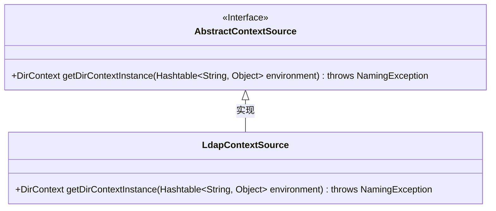
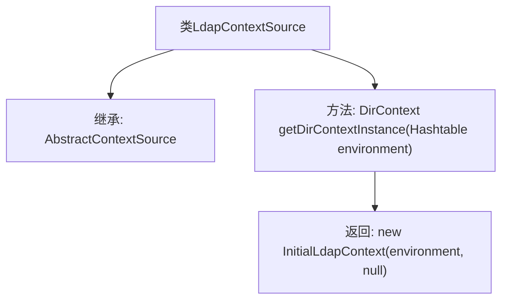

# 基础信息

|      |      |
|------|------|
| 名称 | LdapContextSource |
| 编码语言 | .java |
| 代码路径 | spring-ldap/core/src/main/java/org/springframework/ldap/core/support/LdapContextSource.java |
| 包名 | org.springframework.ldap.core.support |
| 依赖项 | ['java.util.Hashtable', 'javax.naming.NamingException', 'javax.naming.directory.DirContext', 'javax.naming.ldap.InitialLdapContext'] |
| 概述说明 | LdapContextSource继承AbstractContextSource，实现获取LDAP上下文实例。 |

# 说明

LdapContextSource类继承自AbstractContextSource，其主要功能是实现获取LDAP上下文实例的方法。该类通过继承和实现，提供了与LDAP服务器交互所需的基础功能，确保能够有效管理和操作LDAP上下文。

# 类列表 Class Summary

| 名称   | 类型  | 说明 |
|-------|------|-------------|
| LdapContextSource | class | LdapContextSource类继承AbstractContextSource，实现获取LDAP上下文实例的方法。 |

## 类 LdapContextSource

|      |      |
|------|------|
| 访问范围 | public |
| 类型 | class |
| 名称 | LdapContextSource |
| 说明 | LdapContextSource类继承AbstractContextSource，实现获取LDAP上下文实例的方法。 |

### UML类图

**描述：**  
`LdapContextSource` 类继承自 `AbstractContextSource` 接口，并实现了 `getDirContextInstance` 方法。该方法接受一个 `Hashtable<String, Object>` 类型的参数，返回一个 `DirContext` 实例，并在过程中可能抛出 `NamingException` 异常。`LdapContextSource` 通过调用 `InitialLdapContext` 构造函数来创建并返回一个新的 `InitialLdapContext` 对象。

### 内部方法调用关系图

该流程图描述了`LdapContextSource`类的结构及其方法调用关系。`LdapContextSource`继承自`AbstractContextSource`，并实现了`getDirContextInstance`方法。该方法接收一个`Hashtable<String, Object>`类型的参数`environment`，并返回一个`InitialLdapContext`对象。通过这种方式，`LdapContextSource`类提供了创建LDAP上下文实例的功能。

### 字段列表 Field List

| 名称  | 类型  | 说明 |
|-------|-------|------|

### 方法列表 Method List

| 名称  | 类型  | 说明 |
|-------|-------|------|
| getDirContextInstance | DirContext | 获取LDAP目录上下文实例的方法，传入环境参数并返回初始上下文。 |

