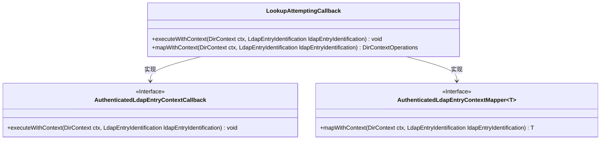
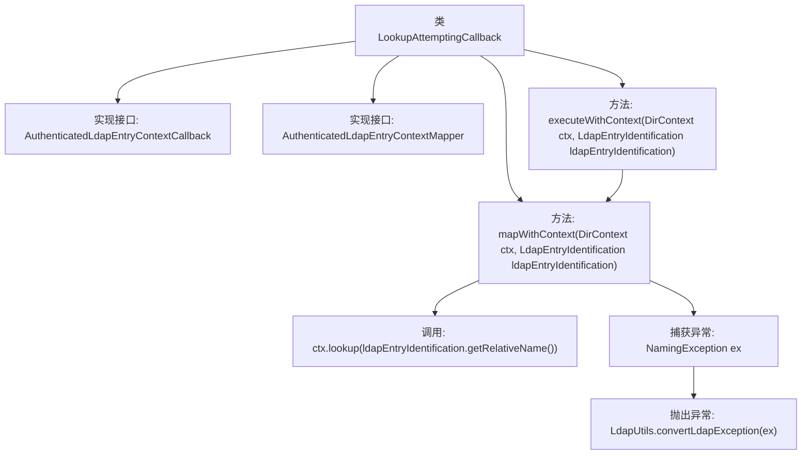

# 基础信息

|      |      |
|------|------|
| 名称 | LookupAttemptingCallback |
| 编码语言 | .java |
| 代码路径 | spring-ldap/core/src/main/java/org/springframework/ldap/core/support/LookupAttemptingCallback.java |
| 包名 | org.springframework.ldap.core.support |
| 依赖项 | ['javax.naming.NamingException', 'javax.naming.directory.DirContext', 'org.springframework.ldap.core.AuthenticatedLdapEntryContextCallback', 'org.springframework.ldap.core.AuthenticatedLdapEntryContextMapper', 'org.springframework.ldap.core.DirContextOperations', 'org.springframework.ldap.core.LdapEntryIdentification', 'org.springframework.ldap.support.LdapUtils'] |
| 概述说明 | 类LookupAttemptingCallback实现LDAP回调，处理查找并转换异常。 |

# 说明

类LookupAttemptingCallback实现了LDAP上下文回调和映射功能，主要用于处理查找操作。该类的核心职责是执行LDAP查找，并在查找过程中捕获和处理可能出现的异常。通过将异常转换为更合适的格式，确保查找操作的稳定性和可靠性。此类在LDAP操作中起到关键作用，帮助系统在查找失败时进行适当的异常处理和上下文映射。

# 类列表 Class Summary

| 名称   | 类型  | 说明 |
|-------|------|-------------|
| LookupAttemptingCallback | class | 类LookupAttemptingCallback实现LDAP上下文回调和映射，处理查找操作并转换异常。 |

## 类 LookupAttemptingCallback

|      |      |
|------|------|
| 访问范围 | public |
| 类型 | class |
| 名称 | LookupAttemptingCallback |
| 说明 | 类LookupAttemptingCallback实现LDAP上下文回调和映射，处理查找操作并转换异常。 |

### UML类图

这段代码展示了 `LookupAttemptingCallback` 类实现了 `AuthenticatedLdapEntryContextCallback` 和 `AuthenticatedLdapEntryContextMapper` 两个接口。`LookupAttemptingCallback` 类提供了 `executeWithContext` 和 `mapWithContext` 方法，分别用于执行上下文操作和映射上下文操作。`mapWithContext` 方法通过 `ctx.lookup` 方法查找 LDAP 条目，并在出现异常时将其转换为运行时异常重新抛出。类图清晰地展示了类与接口之间的实现关系。

### 内部方法调用关系图

这段代码定义了一个名为`LookupAttemptingCallback`的类，它实现了两个接口：`AuthenticatedLdapEntryContextCallback`和`AuthenticatedLdapEntryContextMapper<DirContextOperations>`。类中包含两个方法：`executeWithContext`和`mapWithContext`。`executeWithContext`方法调用了`mapWithContext`方法，后者尝试通过`ctx.lookup`查找LDAP条目，如果查找过程中抛出`NamingException`异常，则将其转换为`LdapException`并重新抛出。该流程展示了LDAP上下文中的查找操作及其异常处理机制。

### 字段列表 Field List

| 名称  | 类型  | 说明 |
|-------|-------|------|

### 方法列表 Method List

| 名称  | 类型  | 说明 |
|-------|-------|------|
| executeWithContext | void | 重写方法，使用上下文映射LDAP条目。 |
| mapWithContext | DirContextOperations | 重写方法，通过LDAP上下文查找并返回对象，异常时转换并抛出。 |

