# 基础信息

|      |      |
|------|------|
| 名称 | ObservationContextSource |
| 编码语言 | .java |
| 代码路径 | spring-ldap/core/src/main/java/org/springframework/ldap/core/support/ObservationContextSource.java |
| 包名 | org.springframework.ldap.core.support |
| 依赖项 | ['java.util.ArrayList', 'java.util.Arrays', 'java.util.Collections', 'java.util.Hashtable', 'java.util.List', 'java.util.Objects', 'javax.naming.Binding', 'javax.naming.Context', 'javax.naming.Name', 'javax.naming.NameClassPair', 'javax.naming.NameParser', 'javax.naming.NamingEnumeration', 'javax.naming.directory.Attributes', 'javax.naming.directory.DirContext', 'javax.naming.directory.ModificationItem', 'javax.naming.directory.SearchControls', 'javax.naming.directory.SearchResult', 'javax.naming.ldap.Control', 'javax.naming.ldap.ExtendedRequest', 'javax.naming.ldap.ExtendedResponse', 'javax.naming.ldap.LdapContext', 'javax.naming.ldap.LdapName', 'io.micrometer.common.KeyValue', 'io.micrometer.common.KeyValues', 'io.micrometer.observation.Observation', 'io.micrometer.observation.ObservationConvention', 'io.micrometer.observation.ObservationRegistry', 'org.springframework.lang.NonNull', 'org.springframework.ldap.NamingException', 'org.springframework.ldap.core.ContextSource', 'org.springframework.ldap.core.DirContextOperations', 'org.springframework.ldap.core.DirContextProxy', 'org.springframework.ldap.core.DistinguishedName', 'org.springframework.util.Assert', 'org.springframework.util.LinkedMultiValueMap', 'org.springframework.util.MultiValueMap'] |
| 概述说明 | ObservationContextSource类封装LDAP操作，提供观察和上下文记录功能。 |

# 说明

ObservationContextSource类是一个用于封装LDAP操作的组件，主要功能是提供观察机制并记录相关的上下文信息。通过该类，用户可以监控和跟踪LDAP操作的过程，确保操作的透明性和可追溯性。该类的设计旨在简化LDAP操作的复杂性，同时增强系统的可维护性和可观察性。

# 类列表 Class Summary

| 名称   | 类型  | 说明 |
|-------|------|-------------|
| ObservationContextSource | class | ObservationContextSource类封装LDAP操作，提供观察功能，记录上下文信息。 |


## 类 ObservationContextSource

|      |      |
|------|------|
| 访问范围 | public final |
| 类型 | class |
| 名称 | ObservationContextSource |
| 说明 | ObservationContextSource类封装LDAP操作，提供观察功能，记录上下文信息。 |


### UML类图

```mermaid
classDiagram
    class ObservationContextSource {
        -BaseLdapPathContextSource contextSource
        -DirContextOperationObservationContext.Builder builder
        -ObservationRegistry registry
        +ObservationContextSource(BaseLdapPathContextSource contextSource, ObservationRegistry observationRegistry)
        +DirContext getReadOnlyContext() : DirContext
        +DirContext getReadWriteContext() : DirContext
        +DirContext getContext(String principal, String credentials) : DirContext
        +DistinguishedName getBaseLdapPath() : DistinguishedName
        +LdapName getBaseLdapName() : LdapName
        +String getBaseLdapPathAsString() : String
        -DirContext wrapDirContext(DirContext delegate) : DirContext
    }

    class DirContextOperationObservationContext {
        -String urls
        -String base
        -String operation
        +DirContextOperationObservationContext(String urls, String base, String operation)
        +String getUrls() : String
        +String getBase() : String
        +String getOperation() : String
        <<Interface>> Builder {
            +DirContextOperationObservationContext operation(String operation) : DirContextOperationObservationContext
        }
    }

    class DirContextOperationObservationConvention {
        <<Interface>>
        +KeyValues getLowCardinalityKeyValues(DirContextOperationObservationContext context) : KeyValues
        +boolean supportsContext(Observation.Context context) : boolean
        +String getName() : String
        +String getContextualName(DirContextOperationObservationContext context) : String
    }

    interface DelegatingLdapContext {
        <<Interface>>
        +LdapContext newInstance(Control[] requestControls) : LdapContext
        +Control[] getConnectControls() : Control[]
        +void setRequestControls(Control[] requestControls)
        +Control[] getRequestControls() : Control[]
        +Control[] getResponseControls() : Control[]
    }

    class ObservationLdapContext {
        -LdapContext delegate
        +ObservationLdapContext(DirContextOperationObservationContext.Builder builder, LdapContext delegate, ObservationRegistry registry)
        +ExtendedResponse extendedOperation(ExtendedRequest request) : ExtendedResponse
        +void reconnect(Control[] controls)
    }

    interface DelegatingDirContext {
        <<Interface>>
        +NameParser getNameParser(Name name) : NameParser
        +NameParser getNameParser(String name) : NameParser
        +Name composeName(Name name, Name prefix) : Name
        +String composeName(String name, String prefix) : String
        +Object addToEnvironment(String propName, Object propVal) : Object
        +Object removeFromEnvironment(String propName) : Object
        +Hashtable<?, ?> getEnvironment() : Hashtable<?, ?>
        +void close()
    }

    class ObservationDirContext {
        -ObservationRegistry registry
        -DirContextOperationObservationConvention convention
        -DirContextOperationObservationContext.Builder builder
        +ObservationDirContext(DirContextOperationObservationContext.Builder builder, DirContext delegate, ObservationRegistry registry)
        +Attributes getAttributes(Name name) : Attributes
        +Attributes getAttributes(String name) : Attributes
        +Attributes getAttributes(Name name, String[] attrIds) : Attributes
        +Attributes getAttributes(String name, String[] attrIds) : Attributes
        +void modifyAttributes(Name name, int mod_op, Attributes attrs)
        +void modifyAttributes(String name, int mod_op, Attributes attrs)
        +void modifyAttributes(Name name, ModificationItem[] mods)
        +void modifyAttributes(String name, ModificationItem[] mods)
        +void bind(Name name, Object obj, Attributes attrs)
        +void bind(String name, Object obj, Attributes attrs)
        +void rebind(Name name, Object obj, Attributes attrs)
        +void rebind(String name, Object obj, Attributes attrs)
        +DirContext createSubcontext(Name name, Attributes attrs) : DirContext
        +DirContext createSubcontext(String name, Attributes attrs) : DirContext
        +DirContext getSchema(Name name) : DirContext
        +DirContext getSchema(String name) : DirContext
        +DirContext getSchemaClassDefinition(Name name) : DirContext
        +DirContext getSchemaClassDefinition(String name) : DirContext
        +NamingEnumeration<SearchResult> search(Name name, Attributes matchingAttributes, String[] attributesToReturn) : NamingEnumeration<SearchResult>
        +NamingEnumeration<SearchResult> search(String name, Attributes matchingAttributes, String[] attributesToReturn) : NamingEnumeration<SearchResult>
        +NamingEnumeration<SearchResult> search(Name name, Attributes matchingAttributes) : NamingEnumeration<SearchResult>
        +NamingEnumeration<SearchResult> search(String name, Attributes matchingAttributes) : NamingEnumeration<SearchResult>
        +NamingEnumeration<SearchResult> search(Name name, String filter, SearchControls cons) : NamingEnumeration<SearchResult>
        +NamingEnumeration<SearchResult> search(String name, String filter, SearchControls cons) : NamingEnumeration<SearchResult>
        +NamingEnumeration<SearchResult> search(Name name, String filterExpr, Object[] filterArgs, SearchControls cons) : NamingEnumeration<SearchResult>
        +NamingEnumeration<SearchResult> search(String name, String filterExpr, Object[] filterArgs, SearchControls cons) : NamingEnumeration<SearchResult>
        +Object lookup(Name name) : Object
        +Object lookup(String name) : Object
        +void bind(Name name, Object obj)
        +void bind(String name, Object obj)
        +void rebind(Name name, Object obj)
        +void rebind(String name, Object obj)
        +void unbind(Name name)
        +void unbind(String name)
        +void rename(Name oldName, Name newName)
        +void rename(String oldName, String newName)
        +NamingEnumeration<NameClassPair> list(Name name) : NamingEnumeration<NameClassPair>
        +NamingEnumeration<NameClassPair> list(String name) : NamingEnumeration<NameClassPair>
        +NamingEnumeration<Binding> listBindings(Name name) : NamingEnumeration<Binding>
        +NamingEnumeration<Binding> listBindings(String name) : NamingEnumeration<Binding>
        +void destroySubcontext(Name name)
        +void destroySubcontext(String name)
        +Context createSubcontext(Name name) : Context
        +Context createSubcontext(String name) : Context
        +Object lookupLink(Name name) : Object
        +Object lookupLink(String name) : Object
        +String getNameInNamespace() : String
        -Observation observation(String operation) : Observation
    }

    abstract class AbstractDirContextProxy {
        -DirContext delegate
        +AbstractDirContextProxy(DirContext delegate)
        +DirContext getTargetContext() : DirContext
    }

    ObservationContextSource --> DirContextOperationObservationContext : 依赖
    ObservationContextSource --> DirContextOperationObservationConvention : 依赖
    ObservationContextSource --> DelegatingLdapContext : 依赖
    ObservationContextSource --> DelegatingDirContext : 依赖
    ObservationLdapContext --> DelegatingLdapContext : 实现
    ObservationDirContext --> DelegatingDirContext : 实现
    ObservationDirContext --> AbstractDirContextProxy : 继承
```

这段代码定义了一个`ObservationContextSource`类，它实现了`BaseLdapPathContextSource`接口，并提供了对LDAP操作的观察功能。通过`DirContextOperationObservationContext`和`DirContextOperationObservationConvention`类，代码能够记录和监控LDAP操作的上下文信息。`ObservationLdapContext`和`ObservationDirContext`类分别实现了`DelegatingLdapContext`和`DelegatingDirContext`接口，用于代理LDAP上下文操作，并在操作前后添加观察逻辑。`AbstractDirContextProxy`是一个抽象类，提供了对`DirContext`的代理功能。整体设计旨在通过观察模式监控LDAP操作的执行情况。


### 内部方法调用关系图

```mermaid
graph TD
    A["类ObservationContextSource"]
    B["属性: BaseLdapPathContextSource contextSource"]
    C["属性: DirContextOperationObservationContext.Builder builder"]
    D["属性: ObservationRegistry registry"]
    E["构造方法: ObservationContextSource(BaseLdapPathContextSource contextSource, ObservationRegistry observationRegistry)"]
    F["方法: DirContext getReadOnlyContext()"]
    G["方法: DirContext getReadWriteContext()"]
    H["方法: DirContext getContext(String principal, String credentials)"]
    I["方法: DirContext wrapDirContext(DirContext delegate)"]
    J["方法: DistinguishedName getBaseLdapPath()"]
    K["方法: LdapName getBaseLdapName()"]
    L["方法: String getBaseLdapPathAsString()"]
    M["内部类: DirContextOperationObservationContext"]
    N["内部类: DirContextOperationObservationConvention"]
    O["内部类: DelegatingLdapContext"]
    P["内部类: ObservationLdapContext"]
    Q["内部类: DelegatingDirContext"]
    R["内部类: ObservationDirContext"]
    S["内部类: AbstractDirContextProxy"]

    A --> B
    A --> C
    A --> D
    A --> E
    A --> F
    A --> G
    A --> H
    A --> I
    A --> J
    A --> K
    A --> L
    A -.-> M
    A -.-> N
    A -.-> O
    A -.-> P
    A -.-> Q
    A -.-> R
    A -.-> S
    M --> M1["属性: String urls"]
    M --> M2["属性: String base"]
    M --> M3["属性: String operation"]
    M --> M4["构造方法: DirContextOperationObservationContext(String urls, String base, String operation)"]
    M --> M5["方法: static Builder withContextSource(BaseLdapPathContextSource contextSource)"]
    M --> M6["方法: String getUrls()"]
    M --> M7["方法: String getBase()"]
    M --> M8["方法: String getOperation()"]
    M --> M9["内部类: Builder"]
    M9 --> M9A["属性: String urls"]
    M9 --> M9B["属性: String base"]
    M9 --> M9C["构造方法: Builder(BaseLdapPathContextSource contextSource)"]
    M9 --> M9D["方法: DirContextOperationObservationContext operation(String operation)"]
    N --> N1["属性: static final String OBSERVATION_NAME"]
    N --> N2["方法: KeyValues getLowCardinalityKeyValues(DirContextOperationObservationContext context)"]
    N --> N3["方法: boolean supportsContext(Observation.Context context)"]
    N --> N4["方法: String getName()"]
    N --> N5["方法: String getContextualName(DirContextOperationObservationContext context)"]
    O --> O1["方法: LdapContext newInstance(Control[] requestControls)"]
    O --> O2["方法: Control[] getConnectControls()"]
    O --> O3["方法: void setRequestControls(Control[] requestControls)"]
    O --> O4["方法: Control[] getRequestControls()"]
    O --> O5["方法: Control[] getResponseControls()"]
    P --> P1["属性: LdapContext delegate"]
    P --> P2["构造方法: ObservationLdapContext(DirContextOperationObservationContext.Builder builder, LdapContext delegate, ObservationRegistry registry)"]
    P --> P3["方法: ExtendedResponse extendedOperation(ExtendedRequest request)"]
    P --> P4["方法: void reconnect(Control[] controls)"]
    Q --> Q1["方法: NameParser getNameParser(Name name)"]
    Q --> Q2["方法: NameParser getNameParser(String name)"]
    Q --> Q3["方法: Name composeName(Name name, Name prefix)"]
    Q --> Q4["方法: String composeName(String name, String prefix)"]
    Q --> Q5["方法: Object addToEnvironment(String propName, Object propVal)"]
    Q --> Q6["方法: Object removeFromEnvironment(String propName)"]
    Q --> Q7["方法: Hashtable<?, ?> getEnvironment()"]
    Q --> Q8["方法: void close()"]
    R --> R1["属性: ObservationRegistry registry"]
    R --> R2["属性: DirContextOperationObservationConvention convention"]
    R --> R3["属性: DirContextOperationObservationContext.Builder builder"]
    R --> R4["构造方法: ObservationDirContext(DirContextOperationObservationContext.Builder builder, DirContext delegate, ObservationRegistry registry)"]
    R --> R5["方法: Attributes getAttributes(Name name)"]
    R --> R6["方法: Attributes getAttributes(String name)"]
    R --> R7["方法: Attributes getAttributes(Name name, String[] attrIds)"]
    R --> R8["方法: Attributes getAttributes(String name, String[] attrIds)"]
    R --> R9["方法: void modifyAttributes(Name name, int mod_op, Attributes attrs)"]
    R --> R10["方法: void modifyAttributes(String name, int mod_op, Attributes attrs)"]
    R --> R11["方法: void modifyAttributes(Name name, ModificationItem[] mods)"]
    R --> R12["方法: void modifyAttributes(String name, ModificationItem[] mods)"]
    R --> R13["方法: void bind(Name name, Object obj, Attributes attrs)"]
    R --> R14["方法: void bind(String name, Object obj, Attributes attrs)"]
    R --> R15["方法: void rebind(Name name, Object obj, Attributes attrs)"]
    R --> R16["方法: void rebind(String name, Object obj, Attributes attrs)"]
    R --> R17["方法: DirContext createSubcontext(Name name, Attributes attrs)"]
    R --> R18["方法: DirContext createSubcontext(String name, Attributes attrs)"]
    R --> R19["方法: DirContext getSchema(Name name)"]
    R --> R20["方法: DirContext getSchema(String name)"]
    R --> R21["方法: DirContext getSchemaClassDefinition(Name name)"]
    R --> R22["方法: DirContext getSchemaClassDefinition(String name)"]
    R --> R23["方法: NamingEnumeration<SearchResult> search(Name name, Attributes matchingAttributes, String[] attributesToReturn)"]
    R --> R24["方法: NamingEnumeration<SearchResult> search(String name, Attributes matchingAttributes, String[] attributesToReturn)"]
    R --> R25["方法: NamingEnumeration<SearchResult> search(Name name, Attributes matchingAttributes)"]
    R --> R26["方法: NamingEnumeration<SearchResult> search(String name, Attributes matchingAttributes)"]
    R --> R27["方法: NamingEnumeration<SearchResult> search(Name name, String filter, SearchControls cons)"]
    R --> R28["方法: NamingEnumeration<SearchResult> search(String name, String filter, SearchControls cons)"]
    R --> R29["方法: NamingEnumeration<SearchResult> search(Name name, String filterExpr, Object[] filterArgs, SearchControls cons)"]
    R --> R30["方法: NamingEnumeration<SearchResult> search(String name, String filterExpr, Object[] filterArgs, SearchControls cons)"]
    R --> R31["方法: Object lookup(Name name)"]
    R --> R32["方法: Object lookup(String name)"]
    R --> R33["方法: void bind(Name name, Object obj)"]
    R --> R34["方法: void bind(String name, Object obj)"]
    R --> R35["方法: void rebind(Name name, Object obj)"]
    R --> R36["方法: void rebind(String name, Object obj)"]
    R --> R37["方法: void unbind(Name name)"]
    R --> R38["方法: void unbind(String name)"]
    R --> R39["方法: void rename(Name oldName, Name newName)"]
    R --> R40["方法: void rename(String oldName, String newName)"]
    R --> R41["方法: NamingEnumeration<NameClassPair> list(Name name)"]
    R --> R42["方法: NamingEnumeration<NameClassPair> list(String name)"]
    R --> R43["方法: NamingEnumeration<Binding> listBindings(Name name)"]
    R --> R44["方法: NamingEnumeration<Binding> listBindings(String name)"]
    R --> R45["方法: void destroySubcontext(Name name)"]
    R --> R46["方法: void destroySubcontext(String name)"]
    R --> R47["方法: Context createSubcontext(Name name)"]
    R --> R48["方法: Context createSubcontext(String name)"]
    R --> R49["方法: Object lookupLink(Name name)"]
    R --> R50["方法: Object lookupLink(String name)"]
    R --> R51["方法: String getNameInNamespace()"]
    R --> R52["方法: static KeyValue name(String tagName, Name name)"]
    R --> R53["方法: static KeyValue name(String tagName, String name)"]
    R --> R54["方法: static KeyValue name(Name name)"]
    R --> R55["方法: static KeyValue name(String name)"]
    R --> R56["方法: static KeyValue attributeIds(String[] attributes)"]
    R --> R57["方法: static KeyValue attributeIds(Attributes attributes)"]
    R --> R58["方法: static KeyValue attributeIds(int mod_op, Attributes attrs)"]
    R --> R59["方法: static KeyValue attributeIds(ModificationItem[] items)"]
    R --> R60["方法: static KeyValue attributeIdsReturn(String[] attrs)"]
    R --> R61["方法: static KeyValue attributeIdsReturn(SearchControls searchControls)"]
    R --> R62["方法: static KeyValue searchControls(SearchControls searchControls)"]
    R --> R63["方法: static String modify(int mod_op)"]
    R --> R64["方法: Observation observation(String operation)"]
    S --> S1["属性: DirContext delegate"]
    S --> S2["构造方法: AbstractDirContextProxy(DirContext delegate)"]
    S --> S3["方法: DirContext getTargetContext()"]
```



这段代码定义了一个`ObservationContextSource`类，用于在LDAP操作中增加观察（Observation）功能。它通过包装`BaseLdapPathContextSource`来实现对LDAP操作的监控，并提供了多个方法来获取不同类型的上下文（如只读上下文、读写上下文等）。代码中还包含多个内部类，用于处理LDAP操作的具体实现和观察逻辑。

### 字段列表 Field List

| 名称  | 类型  | 说明 |
|-------|-------|------|
| builder | DirContextOperationObservationContext.Builder | 私有不可变的DirContext操作观察上下文构建器实例。 |
| registry | ObservationRegistry | 私有常量ObservationRegistry用于存储观察记录。 |
| contextSource | BaseLdapPathContextSource | 私有最终变量 contextSource 类型为 BaseLdapPathContextSource。 |

### 方法列表 Method List

| 名称  | 类型  | 说明 |
|-------|-------|------|
| getBaseLdapPath | DistinguishedName | 废弃方法：获取LDAP基础路径。 |
| getContext | DirContext | 重写方法，获取并包装DirContext对象。 |
| getBaseLdapPathAsString | String | 重写方法，返回LDAP基础路径字符串。 |
| getBaseLdapName | LdapName | 重写方法，返回上下文源的LDAP基础名称。 |
| wrapDirContext | DirContext | 私有方法wrapDirContext根据传入的DirContext类型返回相应的包装对象。 |
| getReadOnlyContext | DirContext | 重写方法，获取只读上下文并包装返回。 |
| getReadWriteContext | DirContext | 重写方法，返回可读写上下文。 |


