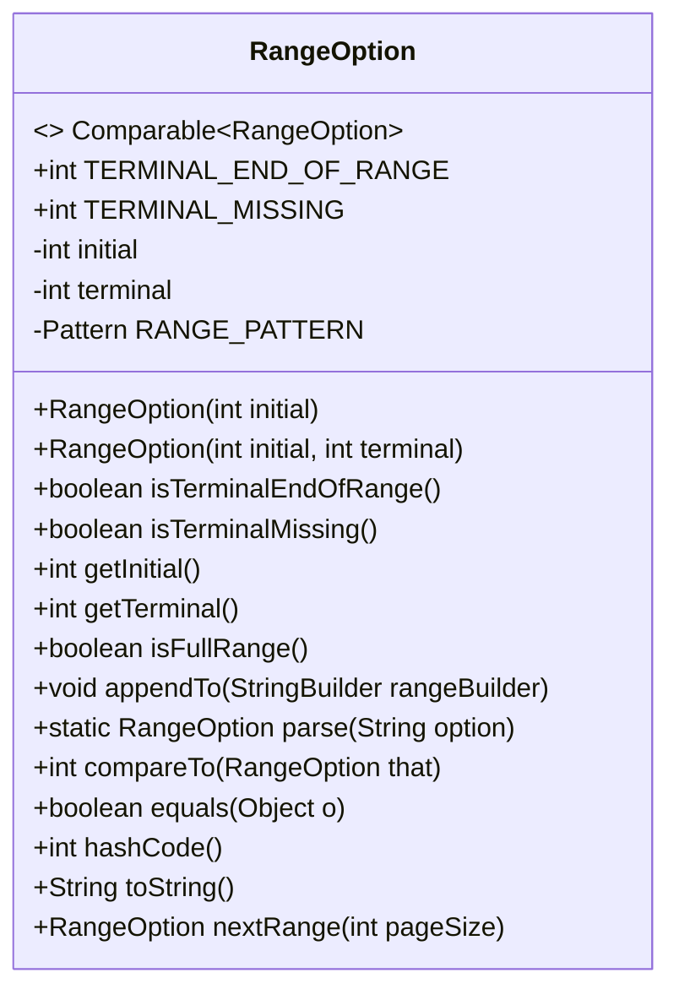

# 基础信息

|      |      |
|------|------|
| 名称 | RangeOption |
| 编码语言 | .java |
| 代码路径 | spring-ldap/core/src/main/java/org/springframework/ldap/core/support/RangeOption.java |
| 包名 | org.springframework.ldap.core.support |
| 依赖项 | ['java.util.regex.Matcher', 'java.util.regex.Pattern'] |
| 概述说明 | RangeOption类实现范围操作，支持比较、解析和生成，包含初始和终止值。 |

# 说明

RangeOption类用于实现范围操作，包含初始值和终止值两个关键属性。该类支持范围比较功能，能够判断两个范围是否相等或包含关系。此外，RangeOption类还提供范围解析能力，可以从字符串或其他格式中提取范围信息，并支持生成范围表示，将范围转换为字符串或其他格式。这些功能使得RangeOption类在处理范围相关操作时非常实用和高效。

# 类列表 Class Summary

| 名称   | 类型  | 说明 |
|-------|------|-------------|
| RangeOption | class | RangeOption类实现范围操作，包含初始和终止值，支持范围比较、解析和生成。 |

## 类 RangeOption

|      |      |
|------|------|
| 访问范围 | None |
| 类型 | class |
| 名称 | RangeOption |
| 说明 | RangeOption类实现范围操作，包含初始和终止值，支持范围比较、解析和生成。 |

### UML类图

**描述**：`RangeOption` 类实现了 `Comparable` 接口，用于表示一个范围选项。该类包含初始值和终止值，并提供了一系列方法来检查范围的属性、解析字符串、比较范围、生成下一个范围等。`RangeOption` 类还重写了 `equals`、`hashCode` 和 `toString` 方法，以确保对象的正确比较和字符串表示。

### 内部方法调用关系图

```mermaid
graph TD
    A["类RangeOption"]
    B["常量: TERMINAL_END_OF_RANGE = -1"]
    C["常量: TERMINAL_MISSING = -2"]
    D["属性: int initial = 0"]
    E["属性: int terminal = TERMINAL_END_OF_RANGE"]
    F["静态常量: Pattern RANGE_PATTERN"]
    G["构造方法: RangeOption(int initial)"]
    H["构造方法: RangeOption(int initial, int terminal)"]
    I["方法: boolean isTerminalEndOfRange()"]
    J["方法: boolean isTerminalMissing()"]
    K["方法: int getInitial()"]
    L["方法: int getTerminal()"]
    M["方法: boolean isFullRange()"]
    N["方法: void appendTo(StringBuilder rangeBuilder)"]
    O["静态方法: RangeOption parse(String option)"]
    P["重写方法: int compareTo(RangeOption that)"]
    Q["重写方法: boolean equals(Object o)"]
    R["重写方法: int hashCode()"]
    S["重写方法: String toString()"]
    T["方法: RangeOption nextRange(int pageSize)"]

    A --> B
    A --> C
    A --> D
    A --> E
    A --> F
    A --> G
    A --> H
    A --> I
    A --> J
    A --> K
    A --> L
    A --> M
    A --> N
    A --> O
    A --> P
    A --> Q
    A --> R
    A --> S
    A --> T
```

这段代码定义了一个名为 `RangeOption` 的类，该类实现了 `Comparable` 接口，用于表示和处理范围选项。类中包含多个方法和属性，用于初始化、比较、解析和生成范围选项。代码通过构造方法、静态方法和实例方法来实现对范围选项的操作，并且重写了 `compareTo`、`equals`、`hashCode` 和 `toString` 方法以确保类的正确行为。

### 字段列表 Field List

| 名称  | 类型  | 说明 |
|-------|-------|------|
| initial = 0 | int | 定义一个私有整型变量initial，初始值为0。 |
| TERMINAL_MISSING = -2 | int | 静态常量TERMINAL_MISSING值为-2。 |
| TERMINAL_END_OF_RANGE = -1 | int | 定义常量TERMINAL_END_OF_RANGE，值为-1。 |
| terminal = TERMINAL_END_OF_RANGE | int | 私有整型变量terminal初始化为范围结束值。 |
| RANGE_PATTERN = Pattern.compile("^Range=([0-9]+)(-([0-9]+|\\*))?$",			Pattern.CASE_INSENSITIVE) | Pattern | 定义了一个静态常量RANGE_PATTERN，用于匹配Range格式的正则表达式。 |

### 方法列表 Method List

| 名称  | 类型  | 说明 |
|-------|-------|------|
| getInitial | int | 获取初始值的方法。 |
| getTerminal | int | 返回当前对象的终端值。 |
| isTerminalEndOfRange | boolean | 方法判断终端是否为范围结束。 |
| isTerminalMissing | boolean | 方法isTerminalMissing检查终端是否缺失。 |
| parse | RangeOption | 解析字符串为RangeOption对象，包含初始值和可选终止值。 |
| appendTo | void | 方法将范围信息追加到StringBuilder中，包含初始值和可选终止值。 |
| toString | String | 重写toString方法，使用StringBuilder构建并返回字符串。 |
| nextRange | RangeOption | 检查范围终点和页面大小，生成并返回新的范围选项。 |
| isFullRange | boolean | 判断范围是否完整，初始值为0且终止值为范围终点。 |
| hashCode | int | 重写hashCode方法，结合initial和terminal生成哈希值。 |
| equals | boolean | 重写equals方法，比较对象引用、类型及属性值。 |
| compareTo | int | 比较RangeOption对象，初始值不同抛出异常，终端值相同返回0，缺失终端抛出异常，根据终端值大小返回1或-1。 |

