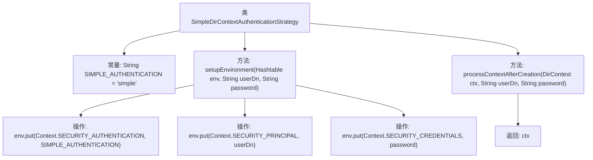

# 基础信息

|      |      |
|------|------|
| 名称 | SimpleDirContextAuthenticationStrategy |
| 编码语言 | .java |
| 代码路径 | spring-ldap/core/src/main/java/org/springframework/ldap/core/support/SimpleDirContextAuthenticationStrategy.java |
| 包名 | org.springframework.ldap.core.support |
| 依赖项 | ['java.util.Hashtable', 'javax.naming.Context', 'javax.naming.directory.DirContext'] |
| 概述说明 | SimpleDirContextAuthenticationStrategy类实现LDAP认证，管理环境变量和上下文处理。 |

# 说明

SimpleDirContextAuthenticationStrategy类实现了简单的LDAP认证策略。该类负责设置相关的环境变量，并处理与LDAP服务器的上下文交互，以确保认证过程的顺利进行。通过这种方式，该类提供了一种直接且有效的方法来管理LDAP认证的配置和执行。

# 类列表 Class Summary

| 名称   | 类型  | 说明 |
|-------|------|-------------|
| SimpleDirContextAuthenticationStrategy | class | SimpleDirContextAuthenticationStrategy类实现简单LDAP认证策略，设置环境变量并处理上下文。 |


## 类 SimpleDirContextAuthenticationStrategy

|      |      |
|------|------|
| 访问范围 | public |
| 类型 | class |
| 名称 | SimpleDirContextAuthenticationStrategy |
| 说明 | SimpleDirContextAuthenticationStrategy类实现简单LDAP认证策略，设置环境变量并处理上下文。 |


### UML类图

```mermaid
classDiagram
    class SimpleDirContextAuthenticationStrategy {
        -String SIMPLE_AUTHENTICATION
        +void setupEnvironment(Hashtable~String, Object~ env, String userDn, String password)
        +DirContext processContextAfterCreation(DirContext ctx, String userDn, String password)
    }

    class <<Interface>> DirContextAuthenticationStrategy {
        <<Interface>>
        +void setupEnvironment(Hashtable~String, Object~ env, String userDn, String password)
        +DirContext processContextAfterCreation(DirContext ctx, String userDn, String password)
    }

    SimpleDirContextAuthenticationStrategy ..|> DirContextAuthenticationStrategy : 实现
```

这段代码定义了一个名为 `SimpleDirContextAuthenticationStrategy` 的类，它实现了 `DirContextAuthenticationStrategy` 接口。该类主要用于处理LDAP（轻量级目录访问协议）的简单认证策略。`setupEnvironment` 方法用于设置环境变量，包括认证方式、用户DN（Distinguished Name）和密码；`processContextAfterCreation` 方法在创建上下文后进行处理，并返回处理后的上下文。通过实现接口，该类确保了LDAP认证策略的一致性和可扩展性。


### 内部方法调用关系图



这段代码定义了一个名为`SimpleDirContextAuthenticationStrategy`的类，实现了LDAP认证策略。该类包含两个主要方法：`setupEnvironment`用于设置LDAP环境变量，包括认证方式、用户DN和密码；`processContextAfterCreation`用于处理LDAP上下文创建后的操作，直接返回传入的上下文对象。流程图展示了类的结构及其方法的调用关系。

### 字段列表 Field List

| 名称  | 类型  | 说明 |
|-------|-------|------|
| SIMPLE_AUTHENTICATION = "simple" | String | 定义私有静态常量SIMPLE_AUTHENTICATION，值为"simple"。 |

### 方法列表 Method List

| 名称  | 类型  | 说明 |
|-------|-------|------|
| setupEnvironment | void | 设置环境变量，包括认证方式、用户DN和密码。 |
| processContextAfterCreation | DirContext | 处理创建后的DirContext，返回原上下文。 |


