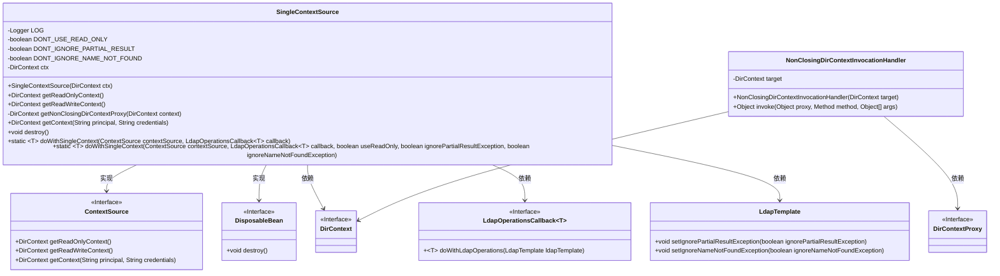

# 基础信息

|      |      |
|------|------|
| 名称 | SingleContextSource |
| 编码语言 | .java |
| 代码路径 | spring-ldap/core/src/main/java/org/springframework/ldap/core/support/SingleContextSource.java |
| 包名 | org.springframework.ldap.core.support |
| 依赖项 | ['java.lang.reflect.InvocationHandler', 'java.lang.reflect.InvocationTargetException', 'java.lang.reflect.Method', 'java.lang.reflect.Proxy', 'javax.naming.directory.DirContext', 'org.slf4j.Logger', 'org.slf4j.LoggerFactory', 'org.springframework.beans.factory.DisposableBean', 'org.springframework.ldap.core.ContextSource', 'org.springframework.ldap.core.DirContextProxy', 'org.springframework.ldap.core.LdapTemplate', 'org.springframework.ldap.support.LdapUtils'] |
| 概述说明 | SingleContextSource类实现ContextSource接口，管理DirContext，提供读写代理并确保连接关闭。 |

# 说明

SingleContextSource类实现了ContextSource接口，主要负责管理DirContext对象。它提供了对DirContext的读写操作代理，确保在执行完相关操作后，连接能够被正确关闭，从而有效管理资源并防止连接泄漏。

# 类列表 Class Summary

| 名称   | 类型  | 说明 |
|-------|------|-------------|
| SingleContextSource | class | SingleContextSource类实现ContextSource接口，管理DirContext，提供读写操作代理，并确保连接在操作完成后关闭。 |

## 类 SingleContextSource

|      |      |
|------|------|
| 访问范围 | public |
| 类型 | class |
| 名称 | SingleContextSource |
| 说明 | SingleContextSource类实现ContextSource接口，管理DirContext，提供读写操作代理，并确保连接在操作完成后关闭。 |

### UML类图

**描述：**  
`SingleContextSource` 类实现了 `ContextSource` 和 `DisposableBean` 接口，用于管理 `DirContext` 的生命周期和操作。它提供了获取只读和读写上下文的方法，并通过 `NonClosingDirContextInvocationHandler` 代理确保上下文不会被意外关闭。`doWithSingleContext` 方法允许在单个上下文中执行 LDAP 操作，并确保资源在使用后被正确释放。

### 内部方法调用关系图

```mermaid
graph TD
    A["类SingleContextSource"]
    B["属性: Logger LOG"]
    C["属性: boolean DONT_USE_READ_ONLY"]
    D["属性: boolean DONT_IGNORE_PARTIAL_RESULT"]
    E["属性: boolean DONT_IGNORE_NAME_NOT_FOUND"]
    F["属性: DirContext ctx"]
    G["构造方法: SingleContextSource(DirContext ctx)"]
    H["方法: DirContext getReadOnlyContext()"]
    I["方法: DirContext getReadWriteContext()"]
    J["方法: DirContext getNonClosingDirContextProxy(DirContext context)"]
    K["方法: DirContext getContext(String principal, String credentials)"]
    L["方法: void destroy()"]
    M["静态方法: <T> T doWithSingleContext(ContextSource contextSource, LdapOperationsCallback<T> callback)"]
    N["静态方法: <T> T doWithSingleContext(ContextSource contextSource, LdapOperationsCallback<T> callback, boolean useReadOnly, boolean ignorePartialResultException, boolean ignoreNameNotFoundException)"]
    O["内部类: NonClosingDirContextInvocationHandler"]
    P["属性: DirContext target"]
    Q["构造方法: NonClosingDirContextInvocationHandler(DirContext target)"]
    R["方法: Object invoke(Object proxy, Method method, Object[] args)"]

    A --> B
    A --> C
    A --> D
    A --> E
    A --> F
    A --> G
    A --> H
    A --> I
    A --> J
    A --> K
    A --> L
    A --> M
    A --> N
    A --> O
    O --> P
    O --> Q
    O --> R
```

这段代码定义了一个名为 `SingleContextSource` 的类，它实现了 `ContextSource` 和 `DisposableBean` 接口。该类主要用于管理和操作 `DirContext` 实例，确保在LDAP操作中使用相同的连接。代码中包含多个方法，如获取只读或读写上下文、销毁上下文等。此外，还定义了一个内部类 `NonClosingDirContextInvocationHandler`，用于代理 `DirContext` 的操作，确保不会关闭目标上下文。流程图展示了类的主要结构及其内部方法之间的关系。

### 字段列表 Field List

| 名称  | 类型  | 说明 |
|-------|-------|------|
| LOG = LoggerFactory.getLogger(SingleContextSource.class) | Logger | 单例上下文源类的日志记录器静态常量声明。 |
| DONT_USE_READ_ONLY = false | boolean | 私有静态常量DONT_USE_READ_ONLY设为false。 |
| ctx | DirContext | 私有不可变变量ctx类型为DirContext。 |
| DONT_IGNORE_NAME_NOT_FOUND = false | boolean | 定义静态常量DONT_IGNORE_NAME_NOT_FOUND，值为false。 |
| DONT_IGNORE_PARTIAL_RESULT = false | boolean | 私有静态常量DONT_IGNORE_PARTIAL_RESULT设为false。 |

### 方法列表 Method List

| 名称  | 类型  | 说明 |
|-------|-------|------|
| getContext | DirContext | 该方法抛出异常，表示不支持获取上下文操作。 |
| doWithSingleContext | T | 静态方法执行单上下文操作，支持自定义回调。 |
| getNonClosingDirContextProxy | DirContext | 创建不关闭的DirContext代理实例。 |
| destroy | void | 销毁方法尝试关闭上下文，捕获异常并记录警告。 |
| getReadWriteContext | DirContext | 获取读写上下文，返回非关闭代理的目录上下文。 |
| getReadOnlyContext | DirContext | 获取只读目录上下文代理对象。 |
| doWithSingleContext | T | 静态方法处理单上下文LDAP操作，支持只读、异常忽略和资源销毁。 |

