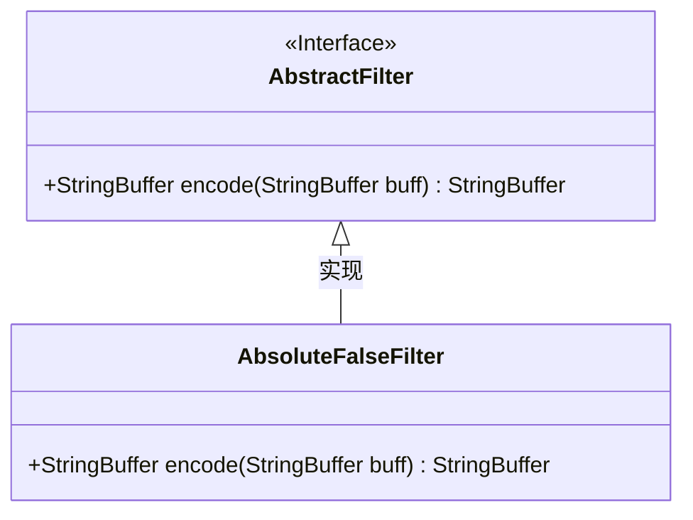
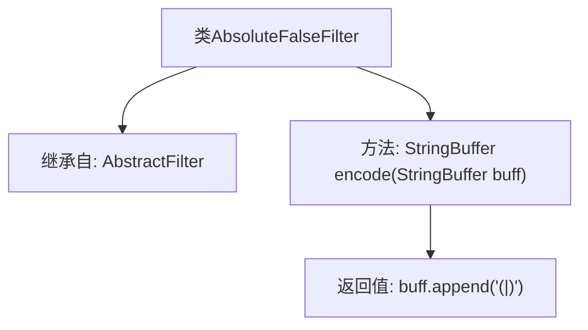

# 基础信息

|      |      |
|------|------|
| 名称 | AbsoluteFalseFilter |
| 编码语言 | .java |
| 代码路径 | spring-ldap/core/src/main/java/org/springframework/ldap/filter/AbsoluteFalseFilter.java |
| 包名 | org.springframework.ldap.filter |
| 依赖项 | [] |
| 概述说明 | AbsoluteFalseFilter继承AbstractFilter，encode方法在buff后追加"|)"。 |

# 说明

AbsoluteFalseFilter类继承自AbstractFilter类，其encode方法在输入缓冲区buff的末尾追加字符串"|)"。这一操作表明该类用于对数据进行特定的过滤处理，具体表现为在数据末尾添加特定字符。通过继承AbstractFilter，AbsoluteFalseFilter类能够利用父类的过滤机制，并在其基础上实现自定义的过滤逻辑。

# 类列表 Class Summary

| 名称   | 类型  | 说明 |
|-------|------|-------------|
| AbsoluteFalseFilter | class | AbsoluteFalseFilter类继承AbstractFilter，encode方法在buff后追加"|)"。 |

## 类 AbsoluteFalseFilter

|      |      |
|------|------|
| 访问范围 | public |
| 类型 | class |
| 名称 | AbsoluteFalseFilter |
| 说明 | AbsoluteFalseFilter类继承AbstractFilter，encode方法在buff后追加"|)"。 |

### UML类图

**描述：**  
`AbsoluteFalseFilter` 类继承自 `AbstractFilter` 接口，并实现了 `encode` 方法。该方法接收一个 `StringBuffer` 类型的参数 `buff`，并在其末尾追加字符串 `"(|)"`，然后返回修改后的 `StringBuffer`。该设计展示了接口与实现类之间的继承关系，`AbsoluteFalseFilter` 通过实现 `AbstractFilter` 接口来提供具体的功能。

### 内部方法调用关系图

这段代码定义了一个名为 `AbsoluteFalseFilter` 的类，该类继承自 `AbstractFilter`。类中包含一个 `encode` 方法，该方法接收一个 `StringBuffer` 类型的参数 `buff`，并在其末尾追加字符串 `"(|)"`，最后返回修改后的 `StringBuffer` 对象。该代码的主要作用是对传入的字符串缓冲区进行简单的格式化操作。

### 字段列表 Field List

| 名称  | 类型  | 说明 |
|-------|-------|------|

### 方法列表 Method List

| 名称  | 类型  | 说明 |
|-------|-------|------|
| encode | StringBuffer | 方法encode在StringBuffer末尾追加字符串"(|)"。 |

