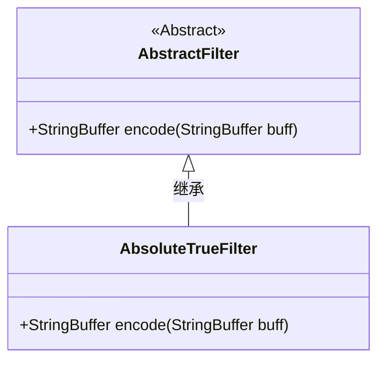
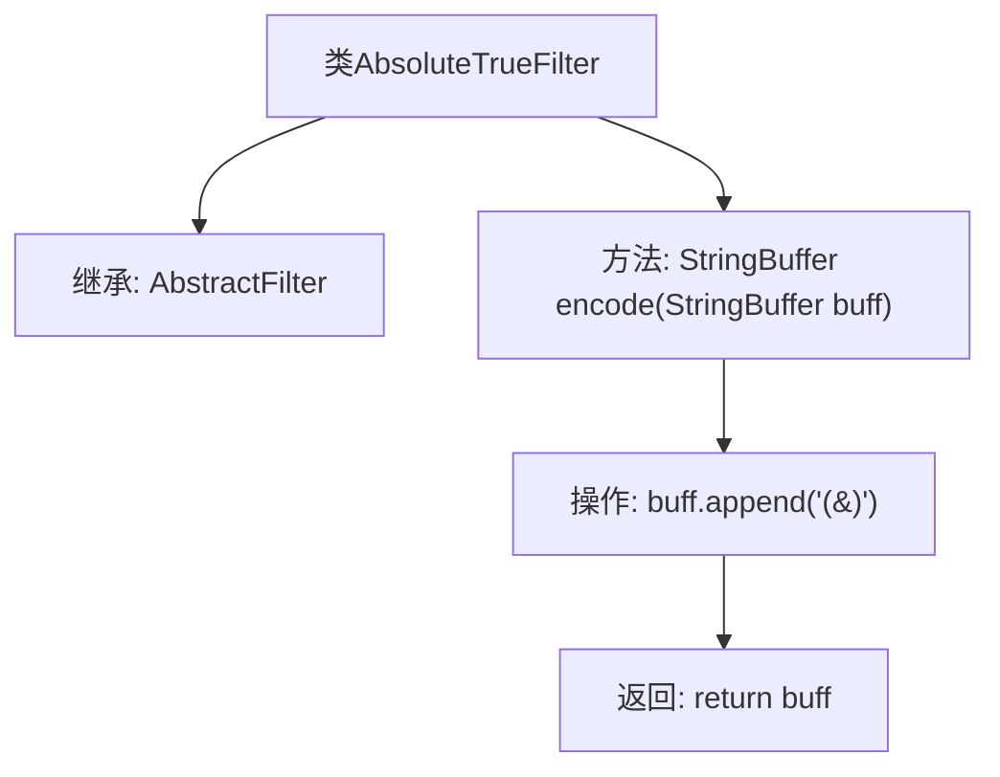

# 基础信息

|      |      |
|------|------|
| 名称 | AbsoluteTrueFilter |
| 编码语言 | .java |
| 代码路径 | spring-ldap/core/src/main/java/org/springframework/ldap/filter/AbsoluteTrueFilter.java |
| 包名 | org.springframework.ldap.filter |
| 依赖项 | [] |
| 概述说明 | AbsoluteTrueFilter继承AbstractFilter，encode方法在buff后追加"(&)"并返回。 |

# 说明

AbsoluteTrueFilter类继承自AbstractFilter类，其encode方法在传入的buff字符串后追加"(&)"，并返回修改后的字符串。

# 类列表 Class Summary

| 名称   | 类型  | 说明 |
|-------|------|-------------|
| AbsoluteTrueFilter | class | AbsoluteTrueFilter类扩展AbstractFilter，encode方法在buff后追加"(&)"并返回。 |

## 类 AbsoluteTrueFilter

|      |      |
|------|------|
| 访问范围 | public |
| 类型 | class |
| 名称 | AbsoluteTrueFilter |
| 说明 | AbsoluteTrueFilter类扩展AbstractFilter，encode方法在buff后追加"(&)"并返回。 |

### UML类图

这段代码定义了一个名为 `AbsoluteTrueFilter` 的类，它继承自 `AbstractFilter` 抽象类。`AbsoluteTrueFilter` 类实现了 `encode` 方法，该方法接收一个 `StringBuffer` 类型的参数 `buff`，并在其末尾追加字符串 `"(&)"`，然后返回修改后的 `StringBuffer`。这个类的主要作用是生成一个特定的字符串格式，可能用于过滤或编码操作。

### 内部方法调用关系图

这段代码定义了一个名为 `AbsoluteTrueFilter` 的类，该类继承自 `AbstractFilter`。类中包含一个 `encode` 方法，该方法接收一个 `StringBuffer` 类型的参数 `buff`，并在其末尾追加字符串 `"(&)"`，最后返回修改后的 `StringBuffer`。流程图清晰地展示了类的继承关系以及方法内部的操作步骤。

### 字段列表 Field List

| 名称  | 类型  | 说明 |
|-------|-------|------|

### 方法列表 Method List

| 名称  | 类型  | 说明 |
|-------|-------|------|
| encode | StringBuffer | 该方法在StringBuffer末尾追加"(&)"并返回。 |

