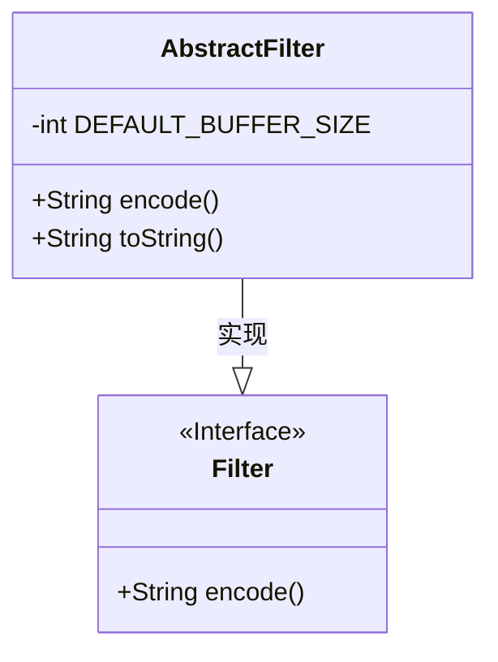
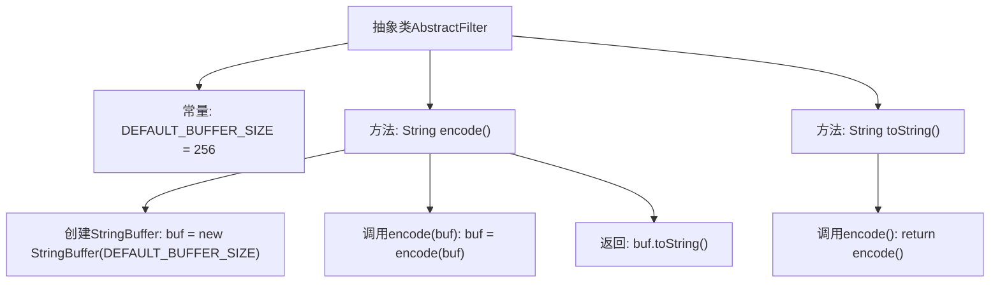

# 基础信息

|      |      |
|------|------|
| 名称 | AbstractFilter |
| 编码语言 | .java |
| 代码路径 | spring-ldap/core/src/main/java/org/springframework/ldap/filter/AbstractFilter.java |
| 包名 | org.springframework.ldap.filter |
| 依赖项 | [] |
| 概述说明 | AbstractFilter类实现Filter接口，默认缓冲区256，encode和toString返回编码字符串。 |

# 说明

AbstractFilter类实现了Filter接口，默认缓冲区大小为256。该类提供了两个主要方法：encode和toString。这两个方法均返回编码后的字符串。通过实现Filter接口，AbstractFilter类具备了过滤功能，且默认缓冲区大小设置为256，适用于需要处理中等规模数据的场景。encode方法用于对输入数据进行编码处理，而toString方法则返回编码后的字符串表示，便于后续使用或展示。

# 类列表 Class Summary

| 名称   | 类型  | 说明 |
|-------|------|-------------|
| AbstractFilter | class | AbstractFilter类实现Filter接口，默认缓冲区大小256，encode和toString方法均返回编码后的字符串。 |

## 类 AbstractFilter

|      |      |
|------|------|
| 访问范围 | public abstract |
| 类型 | class |
| 名称 | AbstractFilter |
| 说明 | AbstractFilter类实现Filter接口，默认缓冲区大小256，encode和toString方法均返回编码后的字符串。 |

### UML类图

**描述：**
`AbstractFilter` 是一个抽象类，实现了 `Filter` 接口。它包含一个私有常量 `DEFAULT_BUFFER_SIZE`，用于指定默认的缓冲区大小。`AbstractFilter` 提供了 `encode()` 方法的默认实现，该方法使用 `StringBuffer` 进行编码，并返回编码后的字符串。`toString()` 方法则直接调用 `encode()` 方法，返回相同的字符串。`Filter` 是一个接口，定义了 `encode()` 方法，`AbstractFilter` 通过实现该接口来提供具体的编码功能。

### 内部方法调用关系图

这段代码定义了一个抽象类 `AbstractFilter`，其中包含一个常量 `DEFAULT_BUFFER_SIZE` 和两个方法 `encode()` 和 `toString()`。`encode()` 方法首先创建一个 `StringBuffer` 对象，然后调用 `encode(buf)` 方法对其进行编码，最后返回编码后的字符串。`toString()` 方法则直接调用 `encode()` 方法并返回其结果。这段代码展示了如何通过方法调用来实现字符串的编码和转换。

### 字段列表 Field List

| 名称  | 类型  | 说明 |
|-------|-------|------|
| DEFAULT_BUFFER_SIZE = 256 | int | 定义默认缓冲区大小为256的私有静态常量。 |

### 方法列表 Method List

| 名称  | 类型  | 说明 |
|-------|-------|------|
| toString | String | 重写toString方法，返回encode()结果。 |
| encode | String | 重写encode方法，使用StringBuffer编码并返回字符串。 |

