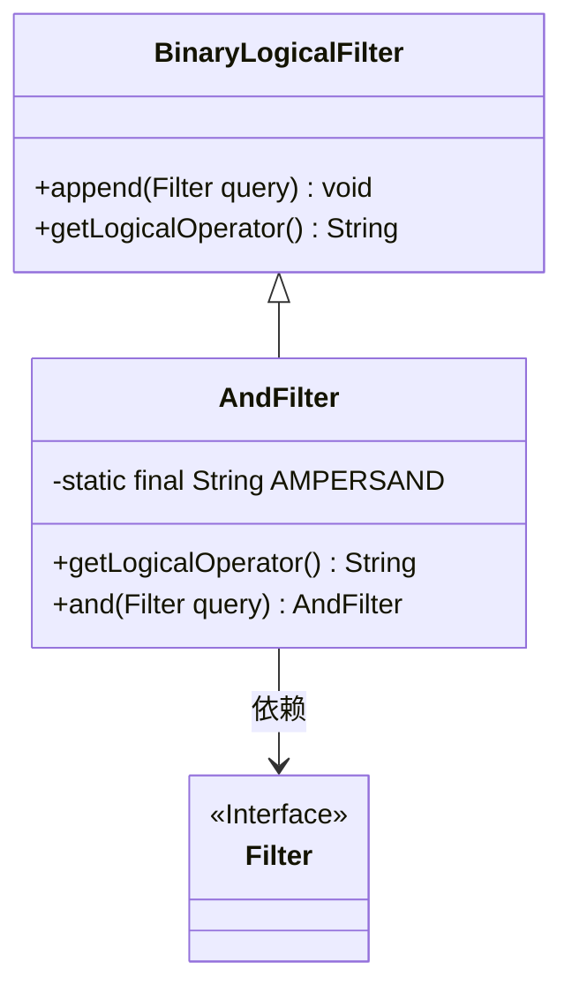
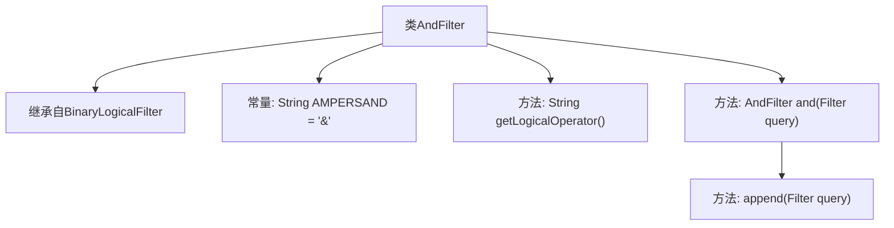

# 基础信息

|      |      |
|------|------|
| 名称 | AndFilter |
| 编码语言 | .java |
| 代码路径 | spring-ldap/core/src/main/java/org/springframework/ldap/filter/AndFilter.java |
| 包名 | org.springframework.ldap.filter |
| 依赖项 | [] |
| 概述说明 | AndFilter类继承BinaryLogicalFilter，实现AND逻辑，提供查询添加方法。 |

# 说明

AndFilter类继承自BinaryLogicalFilter类，专门用于实现AND逻辑操作。该类提供了一种方法来添加查询条件，确保所有添加的条件都必须同时满足，从而实现逻辑与的功能。通过继承和扩展BinaryLogicalFilter，AndFilter类能够有效地处理复杂的查询需求，确保查询结果的准确性和一致性。

# 类列表 Class Summary

| 名称   | 类型  | 说明 |
|-------|------|-------------|
| AndFilter | class | AndFilter类继承BinaryLogicalFilter，实现AND逻辑操作，提供添加查询方法。 |

## 类 AndFilter

|      |      |
|------|------|
| 访问范围 | public |
| 类型 | class |
| 名称 | AndFilter |
| 说明 | AndFilter类继承BinaryLogicalFilter，实现AND逻辑操作，提供添加查询方法。 |

### UML类图

类图描述：`AndFilter` 类继承自 `BinaryLogicalFilter`，并实现了 `and` 方法用于添加查询到 AND 表达式中。`BinaryLogicalFilter` 类提供了 `append` 方法和 `getLogicalOperator` 方法。`AndFilter` 依赖于 `Filter` 接口，该接口可能定义了过滤器的基本行为。整个结构展示了 AND 过滤器的实现及其与父类和接口的关系。

### 内部方法调用关系图

这段代码定义了一个名为 `AndFilter` 的类，它继承自 `BinaryLogicalFilter`。类中包含一个常量 `AMPERSAND`，表示逻辑与运算符 `&`。`getLogicalOperator` 方法返回该常量。`and` 方法用于将一个新的查询表达式追加到现有的 AND 表达式中，并返回当前对象以便链式调用。`append` 方法用于实际执行追加操作。

### 字段列表 Field List

| 名称  | 类型  | 说明 |
|-------|-------|------|
| AMPERSAND = "&" | String | 定义常量AMPERSAND，值为"&"。 |

### 方法列表 Method List

| 名称  | 类型  | 说明 |
|-------|-------|------|
| getLogicalOperator | String | 该方法返回逻辑运算符"&"。 |
| and | AndFilter | `andFilter`方法将传入的`Filter`对象追加并返回当前实例。 |

