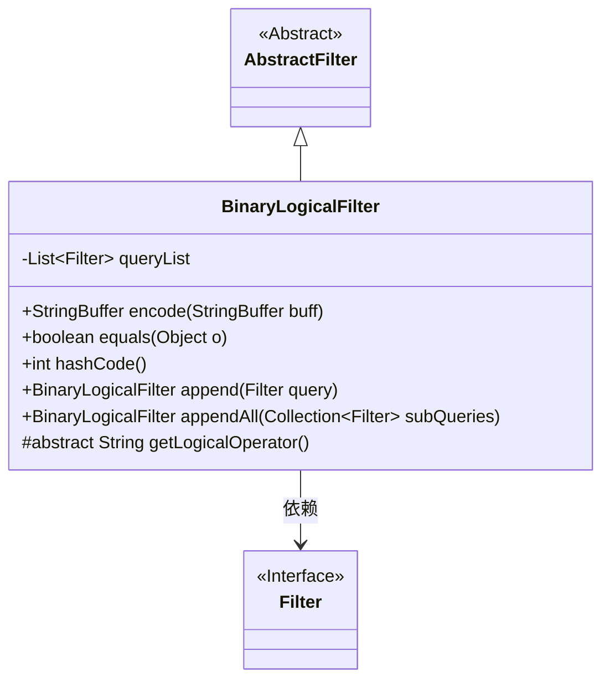
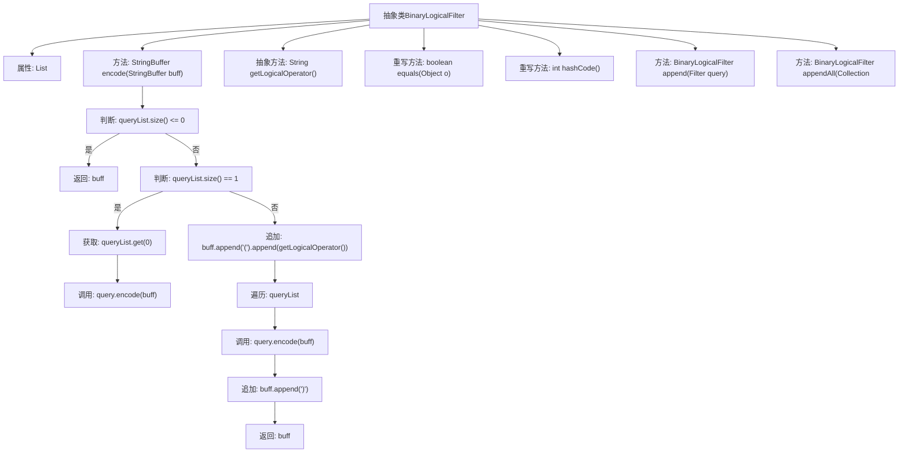

# 基础信息

|      |      |
|------|------|
| 名称 | BinaryLogicalFilter |
| 编码语言 | .java |
| 代码路径 | spring-ldap/core/src/main/java/org/springframework/ldap/filter/BinaryLogicalFilter.java |
| 包名 | org.springframework.ldap.filter |
| 依赖项 | ['java.util.Collection', 'java.util.LinkedList', 'java.util.List'] |
| 概述说明 | BinaryLogicalFilter继承AbstractFilter，处理逻辑过滤器，支持添加和编码查询，需子类实现逻辑运算符。 |

# 说明

BinaryLogicalFilter类继承自AbstractFilter，用于处理逻辑过滤器。该类支持添加和编码查询操作，并要求子类实现具体的逻辑运算符。这一设计使得逻辑过滤器的处理更加灵活和可扩展，同时确保了核心功能的统一性和一致性。

# 类列表 Class Summary

| 名称   | 类型  | 说明 |
|-------|------|-------------|
| BinaryLogicalFilter | class | BinaryLogicalFilter类继承AbstractFilter，处理逻辑过滤器，支持添加和编码查询，需子类实现逻辑运算符。 |

## 类 BinaryLogicalFilter

|      |      |
|------|------|
| 访问范围 | public abstract |
| 类型 | class |
| 名称 | BinaryLogicalFilter |
| 说明 | BinaryLogicalFilter类继承AbstractFilter，处理逻辑过滤器，支持添加和编码查询，需子类实现逻辑运算符。 |

### UML类图

这段代码定义了一个抽象类 `BinaryLogicalFilter`，它继承自 `AbstractFilter`，并依赖于 `Filter` 接口。`BinaryLogicalFilter` 类包含一个 `queryList` 成员变量，用于存储 `Filter` 类型的对象。该类提供了 `encode` 方法，用于将 `queryList` 中的过滤器编码为字符串，并提供了 `append` 和 `appendAll` 方法用于添加过滤器。此外，`BinaryLogicalFilter` 还实现了 `equals` 和 `hashCode` 方法，并定义了一个抽象方法 `getLogicalOperator`，要求子类实现以返回逻辑操作符。

### 内部方法调用关系图

**描述：**  
这段代码定义了一个抽象类`BinaryLogicalFilter`，用于处理逻辑过滤器的编码操作。类中包含一个`queryList`属性，用于存储过滤器列表。`encode`方法根据`queryList`的大小进行不同的处理：如果列表为空，直接返回输入缓冲区；如果列表只有一个元素，调用该元素的`encode`方法；否则，将逻辑操作符和所有过滤器的编码结果追加到缓冲区中。类还提供了`equals`和`hashCode`方法的重写，以及`append`和`appendAll`方法用于添加过滤器。

### 字段列表 Field List

| 名称  | 类型  | 说明 |
|-------|-------|------|
| queryList = new LinkedList<>() | List<Filter> | 声明并初始化一个用于存储过滤条件的链表。 |

### 方法列表 Method List

| 名称  | 类型  | 说明 |
|-------|-------|------|
| getLogicalOperator | String | 获取逻辑运算符的抽象方法。 |
| hashCode | int | 重写hashCode方法，返回queryList的哈希值，若为空则返回0。 |
| appendAll | BinaryLogicalFilter | 该方法将多个过滤器添加到查询列表中并返回当前对象。 |
| append | BinaryLogicalFilter | 方法将过滤器添加到查询列表并返回当前对象。 |
| equals | boolean | 重写equals方法，比较对象和查询列表是否相等。 |
| encode | StringBuffer | 方法根据查询列表大小决定编码逻辑，空列表返回原缓冲，单个查询直接编码，多个查询添加括号和逻辑运算符。 |

