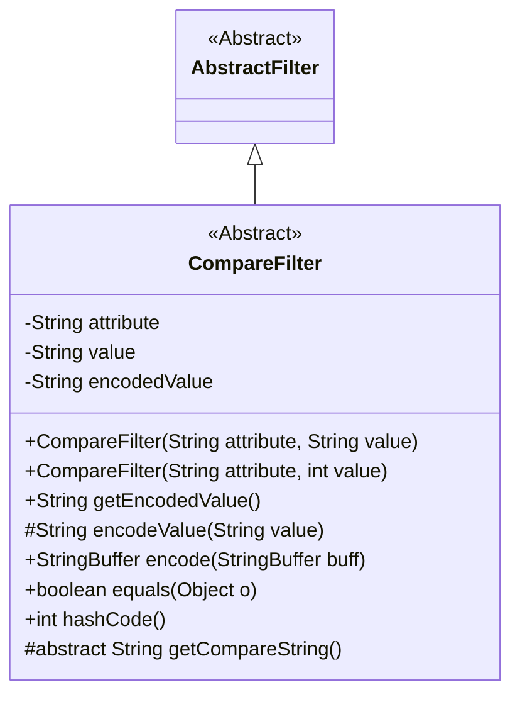
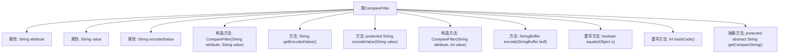

# 基础信息

|      |      |
|------|------|
| 名称 | CompareFilter |
| 编码语言 | .java |
| 代码路径 | spring-ldap/core/src/main/java/org/springframework/ldap/filter/CompareFilter.java |
| 包名 | org.springframework.ldap.filter |
| 依赖项 | ['org.springframework.ldap.support.LdapEncoder'] |
| 概述说明 | CompareFilter类用于LDAP过滤，支持字符串和整数输入，提供编码和比较功能。 |

# 说明

CompareFilter类用于LDAP过滤，支持处理属性和值，并提供编码和比较功能。该类能够处理字符串和整数类型的输入，并包含对属性、值以及编码值的支持。其主要功能包括对输入值进行编码以及执行比较操作，适用于LDAP过滤场景中的多种数据类型处理需求。

# 类列表 Class Summary

| 名称   | 类型  | 说明 |
|-------|------|-------------|
| CompareFilter | class | CompareFilter类用于LDAP过滤，包含属性、值和编码值，支持字符串和整数输入，提供编码和比较功能。 |

## 类 CompareFilter

|      |      |
|------|------|
| 访问范围 | public abstract |
| 类型 | class |
| 名称 | CompareFilter |
| 说明 | CompareFilter类用于LDAP过滤，包含属性、值和编码值，支持字符串和整数输入，提供编码和比较功能。 |

### UML类图

**描述：**
`CompareFilter` 是一个抽象类，继承自 `AbstractFilter`，用于处理比较过滤器的逻辑。它包含三个私有成员变量：`attribute`、`value` 和 `encodedValue`，并提供了两个构造函数，分别接受 `String` 和 `int` 类型的值。`CompareFilter` 提供了编码、比较和哈希计算的方法，并要求子类实现 `getCompareString` 方法以返回比较操作符。该类主要用于构建 LDAP 查询过滤器。

### 内部方法调用关系图

这段代码定义了一个抽象类 `CompareFilter`，用于处理比较过滤器的逻辑。类中包含三个属性：`attribute`、`value` 和 `encodedValue`，分别表示过滤器的属性、值和编码后的值。类提供了两个构造方法，用于初始化这些属性，并包含多个方法，如 `getEncodedValue`、`encodeValue`、`encode`、`equals` 和 `hashCode`。此外，类还定义了一个抽象方法 `getCompareString`，需要在子类中实现以返回比较操作符。

### 字段列表 Field List

| 名称  | 类型  | 说明 |
|-------|-------|------|
| value | String | 声明一个私有的不可变字符串变量value。 |
| attribute | String | 声明一个私有不可变的字符串属性。 |
| encodedValue | String | 私有字符串变量encodedValue。 |

### 方法列表 Method List

| 名称  | 类型  | 说明 |
|-------|-------|------|
| getCompareString | String | 获取比较字符串的受保护抽象方法。 |
| getEncodedValue | String | 该方法返回当前对象的encodedValue属性值。 |
| encodeValue | String | 该方法对字符串进行LDAP编码，防止注入攻击。 |
| encode | StringBuffer | 方法encode在StringBuffer中添加括号、属性、比较字符串和编码值。 |
| hashCode | int | 重写hashCode方法，结合attribute和value的哈希值计算。 |
| equals | boolean | 重写equals方法，比较对象属性是否一致。 |

