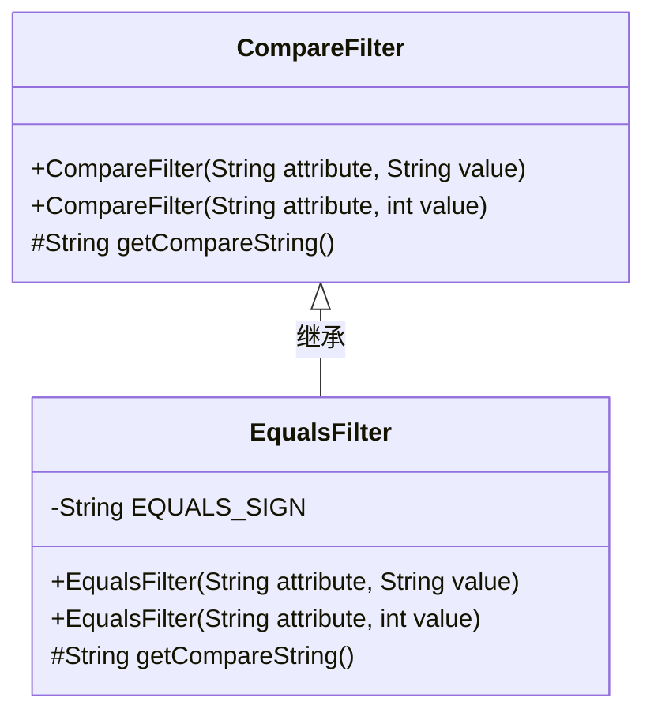
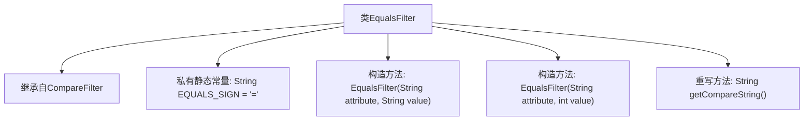

# 基础信息

|      |      |
|------|------|
| 名称 | EqualsFilter |
| 编码语言 | .java |
| 代码路径 | spring-ldap/core/src/main/java/org/springframework/ldap/filter/EqualsFilter.java |
| 包名 | org.springframework.ldap.filter |
| 依赖项 | [] |
| 概述说明 | EqualsFilter继承CompareFilter，支持字符串和整数的等值比较，返回"="。 |

# 说明

EqualsFilter类继承自CompareFilter，专门用于处理字符串和整数值的等值比较操作。其核心功能是判断两个值是否相等，并返回等号"="作为比较结果。该类的设计旨在简化等值比较的逻辑，适用于需要精确匹配的场景，提供了一种高效且直观的比较方式。

# 类列表 Class Summary

| 名称   | 类型  | 说明 |
|-------|------|-------------|
| EqualsFilter | class | EqualsFilter类继承CompareFilter，支持字符串和整数值的等值比较，返回等号"="。 |

## 类 EqualsFilter

|      |      |
|------|------|
| 访问范围 | public |
| 类型 | class |
| 名称 | EqualsFilter |
| 说明 | EqualsFilter类继承CompareFilter，支持字符串和整数值的等值比较，返回等号"="。 |

### UML类图

### 描述
`EqualsFilter` 类继承自 `CompareFilter`，用于实现基于等于条件的过滤功能。它提供了两个构造函数，分别支持字符串和整数值的输入，并重写了 `getCompareString` 方法以返回等于符号 "="。该类主要用于在 LDAP 过滤器中生成等于条件的查询字符串。

### 内部方法调用关系图

这段代码定义了一个名为 `EqualsFilter` 的类，它继承自 `CompareFilter`。类中包含两个构造方法，分别用于处理字符串和整数值的属性过滤。此外，类中还重写了 `getCompareString` 方法，返回一个等号字符串 `=`，用于比较操作。流程图展示了类的继承关系、常量定义、构造方法以及重写方法的调用关系。

### 字段列表 Field List

| 名称  | 类型  | 说明 |
|-------|-------|------|
| EQUALS_SIGN = "=" | String | 定义常量EQUALS_SIGN，值为"="。 |

### 方法列表 Method List

| 名称  | 类型  | 说明 |
|-------|-------|------|
| getCompareString | String | 该方法返回一个等号字符串。 |

