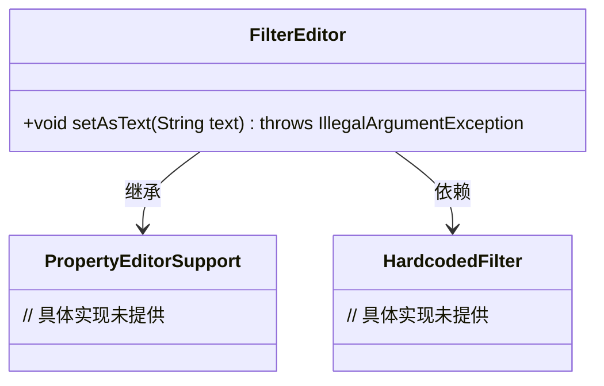
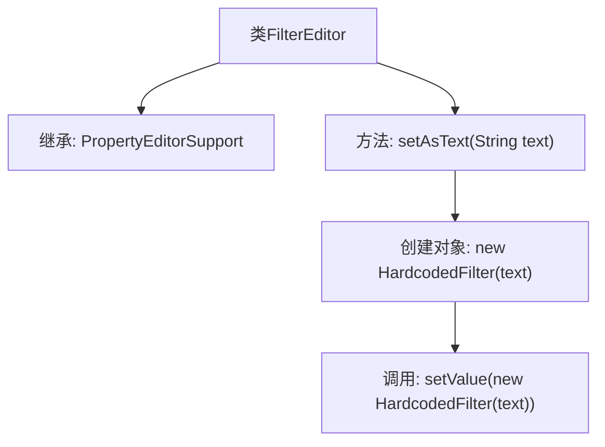

# 基础信息

|      |      |
|------|------|
| 名称 | FilterEditor |
| 编码语言 | .java |
| 代码路径 | spring-ldap/core/src/main/java/org/springframework/ldap/filter/FilterEditor.java |
| 包名 | org.springframework.ldap.filter |
| 依赖项 | ['java.beans.PropertyEditorSupport'] |
| 概述说明 | FilterEditor继承PropertyEditorSupport，通过setAsText设置HardcodedFilter值。 |

# 说明

FilterEditor类继承自PropertyEditorSupport，通过重写setAsText方法来设置HardcodedFilter的值。该方法允许将文本格式的输入转换为特定的HardcodedFilter对象，从而实现对过滤器属性的编辑和配置。

# 类列表 Class Summary

| 名称   | 类型  | 说明 |
|-------|------|-------------|
| FilterEditor | class | FilterEditor类继承PropertyEditorSupport，通过setAsText方法设置HardcodedFilter值。 |

## 类 FilterEditor

|      |      |
|------|------|
| 访问范围 | public |
| 类型 | class |
| 名称 | FilterEditor |
| 说明 | FilterEditor类继承PropertyEditorSupport，通过setAsText方法设置HardcodedFilter值。 |

### UML类图

这段代码定义了一个 `FilterEditor` 类，它继承自 `PropertyEditorSupport` 类，并重写了 `setAsText` 方法。`setAsText` 方法接受一个字符串参数，并将其转换为 `HardcodedFilter` 对象，然后通过 `setValue` 方法设置该对象。`HardcodedFilter` 类的具体实现未在代码中提供，但可以推测它是一个用于过滤操作的类。`PropertyEditorSupport` 是一个支持属性编辑的基类，`FilterEditor` 通过继承它来获得属性编辑的功能。

### 内部方法调用关系图

这段代码定义了一个名为 `FilterEditor` 的类，它继承自 `PropertyEditorSupport`。该类包含一个 `setAsText` 方法，该方法接受一个字符串参数 `text`，并通过 `setValue` 方法将其转换为 `HardcodedFilter` 对象。此方法主要用于将文本值转换为特定的过滤器对象，以便在属性编辑中使用。

### 字段列表 Field List

| 名称  | 类型  | 说明 |
|-------|-------|------|

### 方法列表 Method List

| 名称  | 类型  | 说明 |
|-------|-------|------|
| setAsText | void | 该方法将字符串文本转换为HardcodedFilter对象并设置为其值。 |

