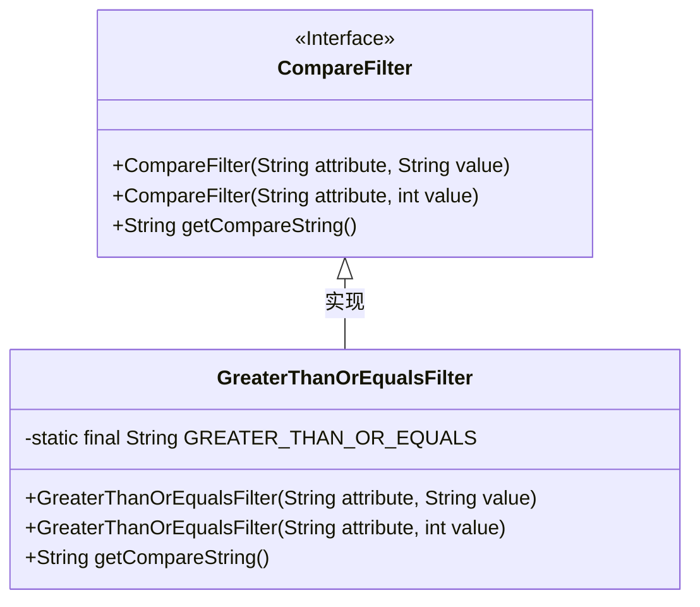
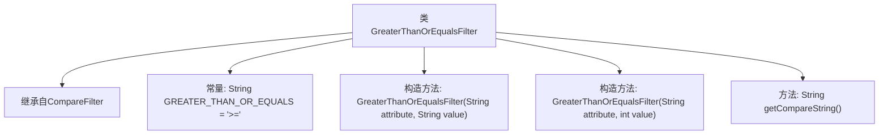

# 基础信息

|      |      |
|------|------|
| 名称 | GreaterThanOrEqualsFilter |
| 编码语言 | .java |
| 代码路径 | spring-ldap/core/src/main/java/org/springframework/ldap/filter/GreaterThanOrEqualsFilter.java |
| 包名 | org.springframework.ldap.filter |
| 依赖项 | [] |
| 概述说明 | GreaterThanOrEqualsFilter继承CompareFilter，实现大于等于比较。 |

# 说明

GreaterThanOrEqualsFilter类继承自CompareFilter，用于实现大于等于的比较操作。该类扩展了CompareFilter的功能，专门处理大于或等于某个值的过滤条件。通过继承CompareFilter，GreaterThanOrEqualsFilter能够利用父类的比较逻辑，同时针对大于等于的场景进行特定实现。这种设计使得代码结构更加清晰，便于维护和扩展。

# 类列表 Class Summary

| 名称   | 类型  | 说明 |
|-------|------|-------------|
| GreaterThanOrEqualsFilter | class | GreaterThanOrEqualsFilter类继承CompareFilter，实现大于等于比较。 |

## 类 GreaterThanOrEqualsFilter

|      |      |
|------|------|
| 访问范围 | public |
| 类型 | class |
| 名称 | GreaterThanOrEqualsFilter |
| 说明 | GreaterThanOrEqualsFilter类继承CompareFilter，实现大于等于比较。 |

### UML类图

**描述**：  
`GreaterThanOrEqualsFilter` 类继承自 `CompareFilter` 接口，并实现了比较操作。该类包含两个构造函数，分别接受 `String` 和 `int` 类型的值作为参数，并通过 `getCompareString` 方法返回比较符号 `">="`。该类的设计用于处理大于或等于的过滤条件，继承了 `CompareFilter` 的基本功能。

### 内部方法调用关系图

这段代码定义了一个名为`GreaterThanOrEqualsFilter`的类，它继承自`CompareFilter`。该类包含一个常量`GREATER_THAN_OR_EQUALS`，表示“>=”操作符。类中有两个构造方法，分别接受不同类型的`value`参数（`String`和`int`），并调用父类的构造方法。此外，类中还定义了一个`getCompareString`方法，返回常量`GREATER_THAN_OR_EQUALS`。该类的设计主要用于实现大于或等于的比较操作。

### 字段列表 Field List

| 名称  | 类型  | 说明 |
|-------|-------|------|
| GREATER_THAN_OR_EQUALS = ">=" | String | 定义常量字符串，表示大于或等于符号。 |

### 方法列表 Method List

| 名称  | 类型  | 说明 |
|-------|-------|------|
| getCompareString | String | 该方法返回字符串"GREATER_THAN_OR_EQUALS"。 |

