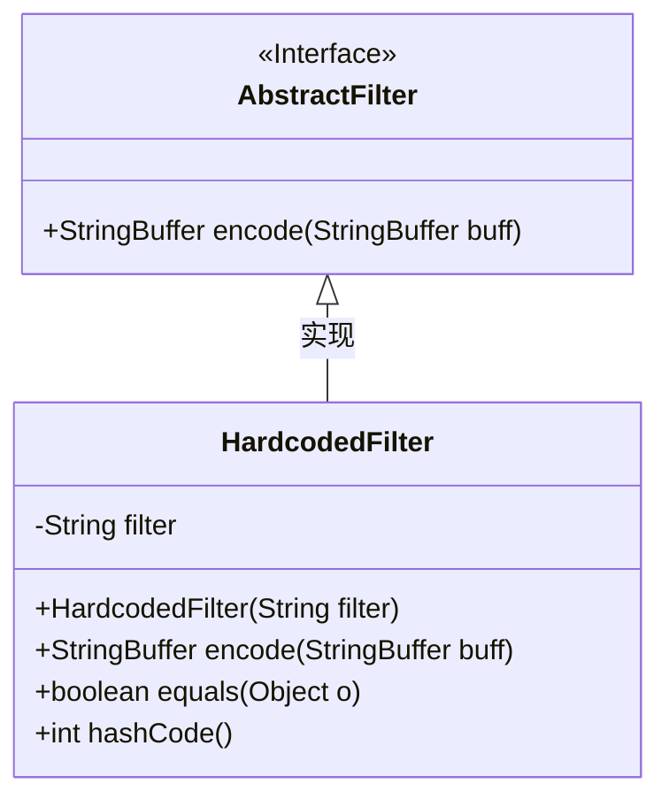
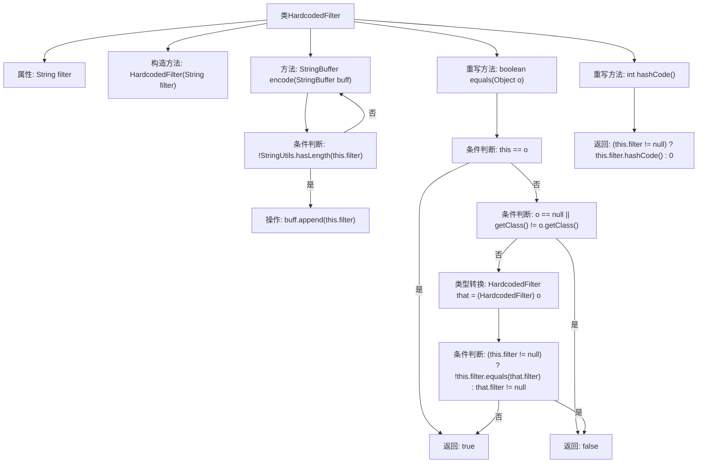

# 基础信息

|      |      |
|------|------|
| 名称 | HardcodedFilter |
| 编码语言 | .java |
| 代码路径 | spring-ldap/core/src/main/java/org/springframework/ldap/filter/HardcodedFilter.java |
| 包名 | org.springframework.ldap.filter |
| 依赖项 | ['org.springframework.util.StringUtils'] |
| 概述说明 | HardcodedFilter继承AbstractFilter，实现字符串过滤、编码、相等性判断及哈希码生成。 |

# 说明

HardcodedFilter类继承自AbstractFilter，主要用于处理字符串过滤器。该类包含编码、相等性判断及哈希码生成等方法，确保字符串过滤器的功能完整性和一致性。通过继承AbstractFilter，HardcodedFilter类实现了对字符串过滤器的基本操作和扩展功能，提供了高效且可靠的字符串处理能力。

# 类列表 Class Summary

| 名称   | 类型  | 说明 |
|-------|------|-------------|
| HardcodedFilter | class | HardcodedFilter类继承AbstractFilter，包含字符串过滤器和编码、相等性判断及哈希码生成方法。 |

## 类 HardcodedFilter

|      |      |
|------|------|
| 访问范围 | public |
| 类型 | class |
| 名称 | HardcodedFilter |
| 说明 | HardcodedFilter类继承AbstractFilter，包含字符串过滤器和编码、相等性判断及哈希码生成方法。 |

### UML类图

这段代码定义了一个 `HardcodedFilter` 类，它继承自 `AbstractFilter` 接口。`HardcodedFilter` 类包含一个私有的 `filter` 字符串，并通过构造函数进行初始化。`encode` 方法将 `filter` 字符串附加到传入的 `StringBuffer` 中，如果 `filter` 为空则直接返回原 `StringBuffer`。`equals` 和 `hashCode` 方法用于比较两个 `HardcodedFilter` 对象的 `filter` 字段是否相等，并生成相应的哈希码。

### 内部方法调用关系图

这段代码定义了一个名为 `HardcodedFilter` 的类，继承自 `AbstractFilter`。该类包含一个字符串属性 `filter`，并通过构造函数进行初始化。`encode` 方法用于将 `filter` 追加到传入的 `StringBuffer` 中，如果 `filter` 为空则直接返回原 `StringBuffer`。`equals` 方法用于比较两个 `HardcodedFilter` 对象的 `filter` 属性是否相等，`hashCode` 方法则返回 `filter` 的哈希值。流程图展示了类的结构、方法的调用关系以及条件判断的逻辑流程。

### 字段列表 Field List

| 名称  | 类型  | 说明 |
|-------|-------|------|
| filter | String | 定义了一个私有字符串变量filter。 |

### 方法列表 Method List

| 名称  | 类型  | 说明 |
|-------|-------|------|
| encode | StringBuffer | 方法encode检查filter是否为空，非空则将其追加到buff并返回。 |
| hashCode | int | 重写hashCode方法，返回filter的哈希值，若filter为空则返回0。 |
| equals | boolean | 重写equals方法，比较对象是否相等，检查null和类类型，并对比filter属性。 |

