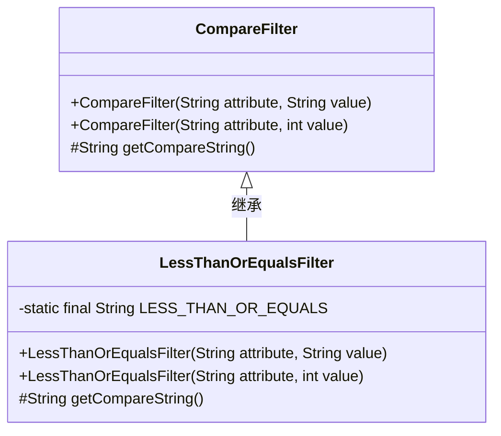
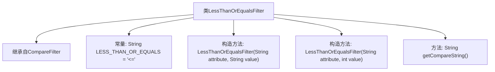

# 基础信息

|      |      |
|------|------|
| 名称 | LessThanOrEqualsFilter |
| 编码语言 | .java |
| 代码路径 | spring-ldap/core/src/main/java/org/springframework/ldap/filter/LessThanOrEqualsFilter.java |
| 包名 | org.springframework.ldap.filter |
| 依赖项 | [] |
| 概述说明 | LessThanOrEqualsFilter继承CompareFilter，实现小于等于比较操作。 |

# 说明

LessThanOrEqualsFilter类继承自CompareFilter，主要用于实现小于等于操作的比较功能。该类通过继承CompareFilter的基础功能，扩展了特定的比较逻辑，使其能够处理小于等于的条件判断。这种设计使得在进行数据过滤时，可以方便地应用小于等于的操作，从而满足特定的业务需求。

# 类列表 Class Summary

| 名称   | 类型  | 说明 |
|-------|------|-------------|
| LessThanOrEqualsFilter | class | LessThanOrEqualsFilter类继承CompareFilter，用于比较小于等于操作。 |

## 类 LessThanOrEqualsFilter

|      |      |
|------|------|
| 访问范围 | public |
| 类型 | class |
| 名称 | LessThanOrEqualsFilter |
| 说明 | LessThanOrEqualsFilter类继承CompareFilter，用于比较小于等于操作。 |

### UML类图

### 描述
`LessThanOrEqualsFilter` 类继承自 `CompareFilter` 类，用于实现小于或等于的过滤操作。它包含两个构造函数，分别接受字符串和整数值作为参数，并通过 `getCompareString` 方法返回比较操作符 `"<="`。该类的主要作用是扩展 `CompareFilter` 的功能，专门处理小于或等于的条件判断。

### 内部方法调用关系图

这段代码定义了一个名为 `LessThanOrEqualsFilter` 的类，它继承自 `CompareFilter` 类。该类包含两个构造方法，分别接受 `String` 和 `int` 类型的值，并将其传递给父类的构造方法。此外，类中定义了一个常量 `LESS_THAN_OR_EQUALS`，其值为 `'<='`，并通过 `getCompareString` 方法返回该常量。这个类的主要作用是提供一个用于比较的过滤器，支持小于或等于的操作。

### 字段列表 Field List

| 名称  | 类型  | 说明 |
|-------|-------|------|
| LESS_THAN_OR_EQUALS = "<=" | String | 定义字符串常量表示小于等于符号。 |

### 方法列表 Method List

| 名称  | 类型  | 说明 |
|-------|-------|------|
| getCompareString | String | 返回小于或等于的字符串。 |

