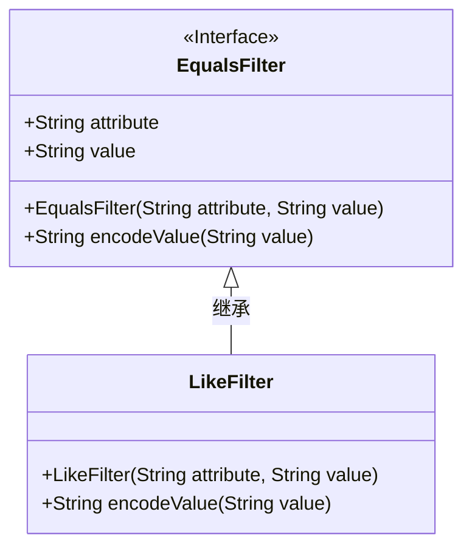
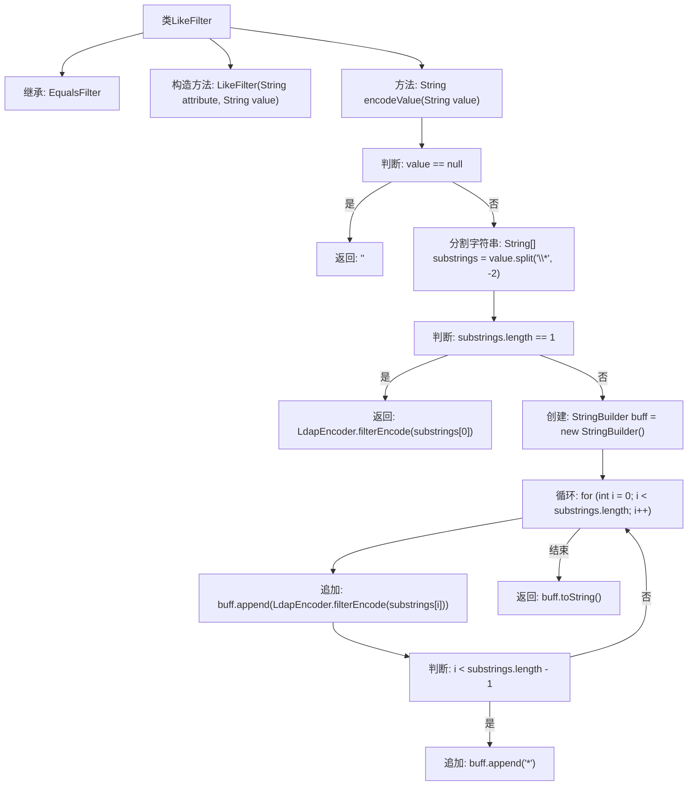

# 基础信息

|      |      |
|------|------|
| 名称 | LikeFilter |
| 编码语言 | .java |
| 代码路径 | spring-ldap/core/src/main/java/org/springframework/ldap/filter/LikeFilter.java |
| 包名 | org.springframework.ldap.filter |
| 依赖项 | ['org.springframework.ldap.support.LdapEncoder'] |
| 概述说明 | LikeFilter继承EqualsFilter，用于编码LDAP过滤器值。 |

# 说明

LikeFilter类继承自EqualsFilter，专门用于处理LDAP过滤器中的值编码。该类在EqualsFilter的基础上扩展了功能，适用于需要对LDAP过滤器值进行特定编码的场景。通过继承，LikeFilter能够利用EqualsFilter的现有逻辑，同时实现自身对值的特殊处理，确保LDAP查询的准确性和灵活性。

# 类列表 Class Summary

| 名称   | 类型  | 说明 |
|-------|------|-------------|
| LikeFilter | class | LikeFilter类继承EqualsFilter，用于编码LDAP过滤器的值。 |

## 类 LikeFilter

|      |      |
|------|------|
| 访问范围 | public |
| 类型 | class |
| 名称 | LikeFilter |
| 说明 | LikeFilter类继承EqualsFilter，用于编码LDAP过滤器的值。 |

### UML类图

### 描述：
`LikeFilter` 类继承自 `EqualsFilter`，并重写了 `encodeValue` 方法。`encodeValue` 方法用于处理字符串值，根据星号 `*` 进行分割，并对每个子字符串进行编码，最后将它们重新拼接成一个字符串。`EqualsFilter` 是一个接口，定义了 `attribute` 和 `value` 属性以及构造方法。`LikeFilter` 通过继承 `EqualsFilter` 并实现其方法，提供了特定的字符串编码逻辑。

### 内部方法调用关系图

这段代码定义了一个名为`LikeFilter`的类，继承自`EqualsFilter`。`LikeFilter`类包含一个构造方法和一个`encodeValue`方法。`encodeValue`方法用于处理字符串值，如果值为空则返回空字符串，否则将字符串按`*`分割并编码，最后返回拼接后的结果。流程图展示了`encodeValue`方法的执行流程，包括空值判断、字符串分割、编码和拼接等步骤。

### 字段列表 Field List

| 名称  | 类型  | 说明 |
|-------|-------|------|

### 方法列表 Method List

| 名称  | 类型  | 说明 |
|-------|-------|------|
| encodeValue | String | 编码字符串值，处理空值并分割编码后重新拼接。 |

