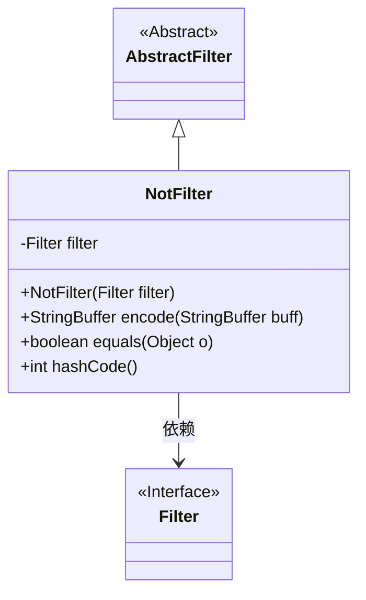
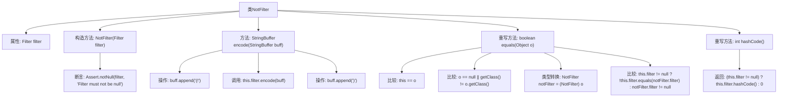

# 基础信息

|      |      |
|------|------|
| 名称 | NotFilter |
| 编码语言 | .java |
| 代码路径 | spring-ldap/core/src/main/java/org/springframework/ldap/filter/NotFilter.java |
| 包名 | org.springframework.ldap.filter |
| 依赖项 | ['org.springframework.util.Assert'] |
| 概述说明 | NotFilter继承AbstractFilter，通过构造函数传入Filter并取反，实现encode、equals和hashCode方法。 |

# 说明

NotFilter类继承自AbstractFilter，通过构造函数接收一个Filter对象并对其进行取反操作。该类实现了encode、equals和hashCode方法，确保其功能完整性和对象比较的一致性。

# 类列表 Class Summary

| 名称   | 类型  | 说明 |
|-------|------|-------------|
| NotFilter | class | NotFilter类继承AbstractFilter，通过构造函数传入Filter并取反，实现encode、equals和hashCode方法。 |

## 类 NotFilter

|      |      |
|------|------|
| 访问范围 | public |
| 类型 | class |
| 名称 | NotFilter |
| 说明 | NotFilter类继承AbstractFilter，通过构造函数传入Filter并取反，实现encode、equals和hashCode方法。 |

### UML类图

类图描述：
`NotFilter` 类继承自 `AbstractFilter`，并依赖于 `Filter` 接口。`NotFilter` 类包含一个私有的 `Filter` 类型成员变量 `filter`，并通过构造函数初始化该变量。`NotFilter` 类实现了 `encode` 方法，用于将过滤器的逻辑编码为字符串；`equals` 方法用于比较两个 `NotFilter` 对象是否相等；`hashCode` 方法用于生成对象的哈希码。`Filter` 接口作为 `NotFilter` 类的依赖，定义了过滤器的基本行为。

### 内部方法调用关系图

这段代码定义了一个 `NotFilter` 类，它继承自 `AbstractFilter`。`NotFilter` 类包含一个 `Filter` 类型的属性 `filter`，并通过构造函数初始化该属性。`encode` 方法用于将过滤器的逻辑取反并编码到 `StringBuffer` 中。`equals` 方法用于比较两个 `NotFilter` 对象是否相等，`hashCode` 方法用于生成对象的哈希码。代码中通过断言确保 `filter` 不为空，并在 `encode` 方法中调用 `filter` 的 `encode` 方法进行嵌套编码。

### 字段列表 Field List

| 名称  | 类型  | 说明 |
|-------|-------|------|
| filter | Filter | 定义了一个私有且不可变的Filter类型变量filter。 |

### 方法列表 Method List

| 名称  | 类型  | 说明 |
|-------|-------|------|
| hashCode | int | 重写hashCode方法，返回filter的哈希值，若filter为空则返回0。 |
| encode | StringBuffer | 方法encode在StringBuffer前后添加"(!)"并调用filter.encode。 |
| equals | boolean | 重写equals方法，比较对象是否相等。 |

