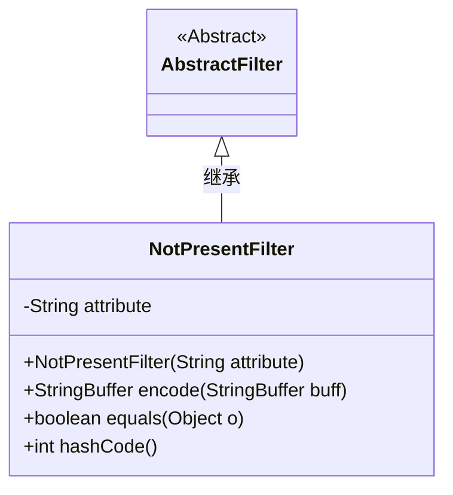
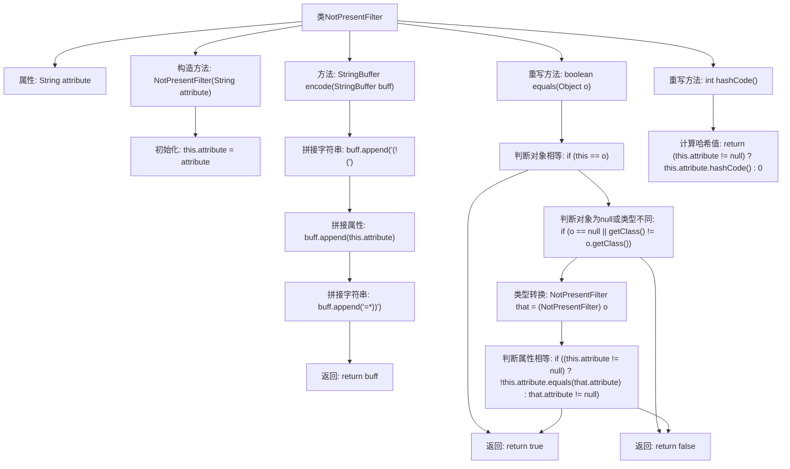

# 基础信息

|      |      |
|------|------|
| 名称 | NotPresentFilter |
| 编码语言 | .java |
| 代码路径 | spring-ldap/core/src/main/java/org/springframework/ldap/filter/NotPresentFilter.java |
| 包名 | org.springframework.ldap.filter |
| 依赖项 | [] |
| 概述说明 | NotPresentFilter类用于检查属性存在性，包含编码、相等性和哈希码方法。 |

# 说明

NotPresentFilter类的主要功能是检查某个属性是否存在。该类实现了编码、相等性和哈希码方法，以确保其在处理属性存在性检查时的功能完整性和性能优化。通过编码方法，可以有效地处理和转换属性数据；相等性方法用于比较两个实例是否相同；哈希码方法则用于支持在哈希表等数据结构中的高效存储和检索。这些方法的实现使得NotPresentFilter类在处理属性存在性检查时更加高效和可靠。

# 类列表 Class Summary

| 名称   | 类型  | 说明 |
|-------|------|-------------|
| NotPresentFilter | class | NotPresentFilter类用于检查属性是否存在，包含编码、相等性和哈希码方法。 |

## 类 NotPresentFilter

|      |      |
|------|------|
| 访问范围 | public |
| 类型 | class |
| 名称 | NotPresentFilter |
| 说明 | NotPresentFilter类用于检查属性是否存在，包含编码、相等性和哈希码方法。 |

### UML类图

**描述：**  
`NotPresentFilter` 类继承自 `AbstractFilter`，用于过滤未设置或为空的属性。它包含一个私有属性 `attribute`，并通过构造函数初始化。`encode` 方法将过滤条件编码为字符串，`equals` 和 `hashCode` 方法用于对象比较和哈希计算。该类主要用于处理属性未设置或为空的情况，适用于需要过滤特定属性的场景。

### 内部方法调用关系图

这段代码定义了一个名为`NotPresentFilter`的类，继承自`AbstractFilter`。该类包含一个属性`attribute`，用于存储过滤器的属性名称。类中定义了构造方法、`encode`方法用于生成特定格式的字符串，以及重写了`equals`和`hashCode`方法用于对象比较和哈希值计算。流程图展示了类的结构、方法调用关系以及各个方法的执行步骤。

### 字段列表 Field List

| 名称  | 类型  | 说明 |
|-------|-------|------|
| attribute | String | 声明了一个私有的字符串类型变量。 |

### 方法列表 Method List

| 名称  | 类型  | 说明 |
|-------|-------|------|
| equals | boolean | 重写equals方法，比较对象和属性是否相等。 |
| encode | StringBuffer | 方法encode在StringBuffer中追加"(!("、属性值和"=*))"并返回。 |
| hashCode | int | 重写hashCode方法，返回attribute的哈希值，若为null则返回0。 |

