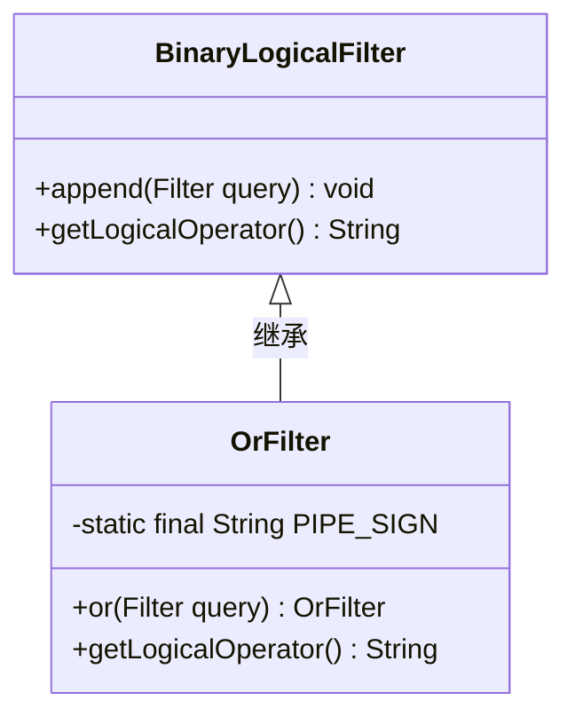
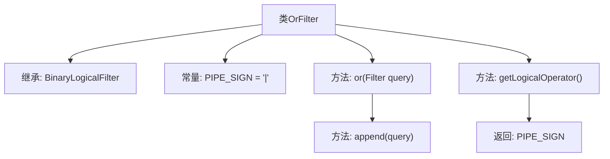

# 基础信息

|      |      |
|------|------|
| 名称 | OrFilter |
| 编码语言 | .java |
| 代码路径 | spring-ldap/core/src/main/java/org/springframework/ldap/filter/OrFilter.java |
| 包名 | org.springframework.ldap.filter |
| 依赖项 | [] |
| 概述说明 | OrFilter类继承BinaryLogicalFilter，实现OR逻辑，支持添加查询并返回管道符号。 |

# 说明

OrFilter类继承自BinaryLogicalFilter，专门用于实现OR逻辑操作。该类支持添加多个查询条件，并在执行逻辑运算时返回管道符号作为逻辑运算符。通过这种方式，OrFilter能够有效地组合多个查询条件，实现灵活的OR逻辑运算。

# 类列表 Class Summary

| 名称   | 类型  | 说明 |
|-------|------|-------------|
| OrFilter | class | OrFilter类扩展BinaryLogicalFilter，实现OR逻辑操作，支持添加查询并返回管道符号作为逻辑运算符。 |

## 类 OrFilter

|      |      |
|------|------|
| 访问范围 | public |
| 类型 | class |
| 名称 | OrFilter |
| 说明 | OrFilter类扩展BinaryLogicalFilter，实现OR逻辑操作，支持添加查询并返回管道符号作为逻辑运算符。 |

### UML类图

这段代码定义了一个 `OrFilter` 类，它继承自 `BinaryLogicalFilter` 类。`OrFilter` 类用于实现逻辑“或”操作，其中包含一个 `or` 方法，用于将查询添加到“或”表达式中，并返回当前对象以支持链式调用。`getLogicalOperator` 方法返回逻辑操作符“|”，表示“或”操作。`BinaryLogicalFilter` 类提供了基础的逻辑过滤功能，`OrFilter` 类通过继承并扩展其功能来实现特定的逻辑操作。

### 内部方法调用关系图

这段代码定义了一个名为 `OrFilter` 的类，它继承自 `BinaryLogicalFilter`。`OrFilter` 类包含一个常量 `PIPE_SIGN`，其值为 `"|"`。该类提供了两个方法：`or(Filter query)` 和 `getLogicalOperator()`。`or` 方法用于将查询添加到 OR 表达式中，并返回当前对象，而 `getLogicalOperator` 方法返回常量 `PIPE_SIGN`。流程图展示了类的继承关系、常量定义以及方法之间的调用关系。

### 字段列表 Field List

| 名称  | 类型  | 说明 |
|-------|-------|------|
| PIPE_SIGN = "|" | String | 定义私有静态常量PIPE_SIGN，值为"|"。 |

### 方法列表 Method List

| 名称  | 类型  | 说明 |
|-------|-------|------|
| getLogicalOperator | String | 该方法返回逻辑操作符PIPE_SIGN。 |
| or | OrFilter | OrFilter类中的or方法用于追加查询条件并返回当前对象。 |

