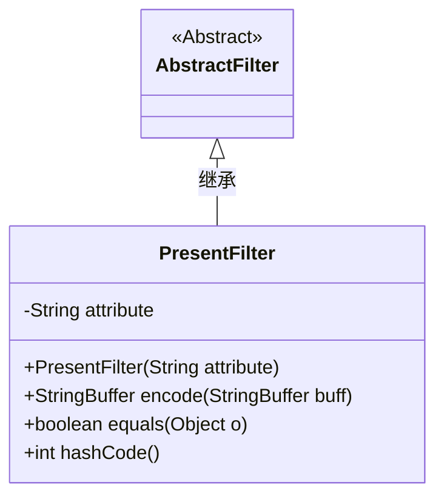
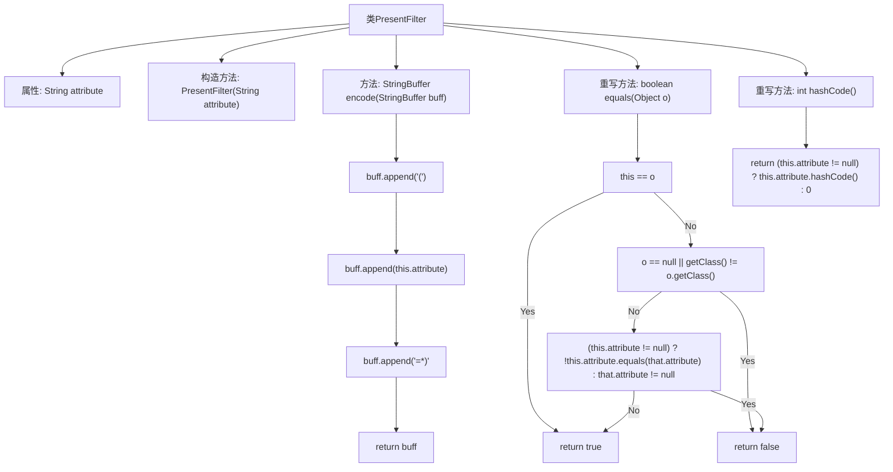

# 基础信息

|      |      |
|------|------|
| 名称 | PresentFilter |
| 编码语言 | .java |
| 代码路径 | spring-ldap/core/src/main/java/org/springframework/ldap/filter/PresentFilter.java |
| 包名 | org.springframework.ldap.filter |
| 依赖项 | [] |
| 概述说明 | PresentFilter类用于检查属性存在性，支持编码、相等性和哈希码功能。 |

# 说明

PresentFilter类主要用于检查特定属性是否存在，并提供了编码、相等性和哈希码功能。该类的核心功能是验证属性是否存在，同时支持对属性进行编码操作，确保数据的准确性和一致性。此外，该类还实现了相等性比较和哈希码生成功能，以便在需要时进行对象比较和哈希表存储。通过这些功能，PresentFilter类能够有效地管理和验证属性，确保在处理相关数据时的高效性和可靠性。

# 类列表 Class Summary

| 名称   | 类型  | 说明 |
|-------|------|-------------|
| PresentFilter | class | PresentFilter类用于检查特定属性是否存在，提供编码、相等性和哈希码功能。 |

## 类 PresentFilter

|      |      |
|------|------|
| 访问范围 | public |
| 类型 | class |
| 名称 | PresentFilter |
| 说明 | PresentFilter类用于检查特定属性是否存在，提供编码、相等性和哈希码功能。 |

### UML类图

这段代码定义了一个 `PresentFilter` 类，它继承自 `AbstractFilter` 类。`PresentFilter` 类包含一个私有属性 `attribute`，用于存储特定的属性值。类中提供了构造方法 `PresentFilter`，用于初始化 `attribute`。此外，`PresentFilter` 类还重写了 `encode` 方法，用于将 `attribute` 编码为特定格式的字符串。同时，`equals` 和 `hashCode` 方法也被重写，以确保对象的相等性和哈希码计算。

### 内部方法调用关系图

这段代码定义了一个`PresentFilter`类，继承自`AbstractFilter`，用于检查某个属性是否存在。类中包含一个属性`attribute`，构造方法用于初始化该属性。`encode`方法将属性格式化为字符串并返回。`equals`方法用于比较两个`PresentFilter`对象是否相等，`hashCode`方法返回属性的哈希值。流程图展示了类的结构及其方法的调用关系。

### 字段列表 Field List

| 名称  | 类型  | 说明 |
|-------|-------|------|
| attribute | String | 定义一个私有字符串属性。 |

### 方法列表 Method List

| 名称  | 类型  | 说明 |
|-------|-------|------|
| equals | boolean | 重写equals方法，比较对象属性是否相等。 |
| encode | StringBuffer | 方法encode在StringBuffer后追加"(attribute=*)"并返回。 |
| hashCode | int | 重写hashCode方法，返回attribute的哈希值，若为null则返回0。 |

