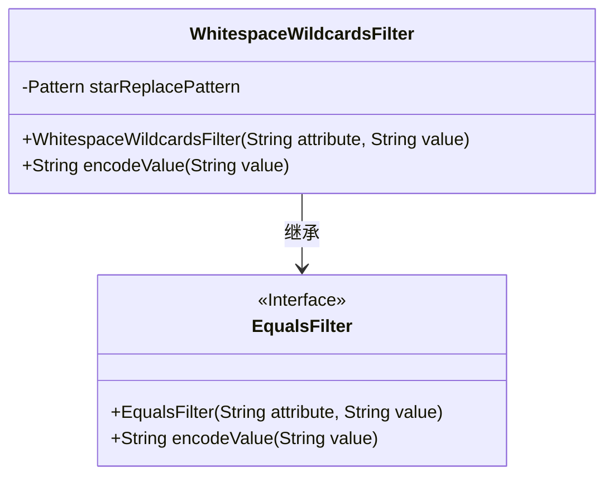
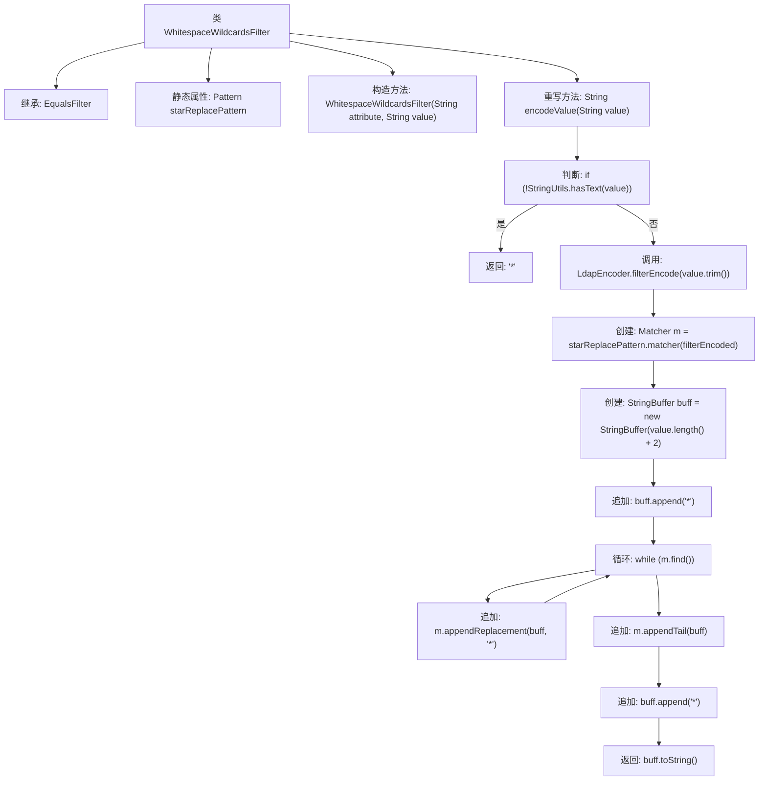

# 基础信息

|      |      |
|------|------|
| 名称 | WhitespaceWildcardsFilter |
| 编码语言 | .java |
| 代码路径 | spring-ldap/core/src/main/java/org/springframework/ldap/filter/WhitespaceWildcardsFilter.java |
| 包名 | org.springframework.ldap.filter |
| 依赖项 | ['java.util.regex.Matcher', 'java.util.regex.Pattern', 'org.springframework.ldap.support.LdapEncoder', 'org.springframework.util.StringUtils'] |
| 概述说明 | WhitespaceWildcardsFilter类将空格替换为星号并编码LDAP过滤值。 |

# 说明

WhitespaceWildcardsFilter类的主要功能是将空格字符替换为星号，并对LDAP过滤值进行编码处理。该类通过替换空格为星号，确保在LDAP过滤操作中能够正确处理包含空格的字符串，同时通过编码进一步保证过滤值的安全性和兼容性。

# 类列表 Class Summary

| 名称   | 类型  | 说明 |
|-------|------|-------------|
| WhitespaceWildcardsFilter | class | WhitespaceWildcardsFilter类将空格替换为星号并编码LDAP过滤值。 |

## 类 WhitespaceWildcardsFilter

|      |      |
|------|------|
| 访问范围 | public |
| 类型 | class |
| 名称 | WhitespaceWildcardsFilter |
| 说明 | WhitespaceWildcardsFilter类将空格替换为星号并编码LDAP过滤值。 |

### UML类图

这段代码定义了一个名为 `WhitespaceWildcardsFilter` 的类，它继承自 `EqualsFilter` 接口。`WhitespaceWildcardsFilter` 类的主要功能是对输入的字符串进行处理，将其中的空白字符替换为星号（`*`），并在字符串的开头和结尾添加星号。这个类特别适用于需要在 LDAP 过滤器中处理包含空白字符的字符串的场景。`EqualsFilter` 接口定义了一个 `encodeValue` 方法，`WhitespaceWildcardsFilter` 类实现了这个方法，并提供了具体的处理逻辑。

### 内部方法调用关系图

这段代码定义了一个名为 `WhitespaceWildcardsFilter` 的类，它继承自 `EqualsFilter`。该类的主要功能是通过 `encodeValue` 方法对输入的字符串进行处理，将字符串中的空白字符替换为星号 `*`，并在字符串的开头和结尾各添加一个星号。如果输入的字符串为空或仅包含空白字符，则直接返回一个星号。代码中使用了正则表达式和 `StringBuffer` 来实现这一功能。

### 字段列表 Field List

| 名称  | 类型  | 说明 |
|-------|-------|------|
| starReplacePattern = Pattern.compile("\\s+") | Pattern | 定义静态正则表达式模式，用于匹配空白字符。 |

### 方法列表 Method List

| 名称  | 类型  | 说明 |
|-------|-------|------|
| encodeValue | String | 编码方法处理空字符串为星号，保留特殊字符并替换空格为星号。 |

