# 基础信息

|      |      |
|------|------|
| 名称 | filter |
| 编码语言 | .java |
| 代码路径 | spring-ldap/core/src/main/java/org/springframework/ldap/filter |
| 包名 | spring-ldap.core.src.main.java.org.springframework.ldap.filter |
| 概述说明 | 多个过滤器类继承自AbstractFilter，处理字符串、逻辑操作和LDAP过滤，提供编码、比较和验证功能。 |

# 说明

## 概述
该代码模块主要围绕LDAP（轻量级目录访问协议）的过滤器功能展开，提供了多种过滤器类来处理不同类型的查询条件。这些过滤器类继承自`AbstractFilter`或`BinaryLogicalFilter`，并在此基础上实现了特定的过滤逻辑。模块的核心功能包括字符串处理、逻辑运算（AND、OR、NOT）、等值比较、范围比较（大于等于、小于等于）、属性存在性检查等。通过这些过滤器类，开发者可以灵活地构建复杂的LDAP查询条件，确保查询结果的准确性和一致性。

## 主要业务场景
1. **字符串处理**：`HardcodedFilter`、`WhitespaceWildcardsFilter`等类用于处理字符串过滤器，确保字符串在LDAP查询中的正确编码和处理。
2. **逻辑运算**：`AndFilter`、`OrFilter`、`NotFilter`等类实现了逻辑与、逻辑或、逻辑非操作，支持多条件的组合查询。
3. **等值比较**：`EqualsFilter`、`LikeFilter`等类用于处理等值比较，支持字符串和整数值的精确匹配。
4. **范围比较**：`GreaterThanOrEqualsFilter`、`LessThanOrEqualsFilter`等类用于处理大于等于、小于等于的范围查询，支持数值和字符串的比较。
5. **属性存在性检查**：`PresentFilter`、`NotPresentFilter`等类用于检查特定属性是否存在，确保查询条件的准确性。
6. **特殊过滤处理**：`AbsoluteTrueFilter`、`AbsoluteFalseFilter`等类实现了特定的过滤逻辑，如在字符串末尾追加特定字符或符号。
7. **过滤器编辑**：`FilterEditor`类提供了对过滤器属性的编辑和配置功能，支持将文本输入转换为特定的过滤器对象。

该模块的设计使得LDAP查询条件的构建更加灵活和高效，适用于需要复杂查询条件的业务场景，如用户管理、权限控制、目录服务等。

### 包内部结构视图

```mermaid
graph TD
    filter --> HardcodedFilter.java
    filter --> AndFilter.java
    filter --> AbsoluteFalseFilter.java
    filter --> WhitespaceWildcardsFilter.java
    filter --> LikeFilter.java
    filter --> NotFilter.java
    filter --> Filter.java
    filter --> CompareFilter.java
    filter --> BinaryLogicalFilter.java
    filter --> EqualsFilter.java
    filter --> GreaterThanOrEqualsFilter.java
    filter --> LessThanOrEqualsFilter.java
    filter --> OrFilter.java
    filter --> AbsoluteTrueFilter.java
    filter --> PresentFilter.java
    filter --> NotPresentFilter.java
    filter --> AbstractFilter.java
    filter --> FilterEditor.java
```

该流程图展示了`spring-ldap/core/src/main/java/org/springframework/ldap/filter`目录下的所有文件及其层级关系。所有文件都直接位于`filter`目录下，没有进一步的子目录结构。这些文件包括各种过滤器类，如`HardcodedFilter.java`、`AndFilter.java`、`EqualsFilter.java`等，涵盖了不同类型的LDAP过滤操作。

# 文件列表 File List

| 名称   | 类型  | 说明 |
|-------|------|-------------|
| [FilterEditor.java](FilterEditor.md) | file | FilterEditor继承PropertyEditorSupport，通过setAsText设置HardcodedFilter值。 |
| [AbsoluteTrueFilter.java](AbsoluteTrueFilter.md) | file | AbsoluteTrueFilter继承AbstractFilter，encode方法在buff后追加"(&)"并返回。 |
| [OrFilter.java](OrFilter.md) | file | OrFilter类继承BinaryLogicalFilter，实现OR逻辑，支持添加查询并返回管道符号。 |
| [BinaryLogicalFilter.java](BinaryLogicalFilter.md) | file | BinaryLogicalFilter继承AbstractFilter，处理逻辑过滤器，支持添加和编码查询，需子类实现逻辑运算符。 |
| [Filter.java](Filter.md) | file | 无内容可总结。 |
| [WhitespaceWildcardsFilter.java](WhitespaceWildcardsFilter.md) | file | WhitespaceWildcardsFilter类将空格替换为星号并编码LDAP过滤值。 |
| [AbstractFilter.java](AbstractFilter.md) | file | AbstractFilter类实现Filter接口，默认缓冲区256，encode和toString返回编码字符串。 |
| [NotPresentFilter.java](NotPresentFilter.md) | file | NotPresentFilter类用于检查属性存在性，包含编码、相等性和哈希码方法。 |
| [PresentFilter.java](PresentFilter.md) | file | PresentFilter类用于检查属性存在性，支持编码、相等性和哈希码功能。 |
| [LessThanOrEqualsFilter.java](LessThanOrEqualsFilter.md) | file | LessThanOrEqualsFilter继承CompareFilter，实现小于等于比较操作。 |
| [GreaterThanOrEqualsFilter.java](GreaterThanOrEqualsFilter.md) | file | GreaterThanOrEqualsFilter继承CompareFilter，实现大于等于比较。 |
| [EqualsFilter.java](EqualsFilter.md) | file | EqualsFilter继承CompareFilter，支持字符串和整数的等值比较，返回"="。 |
| [CompareFilter.java](CompareFilter.md) | file | CompareFilter类用于LDAP过滤，支持字符串和整数输入，提供编码和比较功能。 |
| [NotFilter.java](NotFilter.md) | file | NotFilter继承AbstractFilter，通过构造函数传入Filter并取反，实现encode、equals和hashCode方法。 |
| [LikeFilter.java](LikeFilter.md) | file | LikeFilter继承EqualsFilter，用于编码LDAP过滤器值。 |
| [AbsoluteFalseFilter.java](AbsoluteFalseFilter.md) | file | AbsoluteFalseFilter继承AbstractFilter，encode方法在buff后追加"|)"。 |
| [AndFilter.java](AndFilter.md) | file | AndFilter类继承BinaryLogicalFilter，实现AND逻辑，提供查询添加方法。 |
| [HardcodedFilter.java](HardcodedFilter.md) | file | HardcodedFilter继承AbstractFilter，实现字符串过滤、编码、相等性判断及哈希码生成。 |

