# 基础信息

|      |      |
|------|------|
| 名称 | odm |
| 编码语言 | .java |
| 代码路径 | spring-ldap/core/src/main/java/org/springframework/ldap/odm |
| 包名 | spring-ldap.core.src.main.java.org.springframework.ldap.odm |
| 概述说明 | Spring LDAP核心模块处理LDAP与Java对象映射、元数据管理及异常处理，提升代码可读性和可维护性。 |

# 说明

## 概述

该代码模块是`spring-ldap`库的核心部分，主要负责处理LDAP（轻量级目录访问协议）对象与Java对象之间的映射、元数据管理、异常处理以及类型转换。模块通过一系列类和工具实现了高效的LDAP数据操作，包括属性管理、元数据迭代、对象映射、异常处理以及类型转换等功能。模块的设计旨在简化LDAP数据与Java对象之间的交互，提供灵活的元数据管理和异常处理机制，从而提升代码的可读性和可维护性。此外，模块还通过注解驱动的开发方式，进一步简化了LDAP数据的访问和操作。

## 主要业务场景

1. **异常处理**：模块提供了多种异常类（如`UnmanagedClassException`、`MetaDataException`、`InvalidEntryException`等），用于处理在LDAP对象映射和元数据管理过程中可能出现的错误。这些异常类支持灵活的构造方法，允许开发者在抛出异常时传递详细的错误信息和原因，便于调试和错误追踪。

2. **元数据管理**：通过`AttributeMetaData`和`ObjectMetaData`类，模块实现了对LDAP属性元数据的高效管理。这些类支持通过注解和反射操作动态管理元数据，包括属性名称、语法、字段类型等信息，确保元数据的灵活访问和高效使用。

3. **对象映射**：`DefaultObjectDirectoryMapper`类负责实现Java对象与LDAP数据之间的映射，管理类元数据并处理属性转换。该组件确保对象与LDAP目录之间的数据同步和一致性，优化映射过程并支持不同属性格式的转换。

4. **字符串处理**：`CaseIgnoreString`类提供了忽略大小写的字符串比较、哈希和排序功能。该类简化了字符串处理逻辑，确保在进行字符串操作时不区分大小写，从而提高了代码的通用性和可读性。

5. **元数据迭代与处理**：`ObjectMetaData`类支持对元数据的迭代操作，并提供处理属性的功能，确保元数据的高效管理和灵活使用。

6. **类型转换功能**：模块包含多个已弃用的转换器类和管理器类（如`StringConverter`、`FromStringConverter`、`ToStringConverter`等），主要用于将对象转换为指定类型的实例或字符串，并管理这些转换器的配置和使用。由于这些类已被弃用，开发者需要寻找替代方案或更新实现方式。

7. **注解驱动的LDAP实体映射**：通过`@Entry`、`@Id`、`@Attribute`、`@DnAttribute`、`@Transient`等注解，模块简化了LDAP实体类的定义和操作。这些注解分别用于标识LDAP条目、唯一标识符、属性、DN属性以及临时属性，帮助开发者更方便地处理LDAP数据的访问和操作。

8. **配置类定义**：模块中的配置类定义了两个Bean，分别是转换服务处理器和对象目录映射器。转换服务处理器负责处理数据转换相关的服务逻辑，确保数据在不同格式或结构之间的正确转换。对象目录映射器则用于管理对象与目录之间的映射关系，确保对象能够正确地被定位和访问。这两个Bean的配置为应用程序提供了高效的数据处理和对象管理能力，提升了系统的整体性能和可维护性。

总结来说，该模块的核心业务场景是处理LDAP对象与Java对象之间的映射、元数据管理、异常处理、类型转换以及通过注解简化LDAP数据的访问和操作。模块通过一系列类和工具提供了高效的LDAP数据操作能力，提升了代码的可读性和可维护性。

### 包内部结构视图

```mermaid
graph TD
    odm --> core
    odm --> typeconversion
    odm --> annotations
    odm --> config
    core --> ObjectDirectoryMapper.java
    core --> OdmException.java
    core --> package-info.java
    core --> impl
    impl --> UnmanagedClassException.java
    impl --> CaseIgnoreString.java
    impl --> MetaDataException.java
    impl --> AttributeMetaData.java
    impl --> package-info.java
    impl --> ObjectMetaData.java
    impl --> InvalidEntryException.java
    impl --> DefaultObjectDirectoryMapper.java
    typeconversion --> package-info.java
    typeconversion --> ConverterException.java
    typeconversion --> ConverterManager.java
    typeconversion --> impl
    impl --> StringConverter.java
    impl --> ConversionServiceConverterManager.java
    impl --> Converter.java
    impl --> converters
    converters --> FromStringConverter.java
    converters --> package-info.java
    converters --> ToStringConverter.java
    impl --> ConverterManagerFactoryBean.java
    impl --> package-info.java
    impl --> ConverterManagerImpl.java
    annotations --> Attribute.java
    annotations --> package-info.java
    annotations --> Id.java
    annotations --> Entry.java
    annotations --> DnAttribute.java
    annotations --> Transient.java
    config --> ObjectDirectoryMapperConfiguration.java
```

该流程图展示了`spring-ldap`项目中`odm`模块的层级结构。`odm`模块下分为`core`、`typeconversion`、`annotations`和`config`四个主要子模块。每个子模块下又包含多个具体的Java文件和子目录，展示了各个模块之间的详细依赖关系和文件组织结构。

# 文件列表 File List

| 名称   | 类型  | 说明 |
|-------|------|-------------|
| [config](config/_module.md) | package | 配置类定义了两个Bean：转换服务处理器和对象目录映射器。 |
| [annotations](annotations/_module.md) | package | 输入内容为空，无法生成总结描述。 |
| [typeconversion](typeconversion/_module.md) | package | 类型转换模块涉及多个已弃用类，建议开发者寻找替代方案。 |
| [core](core/_module.md) | package | `spring-ldap`核心模块处理LDAP与Java对象映射，管理元数据，提供异常处理，优化数据操作与异常传递。 |

