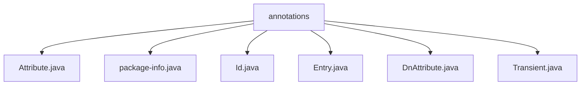

# 基础信息

|      |      |
|------|------|
| 名称 | annotations |
| 编码语言 | .java |
| 代码路径 | spring-ldap/core/src/main/java/org/springframework/ldap/odm/annotations |
| 包名 | spring-ldap.core.src.main.java.org.springframework.ldap.odm.annotations |
| 概述说明 | 输入内容为空，无法生成总结描述。 |

# 说明

## 概述
该代码模块是Spring LDAP框架的一部分，专注于通过注解简化LDAP（轻量级目录访问协议）对象的映射和操作。模块的核心功能是通过一系列注解来定义LDAP实体类的属性和行为，从而将Java对象与LDAP目录中的条目进行映射。这些注解包括`@Entry`、`@Id`、`@Attribute`、`@DnAttribute`、`@Transient`等，分别用于标识LDAP条目、唯一标识符、属性、DN属性以及临时属性。

## 主要业务场景
1. **LDAP实体映射**：通过`@Entry`注解，开发者可以将Java类映射到LDAP目录中的条目，简化了LDAP数据的访问和操作。
2. **唯一标识符定义**：使用`@Id`注解标记LDAP条目的唯一标识符，确保在操作LDAP数据时能够准确定位特定条目。
3. **属性映射**：`@Attribute`注解用于将Java对象的属性映射到LDAP条目的属性，支持自动类型转换和属性值的管理。
4. **DN属性映射**：`@DnAttribute`注解用于处理LDAP条目的专有名称（DN）属性，帮助开发者更方便地处理LDAP的层次结构。
5. **临时属性标记**：`@Transient`注解用于标记那些不需要持久化到LDAP目录中的属性，确保这些属性不会被误操作或存储。

该模块的主要目标是通过注解驱动的开发方式，简化LDAP数据的访问和操作，提升开发效率并减少代码冗余。

### 包内部结构视图

该流程图展示了`spring-ldap`项目中`annotations`文件夹下的所有文件层级关系。`annotations`作为根节点，包含了多个注解类文件，如`Attribute.java`、`Id.java`、`Entry.java`等。每个文件都直接隶属于`annotations`文件夹，没有进一步的子文件夹层级。

# 文件列表 File List

| 名称   | 类型  | 说明 |
|-------|------|-------------|
| [Transient.java](Transient.md) | file | 信息为空，无法生成概要描述。 |
| [Entry.java](Entry.md) | file | 无内容可总结。 |
| [package-info.java](package-info.md) | file | 无内容，无法生成概要描述。 |
| [DnAttribute.java](DnAttribute.md) | file | 信息为空，无法生成概要描述。 |
| [Id.java](Id.md) | file | 信息为空，无法生成概要描述。 |
| [Attribute.java](Attribute.md) | file | 信息为空，无法生成概要描述。 |

