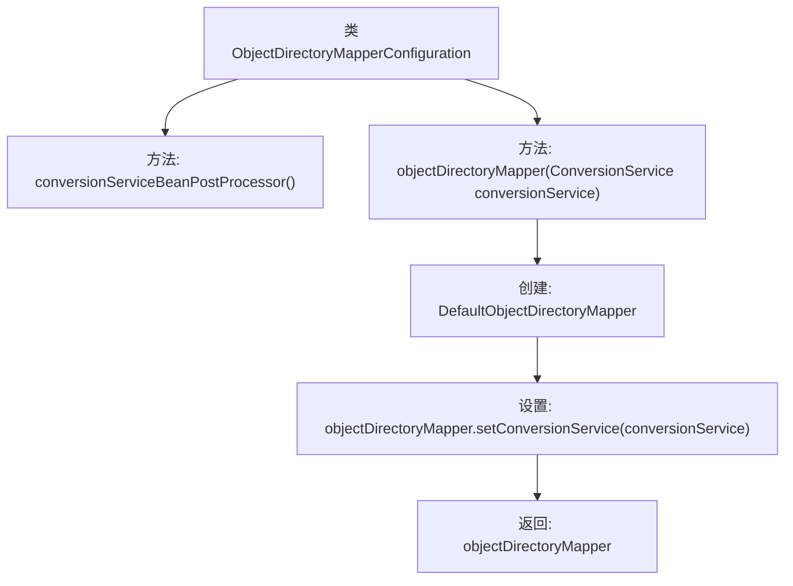

# 基础信息

|      |      |
|------|------|
| 名称 | ObjectDirectoryMapperConfiguration |
| 编码语言 | .java |
| 代码路径 | spring-ldap/core/src/main/java/org/springframework/ldap/odm/config/ObjectDirectoryMapperConfiguration.java |
| 包名 | org.springframework.ldap.odm.config |
| 依赖项 | ['org.springframework.context.annotation.Bean', 'org.springframework.context.annotation.Configuration', 'org.springframework.context.annotation.Fallback', 'org.springframework.core.convert.ConversionService', 'org.springframework.ldap.convert.ConversionServiceBeanFactoryPostProcessor', 'org.springframework.ldap.odm.core.ObjectDirectoryMapper', 'org.springframework.ldap.odm.core.impl.DefaultObjectDirectoryMapper'] |
| 概述说明 | 配置类定义了两个Bean：转换服务处理器和对象目录映射器。 |

# 说明

配置类定义了两个Bean，分别是转换服务处理器和对象目录映射器。转换服务处理器负责处理数据转换相关的服务逻辑，确保数据在不同格式或结构之间的正确转换。对象目录映射器则用于管理对象与目录之间的映射关系，确保对象能够正确地被定位和访问。这两个Bean的配置为应用程序提供了高效的数据处理和对象管理能力，提升了系统的整体性能和可维护性。

# 类列表 Class Summary

| 名称   | 类型  | 说明 |
|-------|------|-------------|
| ObjectDirectoryMapperConfiguration | class | 配置类定义了两个Bean：转换服务处理器和对象目录映射器。 |


## 类 ObjectDirectoryMapperConfiguration

|      |      |
|------|------|
| 访问范围 | @Configuration(proxyBeanMethods = false);public |
| 类型 | class |
| 名称 | ObjectDirectoryMapperConfiguration |
| 说明 | 配置类定义了两个Bean：转换服务处理器和对象目录映射器。 |


### UML类图

```mermaid
classDiagram
    class ObjectDirectoryMapperConfiguration {
        +ConversionServiceBeanFactoryPostProcessor conversionServiceBeanPostProcessor()
        +ObjectDirectoryMapper objectDirectoryMapper(ConversionService conversionService)
    }

    class ConversionServiceBeanFactoryPostProcessor {
        // 依赖
    }

    class DefaultObjectDirectoryMapper {
        -ConversionService conversionService
        +void setConversionService(ConversionService conversionService)
    }

    interface <<Interface>> ConversionService {
        // 依赖
    }

    interface <<Interface>> ObjectDirectoryMapper {
        // 依赖
    }

    ObjectDirectoryMapperConfiguration --> ConversionServiceBeanFactoryPostProcessor : 依赖
    ObjectDirectoryMapperConfiguration --> DefaultObjectDirectoryMapper : 依赖
    DefaultObjectDirectoryMapper --> ConversionService : 依赖
    DefaultObjectDirectoryMapper ..|> ObjectDirectoryMapper : 实现
```

**描述：**  
`ObjectDirectoryMapperConfiguration` 是一个配置类，负责创建和配置 `ConversionServiceBeanFactoryPostProcessor` 和 `DefaultObjectDirectoryMapper` 的 Bean。`DefaultObjectDirectoryMapper` 实现了 `ObjectDirectoryMapper` 接口，并依赖于 `ConversionService` 进行对象转换。`ConversionServiceBeanFactoryPostProcessor` 是一个后处理器，用于处理 `ConversionService` 的 Bean 工厂。整体设计通过依赖注入实现对象的创建和配置。


### 内部方法调用关系图



这段代码定义了一个Spring配置类`ObjectDirectoryMapperConfiguration`，其中包含两个Bean方法。`conversionServiceBeanPostProcessor()`方法返回一个`ConversionServiceBeanFactoryPostProcessor`实例，用于处理Bean工厂的转换服务。`objectDirectoryMapper(ConversionService conversionService)`方法创建并配置一个`DefaultObjectDirectoryMapper`实例，设置其转换服务后返回。这段代码主要用于在Spring应用中配置和管理对象目录映射器的Bean。

### 字段列表 Field List

| 名称  | 类型  | 说明 |
|-------|-------|------|

### 方法列表 Method List

| 名称  | 类型  | 说明 |
|-------|-------|------|
| objectDirectoryMapper | ObjectDirectoryMapper | 创建对象目录映射器并设置转换服务。 |
| conversionServiceBeanPostProcessor | ConversionServiceBeanFactoryPostProcessor | 定义静态方法返回ConversionServiceBeanFactoryPostProcessor实例。 |


