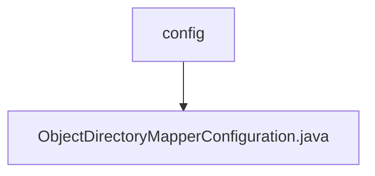

# 基础信息

|      |      |
|------|------|
| 名称 | config |
| 编码语言 | .java |
| 代码路径 | spring-ldap/core/src/main/java/org/springframework/ldap/odm/config |
| 包名 | spring-ldap.core.src.main.java.org.springframework.ldap.odm.config |
| 概述说明 | 配置类定义了两个Bean：转换服务处理器和对象目录映射器。 |

# 说明

配置类定义了两个Bean，分别是转换服务处理器和对象目录映射器。转换服务处理器负责处理数据转换相关的服务逻辑，确保数据在不同格式或结构之间的正确转换。对象目录映射器则用于管理对象与目录之间的映射关系，确保对象能够正确地被定位和访问。这两个Bean的配置为应用程序提供了高效的数据处理和对象管理能力，提升了系统的整体性能和可维护性。

### 包内部结构视图

该流程图展示了路径的层级关系，`config`文件夹下包含一个文件`ObjectDirectoryMapperConfiguration.java`。路径结构简洁明了，反映了文件在项目中的具体位置和依赖关系。

# 文件列表 File List

| 名称   | 类型  | 说明 |
|-------|------|-------------|
| [ObjectDirectoryMapperConfiguration.java](ObjectDirectoryMapperConfiguration.md) | file | 配置类定义了两个Bean：转换服务处理器和对象目录映射器。 |

