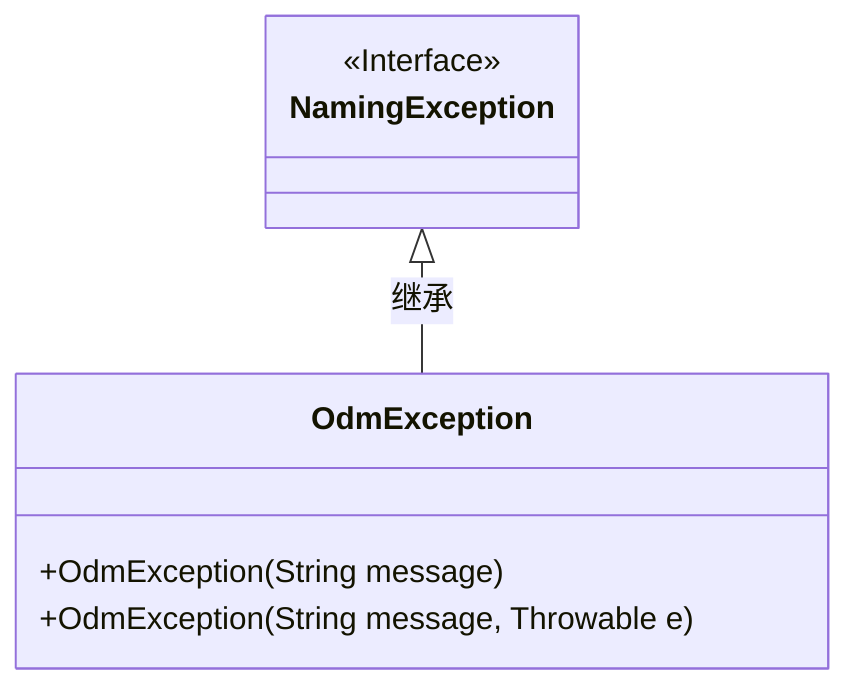
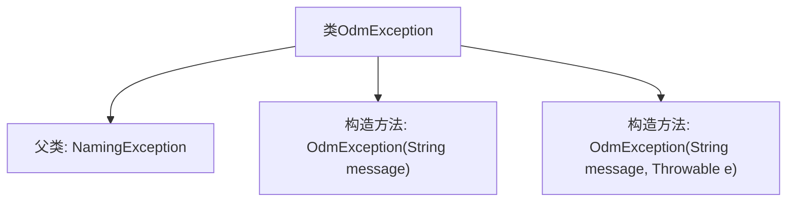

# 基础信息

|      |      |
|------|------|
| 名称 | OdmException |
| 编码语言 | .java |
| 代码路径 | spring-ldap/core/src/main/java/org/springframework/ldap/odm/core/OdmException.java |
| 包名 | org.springframework.ldap.odm.core |
| 依赖项 | ['org.springframework.ldap.NamingException'] |
| 概述说明 | OdmException继承NamingException，支持消息和异常的构造函数。 |

# 说明

OdmException继承自NamingException，并提供了两个构造函数。第一个构造函数接受一个消息参数，用于描述异常的具体信息。第二个构造函数接受一个消息参数和一个异常参数，允许在抛出异常时包含更详细的上下文信息和引发异常的根本原因。这种设计使得OdmException能够更好地传递和处理异常情况，提高了代码的可读性和可维护性。

# 类列表 Class Summary

| 名称   | 类型  | 说明 |
|-------|------|-------------|
| OdmException | class | OdmException继承NamingException，提供带消息和异常的构造函数。 |

## 类 OdmException

|      |      |
|------|------|
| 访问范围 | @SuppressWarnings("serial");public |
| 类型 | class |
| 名称 | OdmException |
| 说明 | OdmException继承NamingException，提供带消息和异常的构造函数。 |

### UML类图

这段代码定义了一个名为 `OdmException` 的类，它继承自 `NamingException` 接口。`OdmException` 类有两个构造函数，分别接受一个字符串参数和一个字符串与 `Throwable` 对象的组合参数。这两个构造函数都调用了父类 `NamingException` 的构造函数来初始化异常信息。通过继承 `NamingException`，`OdmException` 类能够处理与命名相关的异常情况，并提供更具体的异常信息。

### 内部方法调用关系图

这段代码定义了一个名为 `OdmException` 的类，它继承自 `NamingException`。该类包含两个构造方法，分别用于初始化异常信息以及异常信息和原因。通过继承 `NamingException`，`OdmException` 类可以处理与命名相关的异常情况，并提供了灵活的构造方法来传递异常信息和原因。

### 字段列表 Field List

| 名称  | 类型  | 说明 |
|-------|-------|------|

### 方法列表 Method List

| 名称  | 类型  | 说明 |
|-------|-------|------|

