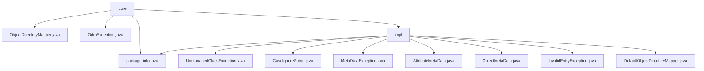

# 基础信息

|      |      |
|------|------|
| 名称 | core |
| 编码语言 | .java |
| 代码路径 | spring-ldap/core/src/main/java/org/springframework/ldap/odm/core |
| 包名 | spring-ldap.core.src.main.java.org.springframework.ldap.odm.core |
| 概述说明 | `spring-ldap`核心模块处理LDAP与Java对象映射，管理元数据，提供异常处理，优化数据操作与异常传递。 |

# 说明

## 概述

该代码模块是`spring-ldap`库中的核心部分，主要负责处理LDAP（轻量级目录访问协议）对象与Java对象之间的映射、元数据管理以及异常处理。模块通过一系列类和工具实现了高效的LDAP数据操作，包括属性管理、元数据迭代、对象映射以及异常处理等功能。该模块的设计旨在简化LDAP数据与Java对象之间的交互，提供灵活的元数据管理和异常处理机制，从而提升代码的可读性和可维护性。

## 主要业务场景

1. **异常处理**：模块提供了多种异常类（如`UnmanagedClassException`、`MetaDataException`、`InvalidEntryException`等），用于处理在LDAP对象映射和元数据管理过程中可能出现的错误。这些异常类支持灵活的构造方法，允许开发者在抛出异常时传递详细的错误信息和原因，便于调试和错误追踪。

2. **元数据管理**：通过`AttributeMetaData`和`ObjectMetaData`类，模块实现了对LDAP属性元数据的高效管理。这些类支持通过注解和反射操作动态管理元数据，包括属性名称、语法、字段类型等信息，确保元数据的灵活访问和高效使用。

3. **对象映射**：`DefaultObjectDirectoryMapper`类负责实现Java对象与LDAP数据之间的映射，管理类元数据并处理属性转换。该组件确保对象与LDAP目录之间的数据同步和一致性，优化映射过程并支持不同属性格式的转换。

4. **字符串处理**：`CaseIgnoreString`类提供了忽略大小写的字符串比较、哈希和排序功能。该类简化了字符串处理逻辑，确保在进行字符串操作时不区分大小写，从而提高了代码的通用性和可读性。

5. **元数据迭代与处理**：`ObjectMetaData`类支持对元数据的迭代操作，并提供处理属性的功能，确保元数据的高效管理和灵活使用。

### 包内部结构视图

该流程图展示了`spring-ldap/core`模块下`odm/core`目录的层级结构。`core`目录包含多个文件和`impl`子目录，`impl`子目录下又包含多个与对象目录映射相关的类文件。整体结构清晰，反映了模块内部的文件组织方式。

# 文件列表 File List

| 名称   | 类型  | 说明 |
|-------|------|-------------|
| [package-info.java](package-info.md) | file | 信息为空，无法生成概要描述。 |
| [ObjectDirectoryMapper.java](ObjectDirectoryMapper.md) | file | 信息缺失，无法生成概要描述。 |
| [OdmException.java](OdmException.md) | file | OdmException继承NamingException，支持消息和异常的构造函数。 |
| [impl](impl/_module.md) | package | 多个类继承OdmException，提供灵活异常处理；CaseIgnoreString实现大小写无关操作；AttributeMetaData管理LDAP属性元数据；ObjectMetaData管理元数据；DefaultObjectDirectoryMapper处理对象与LDAP映射。 |

