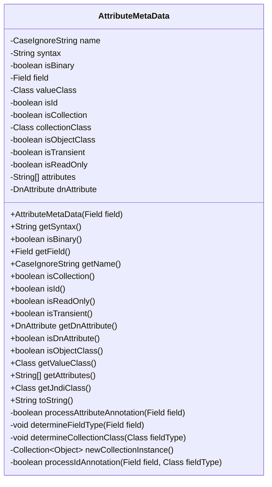

# 基础信息

|      |      |
|------|------|
| 名称 | AttributeMetaData |
| 编码语言 | .java |
| 代码路径 | spring-ldap/core/src/main/java/org/springframework/ldap/odm/core/impl/AttributeMetaData.java |
| 包名 | org.springframework.ldap.odm.core.impl |
| 依赖项 | ['java.lang.reflect.Array', 'java.lang.reflect.Field', 'java.lang.reflect.GenericArrayType', 'java.lang.reflect.ParameterizedType', 'java.lang.reflect.Type', 'java.util.ArrayList', 'java.util.Collection', 'java.util.LinkedHashSet', 'java.util.List', 'java.util.Set', 'java.util.SortedSet', 'java.util.TreeSet', 'javax.naming.Name', 'org.springframework.ldap.UncategorizedLdapException', 'org.springframework.ldap.odm.annotations.Attribute', 'org.springframework.ldap.odm.annotations.DnAttribute', 'org.springframework.ldap.odm.annotations.Id', 'org.springframework.ldap.odm.annotations.Transient'] |
| 概述说明 | AttributeMetaData类管理LDAP属性元数据，支持注解与反射操作。 |

# 说明

AttributeMetaData类是一个用于管理LDAP属性元数据的工具，其主要功能包括处理属性的名称、语法、二进制标志以及字段类型等关键信息。该类支持通过注解处理和反射操作来实现对属性元数据的动态管理和访问，从而提供灵活且高效的元数据管理能力。通过这一机制，开发者可以更便捷地处理和操作LDAP属性相关的元数据信息。

# 类列表 Class Summary

| 名称   | 类型  | 说明 |
|-------|------|-------------|
| AttributeMetaData | class | AttributeMetaData类用于管理LDAP属性元数据，包括名称、语法、二进制标志、字段类型等，支持注解处理与反射操作。 |

## 类 AttributeMetaData

|      |      |
|------|------|
| 访问范围 | final |
| 类型 | class |
| 名称 | AttributeMetaData |
| 说明 | AttributeMetaData类用于管理LDAP属性元数据，包括名称、语法、二进制标志、字段类型等，支持注解处理与反射操作。 |

### UML类图

类图描述：
`AttributeMetaData` 类用于处理与LDAP属性相关的元数据，包括字段的类型、是否为二进制、是否为ID字段、是否为集合等。该类通过构造函数从字段中提取元数据，并提供了多个方法来获取这些元数据。类中的私有方法用于处理特定注解（如`@Attribute`、`@Id`）并确定字段的类型和集合类。该类还包含一个`toString`方法，用于返回对象的字符串表示形式。

### 内部方法调用关系图

```mermaid
graph TD
    A["类AttributeMetaData"]
    B["属性: CaseIgnoreString name"]
    C["属性: String syntax"]
    D["属性: boolean isBinary"]
    E["属性: Field field"]
    F["属性: Class<?> valueClass"]
    G["属性: boolean isId"]
    H["属性: boolean isCollection"]
    I["属性: Class<? extends Collection> collectionClass"]
    J["属性: boolean isObjectClass"]
    K["属性: boolean isTransient"]
    L["属性: boolean isReadOnly"]
    M["属性: String[] attributes"]
    N["属性: DnAttribute dnAttribute"]
    O["方法: boolean processAttributeAnnotation(Field field)"]
    P["方法: void determineFieldType(Field field)"]
    Q["方法: void determineCollectionClass(Class<?> fieldType)"]
    R["方法: Collection<Object> newCollectionInstance()"]
    S["方法: boolean processIdAnnotation(Field field, Class<?> fieldType)"]
    T["构造方法: AttributeMetaData(Field field)"]
    U["方法: String getSyntax()"]
    V["方法: boolean isBinary()"]
    W["方法: Field getField()"]
    X["方法: CaseIgnoreString getName()"]
    Y["方法: boolean isCollection()"]
    Z["方法: boolean isId()"]
    AA["方法: boolean isReadOnly()"]
    AB["方法: boolean isTransient()"]
    AC["方法: DnAttribute getDnAttribute()"]
    AD["方法: boolean isDnAttribute()"]
    AE["方法: boolean isObjectClass()"]
    AF["方法: Class<?> getValueClass()"]
    AG["方法: String[] getAttributes()"]
    AH["方法: Class<?> getJndiClass()"]
    AI["重写方法: String toString()"]

    A --> B
    A --> C
    A --> D
    A --> E
    A --> F
    A --> G
    A --> H
    A --> I
    A --> J
    A --> K
    A --> L
    A --> M
    A --> N
    A --> O
    A --> P
    A --> Q
    A --> R
    A --> S
    A --> T
    A --> U
    A --> V
    A --> W
    A --> X
    A --> Y
    A --> Z
    A --> AA
    A --> AB
    A --> AC
    A --> AD
    A --> AE
    A --> AF
    A --> AG
    A --> AH
    A --> AI
```

这段代码定义了一个名为 `AttributeMetaData` 的类，用于处理与 LDAP 属性相关的元数据。该类通过注解（如 `@Attribute`、`@Id`、`@DnAttribute` 等）从字段中提取信息，并提供了多个方法来获取这些信息。代码的主要功能包括处理注解、确定字段类型、实例化集合类以及验证字段的合法性。流程图展示了类的属性和方法之间的调用关系，帮助理解代码的结构和功能。

### 字段列表 Field List

| 名称  | 类型  | 说明 |
|-------|-------|------|
| isCollection | boolean | 该代码定义了一个私有的布尔类型变量isCollection。 |
| isId | boolean | 私有布尔变量isId。 |
| valueClass | Class<?> | 私有变量valueClass存储类对象。 |
| name | CaseIgnoreString | 定义了一个忽略大小写的私有字符串变量name。 |
| isObjectClass | boolean | 定义私有布尔变量isObjectClass。 |
| isReadOnly = false | boolean | 私有布尔变量isReadOnly初始值为false。 |
| dnAttribute | DnAttribute | 私有属性dnAttribute定义。 |
| isBinary | boolean | 该变量用于判断是否为二进制类型。 |
| syntax | String | 定义了一个私有的字符串类型变量syntax。 |
| collectionClass | Class<? extends Collection> | 私有变量collectionClass存储集合类的Class对象。 |
| isTransient = false | boolean | 该代码定义了一个私有的布尔变量isTransient，初始值为false。 |
| OBJECT_CLASS_ATTRIBUTE_CI = new CaseIgnoreString("objectclass") | CaseIgnoreString | 定义忽略大小写的静态常量OBJECT_CLASS_ATTRIBUTE_CI，值为"objectclass"。 |
| field | Field | 私有且不可变的字段声明。 |
| attributes | String[] | 定义了一个私有的字符串数组变量attributes。 |

### 方法列表 Method List

| 名称  | 类型  | 说明 |
|-------|-------|------|
| getSyntax | String | 获取当前对象的语法字符串。 |
| getAttributes | String[] | 该方法返回当前对象的属性数组。 |
| isDnAttribute | boolean | 该方法检查dnAttribute是否为空。 |
| newCollectionInstance | Collection<Object> | 方法创建集合实例，失败抛出异常。 |
| determineCollectionClass | void | 根据接口类型确定集合类，不支持则抛出异常。 |
| getName | CaseIgnoreString | 方法`getName()`返回当前对象的`name`属性值。 |
| getField | Field | 获取当前对象的字段值。 |
| isObjectClass | boolean | 判断当前对象是否为类对象。 |
| isTransient | boolean | 判断对象是否为瞬态状态。 |
| isId | boolean | 方法isId返回当前对象的isId属性值。 |
| isReadOnly | boolean | 方法isReadOnly返回当前对象的只读状态。 |
| toString | String | 重写toString方法，返回对象属性格式化字符串。 |
| processIdAnnotation | boolean | 检查字段是否为Id类型，并验证其类型是否为Name或其子类。 |
| getValueClass | Class<?> | 该方法返回当前对象的valueClass属性。 |
| processAttributeAnnotation | boolean | 处理字段属性注解，设置默认值并读取注解信息。 |
| isCollection | boolean | 该方法返回布尔值，表示是否为集合。 |
| determineFieldType | void | 方法determineFieldType用于确定字段类型，处理单值和集合类型，并检查是否成功确定值类。 |
| isBinary | boolean | 该方法返回布尔值，表示对象是否为二进制。 |
| getDnAttribute | DnAttribute | 获取当前对象的dnAttribute属性值。 |
| getJndiClass | Class<?> | 根据条件返回JNDI类：二进制返回字节数组，Name类派生返回Name类，否则返回字符串类。 |

