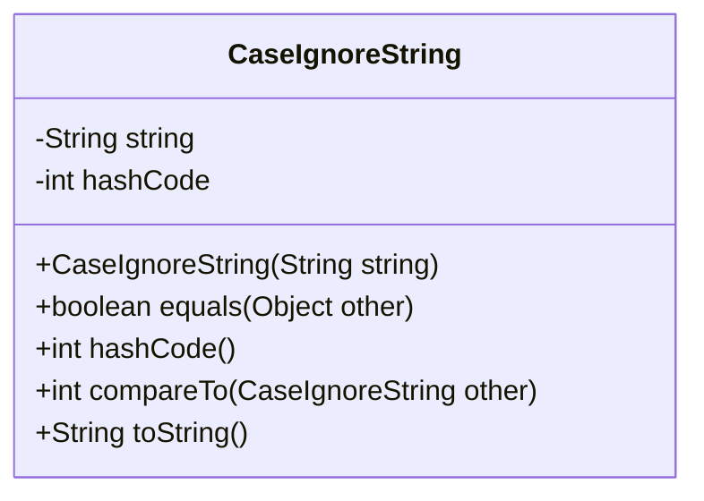
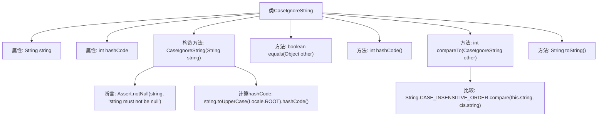

# 基础信息

|      |      |
|------|------|
| 名称 | CaseIgnoreString |
| 编码语言 | .java |
| 代码路径 | spring-ldap/core/src/main/java/org/springframework/ldap/odm/core/impl/CaseIgnoreString.java |
| 包名 | org.springframework.ldap.odm.core.impl |
| 依赖项 | ['java.util.Locale', 'org.springframework.util.Assert'] |
| 概述说明 | CaseIgnoreString类实现大小写不敏感的字符串比较、哈希和排序。 |

# 说明

CaseIgnoreString类提供了忽略大小写的字符串比较、哈希和排序功能。该类通过特殊实现，确保在进行字符串操作时，不区分字母的大小写。这使得在比较字符串、计算哈希值或进行排序时，能够忽略大小写差异，从而简化了字符串处理逻辑，提高了代码的通用性和可读性。

# 类列表 Class Summary

| 名称   | 类型  | 说明 |
|-------|------|-------------|
| CaseIgnoreString | class | CaseIgnoreString类实现忽略大小写的字符串比较、哈希和排序。 |

## 类 CaseIgnoreString

|      |      |
|------|------|
| 访问范围 | final |
| 类型 | class |
| 名称 | CaseIgnoreString |
| 说明 | CaseIgnoreString类实现忽略大小写的字符串比较、哈希和排序。 |

### UML类图

这段代码定义了一个 `CaseIgnoreString` 类，该类实现了 `Comparable<CaseIgnoreString>` 接口。该类的主要功能是处理忽略大小写的字符串比较和哈希计算。构造函数接受一个字符串参数，并将其转换为大写形式后计算哈希值。`equals` 方法用于比较两个 `CaseIgnoreString` 对象是否相等，忽略大小写。`compareTo` 方法用于按字典顺序比较两个字符串，同样忽略大小写。`toString` 方法返回原始字符串。该类通过 `hashCode` 方法缓存哈希值以提高性能。

### 内部方法调用关系图

这段代码定义了一个名为 `CaseIgnoreString` 的不可变类，实现了 `Comparable` 接口。该类用于处理不区分大小写的字符串比较和哈希计算。构造方法中，首先检查输入字符串是否为 `null`，然后计算其大写形式的哈希值并存储。`equals` 方法用于比较两个 `CaseIgnoreString` 对象的字符串是否相等（不区分大小写），`hashCode` 方法返回预先计算的哈希值，`compareTo` 方法使用 `String.CASE_INSENSITIVE_ORDER` 进行比较，`toString` 方法返回原始字符串。

### 字段列表 Field List

| 名称  | 类型  | 说明 |
|-------|-------|------|
| hashCode | int | 私有不可变的哈希码变量。 |
| string | String | 私有不可变字符串变量。 |

### 方法列表 Method List

| 名称  | 类型  | 说明 |
|-------|-------|------|
| equals | boolean | 重写equals方法，忽略大小写比较字符串。 |
| toString | String | 重写toString方法，返回当前对象的字符串值。 |
| compareTo | int | 重写compareTo方法，忽略大小写比较字符串。 |
| hashCode | int | 重写hashCode方法，返回当前对象的hashCode值。 |

