# 基础信息

|      |      |
|------|------|
| 名称 | DefaultObjectDirectoryMapper |
| 编码语言 | .java |
| 代码路径 | spring-ldap/core/src/main/java/org/springframework/ldap/odm/core/impl/DefaultObjectDirectoryMapper.java |
| 包名 | org.springframework.ldap.odm.core.impl |
| 依赖项 | ['java.lang.reflect.Field', 'java.util.ArrayList', 'java.util.Arrays', 'java.util.Collection', 'java.util.HashMap', 'java.util.HashSet', 'java.util.List', 'java.util.Map', 'java.util.Set', 'java.util.concurrent.ConcurrentHashMap', 'java.util.concurrent.ConcurrentMap', 'javax.naming.Name', 'javax.naming.NamingEnumeration', 'javax.naming.NamingException', 'javax.naming.directory.Attribute', 'javax.naming.directory.Attributes', 'org.slf4j.Logger', 'org.slf4j.LoggerFactory', 'org.springframework.LdapDataEntry', 'org.springframework.core.convert.ConversionService', 'org.springframework.core.convert.support.GenericConversionService', 'org.springframework.ldap.convert.ConverterUtils', 'org.springframework.ldap.filter.AndFilter', 'org.springframework.ldap.filter.EqualsFilter', 'org.springframework.ldap.filter.Filter', 'org.springframework.ldap.odm.annotations.DnAttribute', 'org.springframework.ldap.odm.core.ObjectDirectoryMapper', 'org.springframework.ldap.odm.typeconversion.ConverterManager', 'org.springframework.ldap.odm.typeconversion.impl.ConversionServiceConverterManager', 'org.springframework.ldap.support.LdapNameBuilder', 'org.springframework.ldap.support.LdapUtils', 'org.springframework.util.Assert', 'org.springframework.util.ReflectionUtils'] |
| 概述说明 | DefaultObjectDirectoryMapper实现对象与LDAP数据映射，管理元数据及属性转换。 |

# 说明

DefaultObjectDirectoryMapper负责实现对象与LDAP数据之间的映射，管理类元数据，并处理属性转换。该组件确保对象与LDAP目录之间的数据同步和一致性，通过元数据管理优化映射过程，同时处理不同属性格式的转换，以支持高效的数据交互和操作。

# 类列表 Class Summary

| 名称   | 类型  | 说明 |
|-------|------|-------------|
| DefaultObjectDirectoryMapper | class | DefaultObjectDirectoryMapper实现对象与LDAP数据映射，管理类元数据并处理属性转换。 |

## 类 DefaultObjectDirectoryMapper

|      |      |
|------|------|
| 访问范围 | public |
| 类型 | class |
| 名称 | DefaultObjectDirectoryMapper |
| 说明 | DefaultObjectDirectoryMapper实现对象与LDAP数据映射，管理类元数据并处理属性转换。 |

### UML类图

```mermaid
classDiagram
    class DefaultObjectDirectoryMapper {
        -Logger LOG
        -ConverterManager converterManager
        -String OBJECT_CLASS_ATTRIBUTE
        -CaseIgnoreString OBJECT_CLASS_ATTRIBUTE_CI
        -ConcurrentMap~Class~?~, EntityData~ metaDataMap
        +DefaultObjectDirectoryMapper()
        -ConverterManager createDefaultConverterManager()
        +void setConverterManager(ConverterManager converterManager)
        +void setConversionService(ConversionService conversionService)
        -EntityData getEntityData(Class~?~ managedClass)
        +String[] manageClass(Class~?~ clazz)
        -EntityData addManagedClass(Class~?~ managedClass)
        -void verifyConversion(Class~?~ managedClass, Field field, AttributeMetaData attributeInfo)
        +void mapToLdapDataEntry(Object entry, LdapDataEntry context)
        -void populateMultiValueAttribute(Object entry, LdapDataEntry context, Field field, AttributeMetaData attributeInfo, Class~?~ targetClass)
        -void populateSingleValueAttribute(Object entry, LdapDataEntry context, Field field, AttributeMetaData attributeInfo, Class~?~ targetClass)
        +~T~ mapFromLdapDataEntry(LdapDataEntry context, Class~T~ clazz)
        -~T~ populateMultiValueField(T result, Map~CaseIgnoreString, Attribute~ attributeValueMap, Field field, AttributeMetaData attributeInfo)
        -~T~ populateSingleValueField(T result, Map~CaseIgnoreString, Attribute~ attributeValueMap, Field field, AttributeMetaData attributeInfo)
        +Name getId(Object entry)
        -Field getIdField(Object entry)
        +void setId(Object entry, Name id)
        +Name getCalculatedId(Object entry)
        +Filter filterFor(Class~?~ clazz, Filter baseFilter)
        +String attributeFor(Class~?~ clazz, String fieldName)
        +ConcurrentMap~Class~?~, EntityData~ getMetaDataMap()
        -static boolean collectionContainsAll(Collection~?~ collection, Set~?~ shouldBePresent)
    }

    class EntityData {
        -ObjectMetaData metaData
        -Filter ocFilter
        +EntityData(ObjectMetaData metaData, Filter ocFilter)
    }

    class ObjectMetaData {
        <<Interface>>
    }

    class AttributeMetaData {
        <<Interface>>
    }

    class ConverterManager {
        <<Interface>>
    }

    class ConversionService {
        <<Interface>>
    }

    class LdapDataEntry {
        <<Interface>>
    }

    class Name {
        <<Interface>>
    }

    class Filter {
        <<Interface>>
    }

    class CaseIgnoreString {
        <<Interface>>
    }

    class ConversionServiceConverterManager {
        <<Interface>>
    }

    class ConverterUtils {
        <<Interface>>
    }

    class InvalidEntryException {
        <<Interface>>
    }

    class ReflectionUtils {
        <<Interface>>
    }

    class LdapUtils {
        <<Interface>>
    }

    class LdapNameBuilder {
        <<Interface>>
    }

    DefaultObjectDirectoryMapper --> ConverterManager : 依赖
    DefaultObjectDirectoryMapper --> ConversionService : 依赖
    DefaultObjectDirectoryMapper --> LdapDataEntry : 依赖
    DefaultObjectDirectoryMapper --> Name : 依赖
    DefaultObjectDirectoryMapper --> Filter : 依赖
    DefaultObjectDirectoryMapper --> CaseIgnoreString : 依赖
    DefaultObjectDirectoryMapper --> ConversionServiceConverterManager : 依赖
    DefaultObjectDirectoryMapper --> ConverterUtils : 依赖
    DefaultObjectDirectoryMapper --> InvalidEntryException : 依赖
    DefaultObjectDirectoryMapper --> ReflectionUtils : 依赖
    DefaultObjectDirectoryMapper --> LdapUtils : 依赖
    DefaultObjectDirectoryMapper --> LdapNameBuilder : 依赖
    DefaultObjectDirectoryMapper --> ObjectMetaData : 依赖
    DefaultObjectDirectoryMapper --> AttributeMetaData : 依赖
    EntityData --> ObjectMetaData : 依赖
    EntityData --> Filter : 依赖
```

### 描述
`DefaultObjectDirectoryMapper` 是一个用于管理对象与LDAP目录之间映射的类。它通过`ConverterManager`和`ConversionService`处理类型转换，并使用`ObjectMetaData`和`AttributeMetaData`来管理元数据。该类提供了从LDAP数据到Java对象的映射功能，并支持多值属性和单值属性的处理。此外，它还处理对象的ID生成和验证，并提供了过滤器和属性查询的功能。

### 内部方法调用关系图

**描述：**
`DefaultObjectDirectoryMapper` 类是一个用于管理对象与LDAP目录之间映射的工具。它通过 `converterManager` 处理数据类型转换，并通过 `metaDataMap` 缓存对象的元数据。类中的方法包括管理类的属性、验证转换、映射数据到LDAP条目、从LDAP条目映射到Java对象等。流程图展示了类的属性和方法之间的调用关系，帮助理解类的内部逻辑和数据流动。

### 字段列表 Field List

| 名称  | 类型  | 说明 |
|-------|-------|------|
| LOG = LoggerFactory.getLogger(DefaultObjectDirectoryMapper.class) | Logger | 在类中定义了一个名为LOG的静态常量日志记录器。 |
| converterManager | ConverterManager | 声明私有ConverterManager类型变量converterManager。 |
| metaDataMap = new ConcurrentHashMap<>() | ConcurrentMap<Class<?>, EntityData> | 使用ConcurrentHashMap存储类与实体数据的映射。 |
| OBJECT_CLASS_ATTRIBUTE_CI = new CaseIgnoreString(OBJECT_CLASS_ATTRIBUTE) | CaseIgnoreString | 定义忽略大小写的OBJECT_CLASS_ATTRIBUTE常量。 |
| OBJECT_CLASS_ATTRIBUTE = "objectclass" | String | 定义私有静态常量OBJECT_CLASS_ATTRIBUTE，值为"objectclass"。 |

### 方法列表 Method List

| 名称  | 类型  | 说明 |
|-------|-------|------|
| setConversionService | void | 设置转换服务，初始化转换管理器。 |
| collectionContainsAll | boolean | 检查集合是否包含指定集合的所有元素。 |
| createDefaultConverterManager | ConverterManager | 创建默认转换管理器，初始化通用转换服务并添加默认转换器。 |
| getIdField | Field | 该方法通过实体类获取ID字段。 |
| setConverterManager | void | 自3.3版本起，setConverterManager方法已被弃用。 |
| mapToLdapDataEntry | void | 将对象数据映射到LDAP条目，处理对象类和字段属性。 |
| getId | Name | 重写getId方法，获取对象ID字段，异常时抛出InvalidEntryException。 |
| getCalculatedId | Name | 方法根据实体数据计算并返回LDAP名称，若属性为空则抛出异常。 |
| populateSingleValueAttribute | void | 方法将字段值转换为目标类型并写入JNDI上下文，忽略空值。 |
| getEntityData | EntityData | 根据类获取实体数据，若无则添加并返回。 |
| addManagedClass | EntityData | 方法添加管理类，检查无参构造器和必要转换器，更新元数据映射。 |
| attributeFor | String | 根据类及字段名获取属性元数据名称，若字段不存在则抛出异常。 |
| verifyConversion | void | 验证字段类型转换，缺失转换器时抛出异常。 |
| getMetaDataMap | ConcurrentMap<Class<?>, EntityData> | 获取元数据映射的并发映射方法。 |
| mapFromLdapDataEntry | T | 将LDAP数据条目映射到Java对象，检查对象类并填充字段值。 |
| populateMultiValueField | void | 方法从JNDI属性映射中提取多值字段并设置到Java对象中。 |
| filterFor | Filter | 根据类获取过滤器，若基础过滤器为空则返回OC过滤器，否则返回合并过滤器。 |
| setId | void | 重写setId方法，通过反射设置entry的id字段，异常时抛出InvalidEntryException。 |
| populateSingleValueField | void | 方法`populateSingleValueField`从属性映射获取值，转换后设置到指定字段。 |
| populateMultiValueAttribute | void | 该方法将字段值转换为目标类并设置到上下文中，忽略空值和空列表。 |
| manageClass | String[] | 方法`manageClass`提取类属性，排除临时字段，返回管理属性数组，包含`objectclass`。 |

