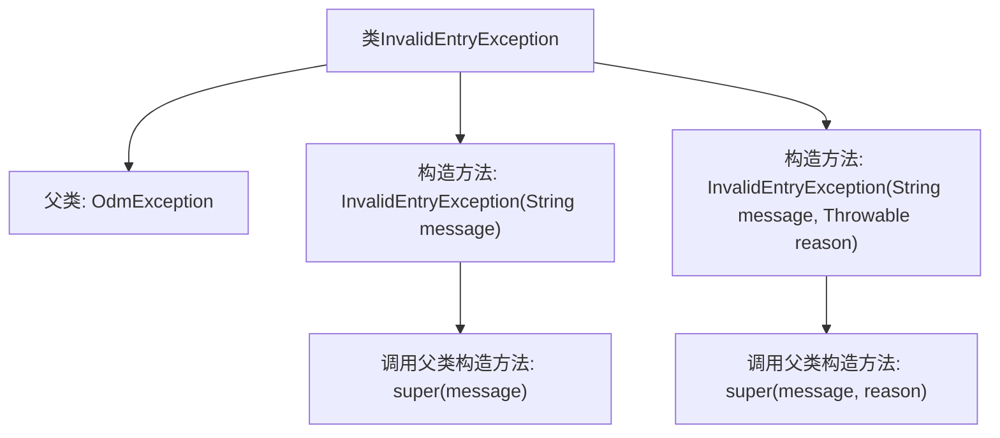

# 基础信息

|      |      |
|------|------|
| 名称 | InvalidEntryException |
| 编码语言 | .java |
| 代码路径 | spring-ldap/core/src/main/java/org/springframework/ldap/odm/core/impl/InvalidEntryException.java |
| 包名 | org.springframework.ldap.odm.core.impl |
| 依赖项 | ['org.springframework.ldap.odm.core.OdmException'] |
| 概述说明 | InvalidEntryException继承OdmException，提供两种构造方法。 |

# 说明

InvalidEntryException继承自OdmException，提供了两种构造方法。这种异常类通常用于处理在数据访问或对象映射过程中遇到的无效条目情况。通过继承OdmException，InvalidEntryException可以利用其父类的异常处理机制，同时通过两种不同的构造方法，开发者可以根据具体需求灵活地初始化异常实例，以便更精确地捕获和处理错误信息。

# 类列表 Class Summary

| 名称   | 类型  | 说明 |
|-------|------|-------------|
| InvalidEntryException | class | InvalidEntryException继承OdmException，提供两种构造方法。 |


## 类 InvalidEntryException

|      |      |
|------|------|
| 访问范围 | @SuppressWarnings("serial");public |
| 类型 | class |
| 名称 | InvalidEntryException |
| 说明 | InvalidEntryException继承OdmException，提供两种构造方法。 |


### UML类图

```mermaid
classDiagram
    class OdmException {
        <<Serializable>>
    }
    class InvalidEntryException {
        +InvalidEntryException(String message)
        +InvalidEntryException(String message, Throwable reason)
    }
    OdmException <|-- InvalidEntryException // InvalidEntryException继承自OdmException
```

类图描述：  
`InvalidEntryException` 是一个自定义异常类，继承自 `OdmException`。它提供了两个构造函数，一个接受字符串类型的错误信息，另一个额外接受一个 `Throwable` 类型的异常原因。该类主要用于处理无效的输入或操作，并将错误信息传递给父类 `OdmException` 进行进一步处理。


### 内部方法调用关系图



这段代码定义了一个名为 `InvalidEntryException` 的异常类，它继承自 `OdmException`。该类包含两个构造方法：一个接受字符串参数 `message`，另一个接受字符串参数 `message` 和 `Throwable` 参数 `reason`。这两个构造方法分别调用了父类 `OdmException` 的相应构造方法。该异常类用于处理无效的条目异常情况，提供了传递错误信息和原因的能力。

### 字段列表 Field List

| 名称  | 类型  | 说明 |
|-------|-------|------|

### 方法列表 Method List

| 名称  | 类型  | 说明 |
|-------|-------|------|


