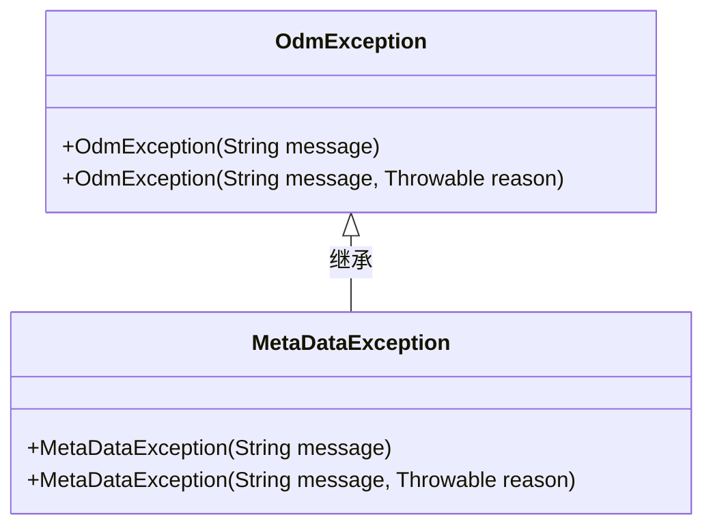
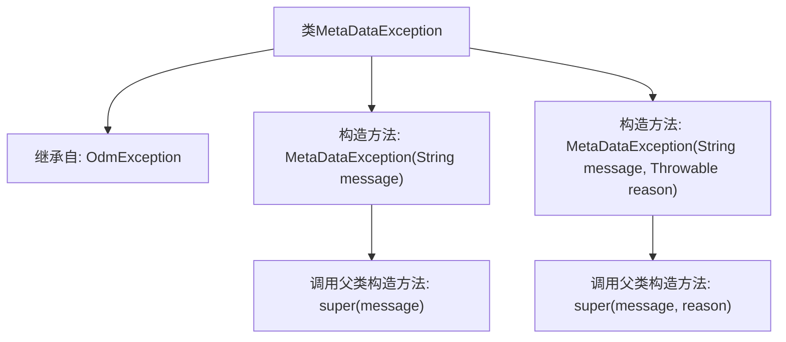

# 基础信息

|      |      |
|------|------|
| 名称 | MetaDataException |
| 编码语言 | .java |
| 代码路径 | spring-ldap/core/src/main/java/org/springframework/ldap/odm/core/impl/MetaDataException.java |
| 包名 | org.springframework.ldap.odm.core.impl |
| 依赖项 | ['org.springframework.ldap.odm.core.OdmException'] |
| 概述说明 | MetaDataException继承OdmException，支持带消息和原因的构造函数。 |

# 说明

MetaDataException类继承自OdmException类，支持通过构造函数传递消息和原因。该类用于处理元数据相关的异常情况，允许开发者在抛出异常时提供详细的错误信息和导致异常的根本原因，以便更好地进行错误追踪和调试。

# 类列表 Class Summary

| 名称   | 类型  | 说明 |
|-------|------|-------------|
| MetaDataException | class | MetaDataException类继承OdmException，支持带消息和原因的构造函数。 |

## 类 MetaDataException

|      |      |
|------|------|
| 访问范围 | @SuppressWarnings("serial");public |
| 类型 | class |
| 名称 | MetaDataException |
| 说明 | MetaDataException类继承OdmException，支持带消息和原因的构造函数。 |

### UML类图

这段代码定义了一个名为 `MetaDataException` 的异常类，它继承自 `OdmException` 类。`MetaDataException` 类提供了两个构造函数，分别用于创建带有错误信息或带有错误信息和原因的异常对象。通过继承，`MetaDataException` 类能够复用 `OdmException` 类的功能，并且可以扩展自定义的异常处理逻辑。这种设计模式在异常处理中非常常见，能够有效地管理和区分不同类型的异常。

### 内部方法调用关系图

这段代码定义了一个名为`MetaDataException`的异常类，它继承自`OdmException`。该类提供了两个构造方法：一个接受字符串`message`作为参数，另一个接受字符串`message`和`Throwable`对象`reason`作为参数。两个构造方法都调用了父类的构造方法，分别传递`message`或`message`和`reason`。这段代码主要用于处理与元数据相关的异常情况。

### 字段列表 Field List

| 名称  | 类型  | 说明 |
|-------|-------|------|

### 方法列表 Method List

| 名称  | 类型  | 说明 |
|-------|-------|------|

