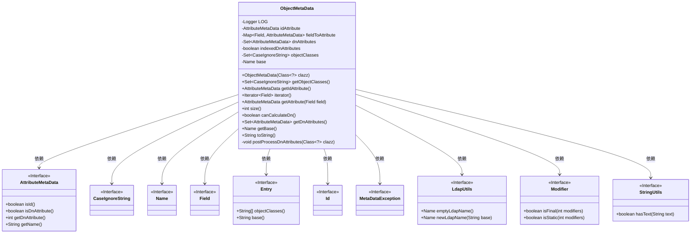

# 基础信息

|      |      |
|------|------|
| 名称 | ObjectMetaData |
| 编码语言 | .java |
| 代码路径 | spring-ldap/core/src/main/java/org/springframework/ldap/odm/core/impl/ObjectMetaData.java |
| 包名 | org.springframework.ldap.odm.core.impl |
| 依赖项 | ['java.lang.reflect.Field', 'java.lang.reflect.Modifier', 'java.util.Comparator', 'java.util.HashMap', 'java.util.Iterator', 'java.util.LinkedHashSet', 'java.util.Map', 'java.util.Set', 'java.util.TreeSet', 'javax.naming.Name', 'org.slf4j.Logger', 'org.slf4j.LoggerFactory', 'org.springframework.ldap.odm.annotations.Entry', 'org.springframework.ldap.odm.annotations.Id', 'org.springframework.ldap.support.LdapUtils', 'org.springframework.util.StringUtils'] |
| 概述说明 | ObjectMetaData类管理元数据，包含字段、ID、DN属性，支持迭代和处理。 |

# 说明

ObjectMetaData类负责管理元数据，主要包含三个关键属性：字段属性、ID属性和DN属性。该类支持对元数据进行迭代操作，并提供处理属性的功能，确保元数据的高效管理和灵活使用。

# 类列表 Class Summary

| 名称   | 类型  | 说明 |
|-------|------|-------------|
| ObjectMetaData | class | ObjectMetaData类管理元数据，包含字段属性、ID属性和DN属性，支持迭代和属性处理。 |

## 类 ObjectMetaData

|      |      |
|------|------|
| 访问范围 | final |
| 类型 | class |
| 名称 | ObjectMetaData |
| 说明 | ObjectMetaData类管理元数据，包含字段属性、ID属性和DN属性，支持迭代和属性处理。 |

### UML类图

### 描述
`ObjectMetaData` 类用于管理对象的元数据，包括属性、对象类、基础名称等信息。它通过 `AttributeMetaData` 类处理字段的元数据，并通过 `Entry` 和 `Id` 注解获取类级别的元数据。`ObjectMetaData` 类还实现了 `Iterable` 接口，允许遍历字段。此外，它通过 `LdapUtils` 和 `Modifier` 等工具类进行辅助操作，并在元数据处理过程中可能抛出 `MetaDataException` 异常。

### 内部方法调用关系图

```mermaid
graph TD
    A["类ObjectMetaData"]
    B["属性: Logger LOG"]
    C["属性: AttributeMetaData idAttribute"]
    D["属性: Map<Field, AttributeMetaData> fieldToAttribute"]
    E["属性: Set<AttributeMetaData> dnAttributes"]
    F["属性: boolean indexedDnAttributes"]
    G["属性: Set<CaseIgnoreString> objectClasses"]
    H["属性: Name base"]
    I["方法: Set<CaseIgnoreString> getObjectClasses()"]
    J["方法: AttributeMetaData getIdAttribute()"]
    K["方法: Iterator<Field> iterator()"]
    L["方法: AttributeMetaData getAttribute(Field field)"]
    M["方法: ObjectMetaData(Class<?> clazz)"]
    N["方法: private void postProcessDnAttributes(Class<?> clazz)"]
    O["方法: int size()"]
    P["方法: boolean canCalculateDn()"]
    Q["方法: Set<AttributeMetaData> getDnAttributes()"]
    R["方法: Name getBase()"]
    S["方法: String toString()"]

    A --> B
    A --> C
    A --> D
    A --> E
    A --> F
    A --> G
    A --> H
    A --> I
    A --> J
    A --> K
    A --> L
    A --> M
    M --> N
    A --> O
    A --> P
    A --> Q
    A --> R
    A --> S
```

这段代码定义了一个名为`ObjectMetaData`的类，用于管理和处理与LDAP（轻量级目录访问协议）相关的元数据。类中包含多个属性，如`idAttribute`、`fieldToAttribute`、`dnAttributes`等，用于存储和操作元数据。类还提供了多个方法，如`getObjectClasses`、`getIdAttribute`、`iterator`等，用于获取和操作这些元数据。构造方法`ObjectMetaData(Class<?> clazz)`负责从给定的类中提取元数据，并进行必要的验证和处理。私有方法`postProcessDnAttributes`用于处理`dnAttributes`的索引状态。该类还实现了`Iterable`接口，允许遍历`fieldToAttribute`中的字段。

### 字段列表 Field List

| 名称  | 类型  | 说明 |
|-------|-------|------|
| idAttribute | AttributeMetaData | 私有属性元数据标识符。 |
| indexedDnAttributes = false | boolean | 布尔变量indexedDnAttributes初始值为false。 |
| base = LdapUtils.emptyLdapName() | Name | 初始化名为base的私有变量，赋值为空LDAP名称。 |
| fieldToAttribute = new HashMap<>() | Map<Field, AttributeMetaData> | 私有映射存储字段与属性元数据的关联。 |
| LOG = LoggerFactory.getLogger(ObjectMetaData.class) | Logger | 定义日志记录器，用于ObjectMetaData类的日志输出。 |
| dnAttributes = new TreeSet<>(new Comparator<>() {		@Override		public int compare(AttributeMetaData a1, AttributeMetaData a2) {			if (!a1.isDnAttribute() || !a2.isDnAttribute()) {				// Not interesting to compare these.				return 0;			}			return Integer.valueOf(a1.getDnAttribute().index()).compareTo(a2.getDnAttribute().index());		}	}) | Set<AttributeMetaData> | 使用TreeSet按DN属性索引排序AttributeMetaData集合。 |
| objectClasses = new LinkedHashSet<>() | Set<CaseIgnoreString> | 声明了一个存储忽略大小写字符串的LinkedHashSet对象。 |

### 方法列表 Method List

| 名称  | 类型  | 说明 |
|-------|-------|------|
| size | int | 方法返回fieldToAttribute的大小。 |
| getBase | Name | 获取当前对象的base属性值。 |
| getIdAttribute | AttributeMetaData | 获取对象中的id属性值。 |
| getDnAttributes | Set<AttributeMetaData> | 获取当前对象的dnAttributes属性集合。 |
| canCalculateDn | boolean | 方法检查dnAttributes非空且indexedDnAttributes为真。 |
| getAttribute | AttributeMetaData | 方法getAttribute根据字段返回对应的属性元数据。 |
| toString | String | 重写toString方法，返回对象类、ID字段和属性信息。 |
| postProcessDnAttributes | void | 方法检查类属性索引状态，混合索引和非索引属性时抛出异常。 |
| getObjectClasses | Set<CaseIgnoreString> | 该方法返回对象类集合，忽略大小写。 |
| iterator | Iterator<Field> | 重写iterator方法，返回字段到属性键集的迭代器。 |

