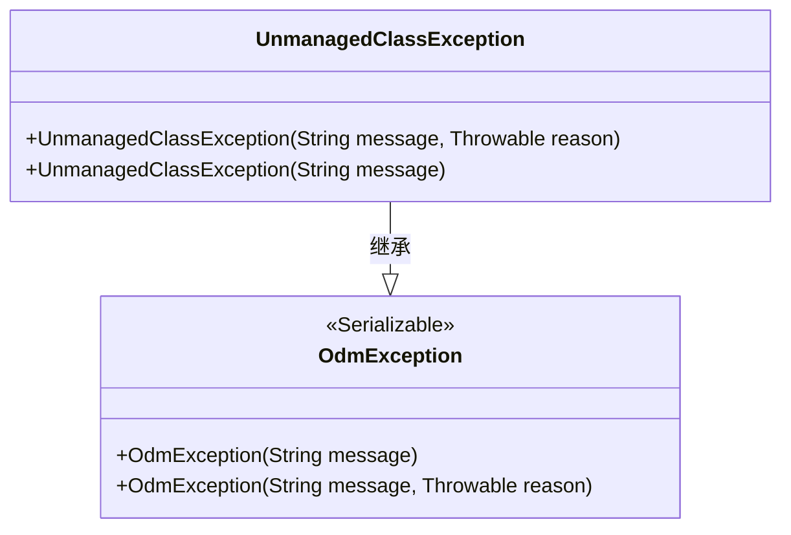
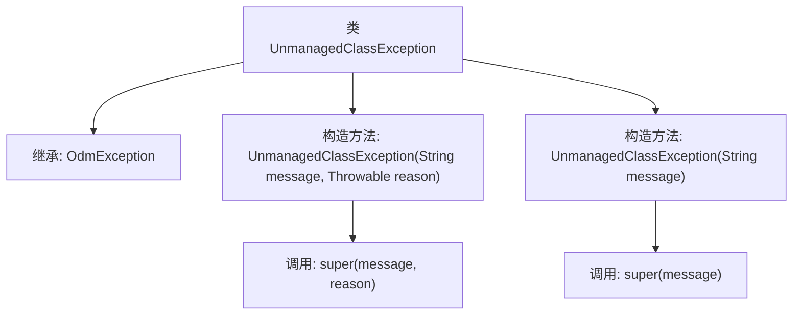

# 基础信息

|      |      |
|------|------|
| 名称 | UnmanagedClassException |
| 编码语言 | .java |
| 代码路径 | spring-ldap/core/src/main/java/org/springframework/ldap/odm/core/impl/UnmanagedClassException.java |
| 包名 | org.springframework.ldap.odm.core.impl |
| 依赖项 | ['org.springframework.ldap.odm.core.OdmException'] |
| 概述说明 | UnmanagedClassException继承OdmException，提供两种构造方法。 |

# 说明

UnmanagedClassException继承自OdmException，提供了两种构造方法：一种不带原因参数，另一种带原因参数。这两种构造方法允许在抛出异常时，可以选择是否包含导致异常的具体原因信息，从而提供更灵活的异常处理方式。

# 类列表 Class Summary

| 名称   | 类型  | 说明 |
|-------|------|-------------|
| UnmanagedClassException | class | UnmanagedClassException继承OdmException，提供带原因和不带原因的构造方法。 |

## 类 UnmanagedClassException

|      |      |
|------|------|
| 访问范围 | @SuppressWarnings("serial");public |
| 类型 | class |
| 名称 | UnmanagedClassException |
| 说明 | UnmanagedClassException继承OdmException，提供带原因和不带原因的构造方法。 |

### UML类图

这段代码定义了一个 `UnmanagedClassException` 类，它继承自 `OdmException` 类。`UnmanagedClassException` 提供了两个构造函数，一个接受 `String` 类型的 `message` 参数，另一个接受 `String` 类型的 `message` 和 `Throwable` 类型的 `reason` 参数。`OdmException` 类标记为 `<<Serializable>>`，表明它实现了序列化接口。`UnmanagedClassException` 类通过继承 `OdmException` 类，能够处理与未管理类相关的异常情况。

### 内部方法调用关系图

这段代码定义了一个名为 `UnmanagedClassException` 的类，它继承自 `OdmException`。该类包含两个构造方法：一个接受 `String` 和 `Throwable` 作为参数，并调用父类的构造方法 `super(message, reason)`；另一个仅接受 `String` 作为参数，并调用父类的构造方法 `super(message)`。这两个构造方法用于创建不同类型的异常实例，分别处理带有原因和不带有原因的异常情况。

### 字段列表 Field List

| 名称  | 类型  | 说明 |
|-------|-------|------|

### 方法列表 Method List

| 名称  | 类型  | 说明 |
|-------|-------|------|

