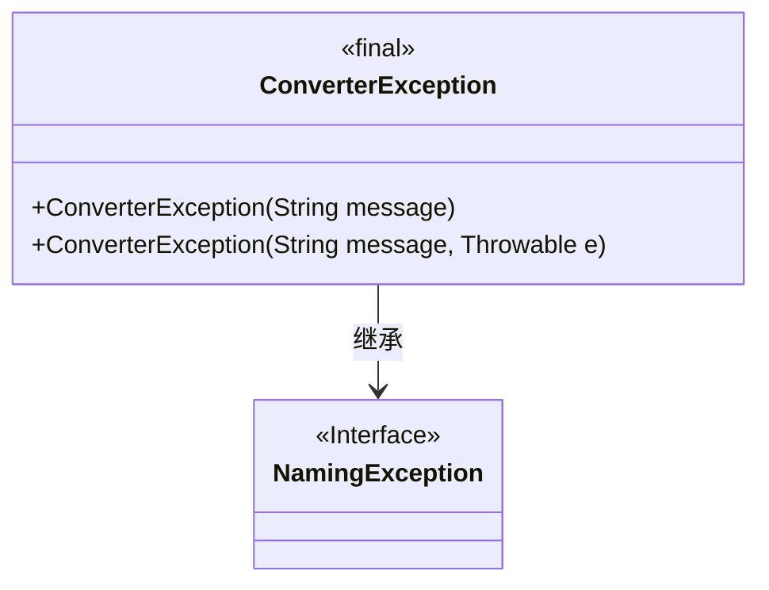
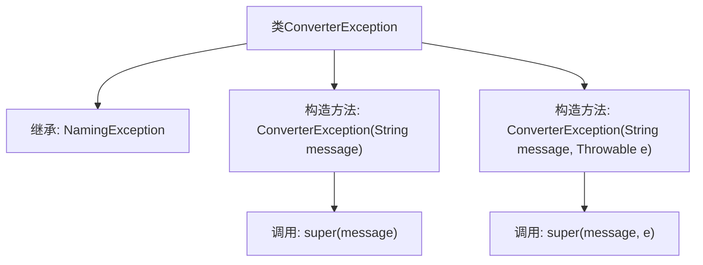

# 基础信息

|      |      |
|------|------|
| 名称 | ConverterException |
| 编码语言 | .java |
| 代码路径 | spring-ldap/core/src/main/java/org/springframework/ldap/odm/typeconversion/ConverterException.java |
| 包名 | org.springframework.ldap.odm.typeconversion |
| 依赖项 | ['org.springframework.ldap.NamingException'] |
| 概述说明 | ConverterException类弃用，继承NamingException，支持消息和异常构造。 |

# 说明

ConverterException类已被标记为弃用，该类继承自NamingException。它提供了两种构造方法，一种支持传递自定义消息，另一种支持同时传递消息和异常对象。这个类的设计主要用于处理命名相关的转换异常，但由于其弃用状态，建议在开发中避免使用。

# 类列表 Class Summary

| 名称   | 类型  | 说明 |
|-------|------|-------------|
| ConverterException | class | ConverterException类已弃用，继承自NamingException，支持带消息和异常的构造方法。 |

## 类 ConverterException

|      |      |
|------|------|
| 访问范围 | @Deprecated;@SuppressWarnings("serial");public final |
| 类型 | class |
| 名称 | ConverterException |
| 说明 | ConverterException类已弃用，继承自NamingException，支持带消息和异常的构造方法。 |

### UML类图

**描述：**  
`ConverterException` 是一个被标记为 `@Deprecated` 的最终类，表示它已过时且不应再使用。该类继承自 `NamingException` 接口，并提供了两个构造函数，分别用于传递错误信息和可选的异常原因。`NamingException` 是一个接口，`ConverterException` 通过继承它来实现异常处理的功能。

### 内部方法调用关系图

该流程图展示了`ConverterException`类的结构及其与`NamingException`的继承关系。类中包含两个构造方法，分别接受一个字符串消息和一个字符串消息与异常对象作为参数，并在构造方法中调用了父类`NamingException`的相应构造方法。流程图清晰地表示了类的层次结构和方法的调用关系。

### 字段列表 Field List

| 名称  | 类型  | 说明 |
|-------|-------|------|

### 方法列表 Method List

| 名称  | 类型  | 说明 |
|-------|-------|------|

