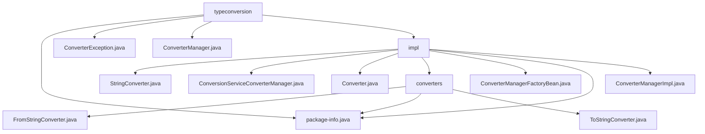

# 基础信息

|      |      |
|------|------|
| 名称 | typeconversion |
| 编码语言 | .java |
| 代码路径 | spring-ldap/core/src/main/java/org/springframework/ldap/odm/typeconversion |
| 包名 | spring-ldap.core.src.main.java.org.springframework.ldap.odm.typeconversion |
| 概述说明 | 类型转换模块涉及多个已弃用类，建议开发者寻找替代方案。 |

# 说明

## 概述

该代码模块主要涉及类型转换功能，包含多个已弃用的转换器类和管理器类。这些类主要用于将对象转换为指定类型的实例或字符串，并管理这些转换器的配置和使用。由于这些类已被弃用，开发者需要寻找替代方案或更新实现方式。

## 主要业务场景

1. **类型转换功能**：
   - **StringConverter类**：已被标记为弃用，主要用于字符串转换。开发者应考虑寻找替代方案或更新代码以避免潜在的问题。
   - **FromStringConverter类**：功能是将对象转换为指定类的实例。由于已被弃用，开发者需要寻找替代方案来实现相同的转换功能。
   - **ToStringConverter类**：实现了Converter接口，主要功能是将对象转换为字符串。同样，由于已被弃用，建议开发者寻找替代方案或更新实现方式。

2. **转换器管理**：
   - **ConversionServiceConverterManager类**：已弃用的转换服务管理器，支持自定义和默认转换服务，主要用于实现类型转换功能。尽管已被弃用，但其核心功能仍然涉及在类型之间进行转换。
   - **ConverterManagerImpl类**：负责管理类型转换的核心组件，支持用户自定义转换器，并能处理原始数据类型。其设计旨在提供高效且可扩展的类型转换机制。
   - **ConverterManagerFactoryBean类**：已废弃的类，主要用于创建ConverterManagerImpl实例，并负责配置相关的转换器。该类已不再使用，可能因其功能被其他更优的解决方案取代或整合。

3. **包级信息**：
   - **package-info.java**：可能包含与类型转换相关的包级注释或元数据，但未提供具体信息。

总结来说，该模块的核心业务场景是处理对象与字符串或其他类型之间的转换，并通过管理器类来配置和管理这些转换器。但由于相关类已被弃用，开发者需要关注替代方案。

### 包内部结构视图

该流程图展示了`spring-ldap`项目中`typeconversion`目录及其子目录和文件的层级关系。`typeconversion`目录下包含多个文件和子目录，其中`impl`子目录下又包含了多个文件和`converters`子目录，`converters`子目录下也包含了多个文件。整个结构清晰地展示了文件之间的层级关系。

# 文件列表 File List

| 名称   | 类型  | 说明 |
|-------|------|-------------|
| [ConverterManager.java](ConverterManager.md) | file | 信息为空，无法生成概要描述。 |
| [package-info.java](package-info.md) | file | 信息为空，无法生成概要描述。 |
| [ConverterException.java](ConverterException.md) | file | ConverterException类弃用，继承NamingException，支持消息和异常构造。 |
| [impl](impl/_module.md) | package | 多个转换器类已被弃用，建议开发者寻找替代方案更新代码。 |

