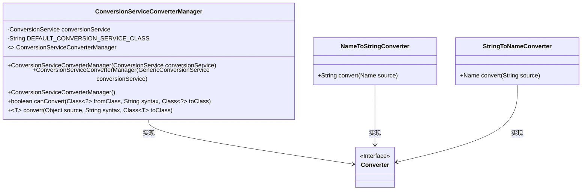

# 基础信息

|      |      |
|------|------|
| 名称 | ConversionServiceConverterManager |
| 编码语言 | .java |
| 代码路径 | spring-ldap/core/src/main/java/org/springframework/ldap/odm/typeconversion/impl/ConversionServiceConverterManager.java |
| 包名 | org.springframework.ldap.odm.typeconversion.impl |
| 依赖项 | ['javax.naming.Name', 'org.springframework.core.convert.ConversionService', 'org.springframework.core.convert.support.GenericConversionService', 'org.springframework.ldap.convert.ConverterUtils', 'org.springframework.ldap.odm.typeconversion.ConverterManager', 'org.springframework.ldap.support.LdapUtils', 'org.springframework.util.ClassUtils', 'org.springframework.util.ReflectionUtils'] |
| 概述说明 | 弃用转换服务管理器，支持自定义与默认转换服务，具备类型转换功能。 |

# 说明

已弃用的转换服务管理器是一个支持自定义和默认转换服务的工具，主要用于实现类型转换功能。该管理器允许用户根据需求定义特定的转换逻辑，同时也提供了一套默认的转换服务以满足常见需求。尽管该管理器已被弃用，但其核心功能仍然涉及在类型之间进行转换，帮助开发者处理不同类型数据的转换问题。

# 类列表 Class Summary

| 名称   | 类型  | 说明 |
|-------|------|-------------|
| ConversionServiceConverterManager | class | 已弃用的转换服务管理器，支持自定义和默认转换服务，提供类型转换功能。 |

## 类 ConversionServiceConverterManager

|      |      |
|------|------|
| 访问范围 | @Deprecated;public |
| 类型 | class |
| 名称 | ConversionServiceConverterManager |
| 说明 | 已弃用的转换服务管理器，支持自定义和默认转换服务，提供类型转换功能。 |

### UML类图

**描述：**
`ConversionServiceConverterManager` 是一个管理类型转换的类，它依赖于 `ConversionService` 来实现具体的转换逻辑。该类提供了多个构造函数，允许通过不同的方式初始化 `ConversionService`。它还包含两个内部静态类 `NameToStringConverter` 和 `StringToNameConverter`，它们分别实现了 `Converter` 接口，用于将 `Name` 类型转换为 `String` 类型以及将 `String` 类型转换为 `Name` 类型。整个类图展示了 `ConversionServiceConverterManager` 与 `Converter` 接口及其实现类之间的关系。

### 内部方法调用关系图

```mermaid
graph TD
    A["类ConversionServiceConverterManager"]
    B["属性: ConversionService conversionService"]
    C["常量: DEFAULT_CONVERSION_SERVICE_CLASS"]
    D["构造方法: ConversionServiceConverterManager(ConversionService conversionService)"]
    E["构造方法: ConversionServiceConverterManager(GenericConversionService conversionService)"]
    F["构造方法: ConversionServiceConverterManager()"]
    G["方法: canConvert(Class<?> fromClass, String syntax, Class<?> toClass)"]
    H["方法: convert(Object source, String syntax, Class<T> toClass)"]
    I["内部类: NameToStringConverter"]
    J["方法: convert(Name source)"]
    K["内部类: StringToNameConverter"]
    L["方法: convert(String source)"]
    M["操作: genericConversionService.addConverter(new StringToNameConverter())"]
    N["操作: Class<?> clazz = ClassUtils.forName(DEFAULT_CONVERSION_SERVICE_CLASS, defaultClassLoader)"]
    O["操作: genericConversionService = (GenericConversionService) clazz.newInstance()"]
    P["操作: ReflectionUtils.handleReflectionException(ex)"]
    Q["操作: return this.conversionService.canConvert(fromClass, toClass)"]
    R["操作: return this.conversionService.convert(source, toClass)"]
    S["操作: return source.toString()"]
    T["操作: return LdapUtils.newLdapName(source)"]

    A --> B
    A --> C
    A --> D
    A --> E
    A --> F
    A --> G
    A --> H
    A --> I
    A --> K
    I --> J
    K --> L
    F --> M
    F --> N
    F --> O
    F --> P
    G --> Q
    H --> R
    J --> S
    L --> T
```

这段代码定义了一个名为 `ConversionServiceConverterManager` 的类，它实现了 `ConverterManager` 接口。该类主要用于管理不同类型的转换服务，并提供了两个内部类 `NameToStringConverter` 和 `StringToNameConverter`，分别用于将 `Name` 对象转换为 `String` 和将 `String` 转换为 `Name`。代码通过构造函数初始化 `ConversionService`，并在无参构造函数中尝试加载默认的转换服务类。流程图展示了类的结构、方法调用关系以及内部类的转换逻辑。

### 字段列表 Field List

| 名称  | 类型  | 说明 |
|-------|-------|------|
| conversionService | ConversionService | 私有变量conversionService用于类型转换服务。 |
| DEFAULT_CONVERSION_SERVICE_CLASS = "org.springframework.core.convert.support.DefaultConversionService" | String | 默认转换服务类为Spring的DefaultConversionService。 |

### 方法列表 Method List

| 名称  | 类型  | 说明 |
|-------|-------|------|
| canConvert | boolean | 重写方法判断类间转换是否可行。 |
| convert | T | 该方法将源对象转换为目标类实例，使用内部转换服务实现。 |

