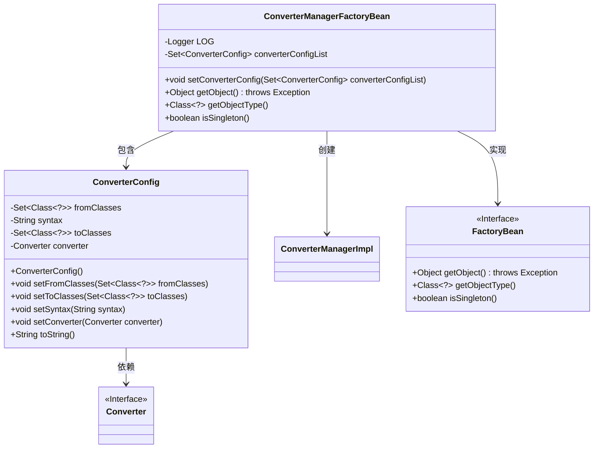
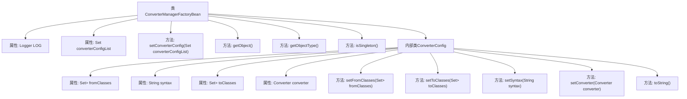

# 基础信息

|      |      |
|------|------|
| 名称 | ConverterManagerFactoryBean |
| 编码语言 | .java |
| 代码路径 | spring-ldap/core/src/main/java/org/springframework/ldap/odm/typeconversion/impl/ConverterManagerFactoryBean.java |
| 包名 | org.springframework.ldap.odm.typeconversion.impl |
| 依赖项 | ['java.util.HashSet', 'java.util.Set', 'org.slf4j.Logger', 'org.slf4j.LoggerFactory', 'org.springframework.beans.factory.FactoryBean', 'org.springframework.beans.factory.FactoryBeanNotInitializedException'] |
| 概述说明 | 废弃类ConverterManagerFactoryBean，用于创建并配置ConverterManagerImpl实例。 |

# 说明

废弃的ConverterManagerFactoryBean类主要用于创建ConverterManagerImpl实例，并负责配置相关的转换器。该类已不再使用，可能因其功能被其他更优的解决方案取代或整合。ConverterManagerImpl实例是管理转换器的核心组件，负责处理不同类型数据之间的转换逻辑。通过配置转换器，该类确保了数据转换的准确性和效率。尽管该类已被废弃，但其在设计模式和应用场景中的历史作用仍值得回顾。

# 类列表 Class Summary

| 名称   | 类型  | 说明 |
|-------|------|-------------|
| ConverterManagerFactoryBean | class | 废弃的ConverterManagerFactoryBean类，用于创建ConverterManagerImpl实例并配置转换器。 |

## 类 ConverterManagerFactoryBean

|      |      |
|------|------|
| 访问范围 | @Deprecated;public final |
| 类型 | class |
| 名称 | ConverterManagerFactoryBean |
| 说明 | 废弃的ConverterManagerFactoryBean类，用于创建ConverterManagerImpl实例并配置转换器。 |

### UML类图

这段代码定义了一个`ConverterManagerFactoryBean`类，它实现了`FactoryBean`接口，用于创建`ConverterManagerImpl`实例。`ConverterManagerFactoryBean`类包含一个`ConverterConfig`内部类，用于配置转换器的来源类、目标类和转换器实例。`ConverterConfig`类依赖于`Converter`接口，表示具体的转换器实现。`ConverterManagerFactoryBean`通过`getObject`方法创建并返回`ConverterManagerImpl`实例，同时确保配置的转换器信息完整无误。

### 内部方法调用关系图

这段代码定义了一个`ConverterManagerFactoryBean`类，用于管理和配置`Converter`实例。类中包含一个内部类`ConverterConfig`，用于存储转换器的配置信息。`ConverterManagerFactoryBean`类的主要功能是通过`getObject`方法创建并返回一个`ConverterManagerImpl`实例，该实例根据`converterConfigList`中的配置信息进行初始化。类还提供了`setConverterConfig`方法用于设置配置列表，以及`getObjectType`和`isSingleton`方法用于返回对象类型和是否为单例。内部类`ConverterConfig`则负责存储和设置转换器的源类、目标类、语法和转换器实例等信息。

### 字段列表 Field List

| 名称  | 类型  | 说明 |
|-------|-------|------|
| LOG = LoggerFactory.getLogger(ConverterManagerFactoryBean.class) | Logger | 定义静态日志记录器，用于ConverterManagerFactoryBean类。 |
| converterConfigList = null | Set<ConverterConfig> | 私有集合变量converterConfigList初始化为null。 |

### 方法列表 Method List

| 名称  | 类型  | 说明 |
|-------|-------|------|
| getObjectType | Class<?> | 该方法返回ConverterManagerImpl类的类型对象。 |
| setConverterConfig | void | 设置转换器配置列表的方法。 |
| isSingleton | boolean | 该方法返回布尔值true，表示单例模式。 |
| getObject | Object | 方法检查配置并初始化转换器管理器，若配置缺失则抛出异常。 |

