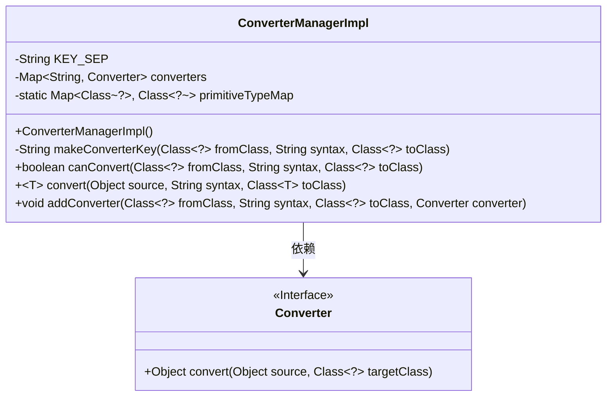
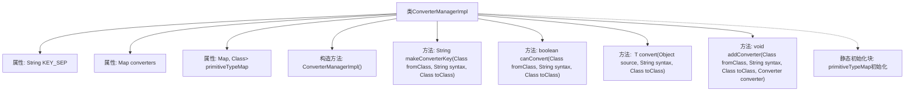

# 基础信息

|      |      |
|------|------|
| 名称 | ConverterManagerImpl |
| 编码语言 | .java |
| 代码路径 | spring-ldap/core/src/main/java/org/springframework/ldap/odm/typeconversion/impl/ConverterManagerImpl.java |
| 包名 | org.springframework.ldap.odm.typeconversion.impl |
| 依赖项 | ['java.util.HashMap', 'java.util.Map', 'org.springframework.ldap.odm.typeconversion.ConverterException', 'org.springframework.ldap.odm.typeconversion.ConverterManager'] |
| 概述说明 | ConverterManagerImpl管理类型转换，支持自定义和原始类型处理。 |

# 说明

ConverterManagerImpl是一个负责管理类型转换的核心组件，它支持用户自定义转换器，并能处理原始数据类型。通过该管理器，用户可以实现灵活的类型转换逻辑，满足不同场景下的需求。其设计旨在提供高效且可扩展的类型转换机制，确保在各种数据类型之间进行无缝转换，同时保持代码的简洁性和可维护性。

# 类列表 Class Summary

| 名称   | 类型  | 说明 |
|-------|------|-------------|
| ConverterManagerImpl | class | ConverterManagerImpl管理类型转换，支持自定义转换器和处理原始类型。 |

## 类 ConverterManagerImpl

|      |      |
|------|------|
| 访问范围 | @Deprecated;public final |
| 类型 | class |
| 名称 | ConverterManagerImpl |
| 说明 | ConverterManagerImpl管理类型转换，支持自定义转换器和处理原始类型。 |

### UML类图

这段代码定义了一个`ConverterManagerImpl`类，该类实现了`ConverterManager`接口，用于管理不同类型之间的转换器。`ConverterManagerImpl`类包含一个`converters`映射，用于存储从源类、语法和目标类组合生成的键到转换器的映射。它还包含一个`primitiveTypeMap`，用于处理基本类型与其包装类之间的映射。`ConverterManagerImpl`提供了`canConvert`方法用于检查是否可以进行转换，`convert`方法用于执行实际的转换操作，以及`addConverter`方法用于添加新的转换器。`Converter`接口定义了一个`convert`方法，用于执行具体的转换逻辑。

### 内部方法调用关系图

**描述：**
`ConverterManagerImpl` 类是一个用于管理类型转换的工具类，它通过 `converters` 映射存储不同类之间的转换器。类中包含了生成转换器键的方法 `makeConverterKey`，判断是否可转换的方法 `canConvert`，执行转换的方法 `convert`，以及添加转换器的方法 `addConverter`。此外，类中还包含了一个静态的 `primitiveTypeMap`，用于将基本类型映射到其对应的包装类。

### 字段列表 Field List

| 名称  | 类型  | 说明 |
|-------|-------|------|
| converters = new HashMap<>() | Map<String, Converter> | 定义私有最终Map变量converters，存储字符串到Converter的映射。 |
| KEY_SEP = ":" | String | 定义静态常量KEY_SEP，值为冒号。 |
| primitiveTypeMap = new HashMap<>() | Map<Class<?>, Class<?>> | 定义了一个静态Map，用于存储基本类型与其对应类的映射关系。 |

### 方法列表 Method List

| 名称  | 类型  | 说明 |
|-------|-------|------|
| makeConverterKey | String | 生成转换器键，包含源类名、语法和目标类名。 |
| canConvert | boolean | 方法检查类间转换，处理原始类型，并验证转换器是否存在。 |
| addConverter | void | 方法`addConverter`用于注册转换器，将指定类、语法和目标类组合为键，存储转换器。 |
| convert | T | 将对象按语法转换为目标类，处理基本类型，支持语法映射，失败抛出异常。 |

