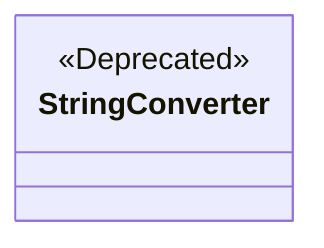
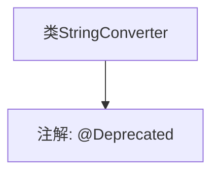

# 基础信息

|      |      |
|------|------|
| 名称 | StringConverter |
| 编码语言 | .java |
| 代码路径 | spring-ldap/core/src/main/java/org/springframework/ldap/odm/typeconversion/impl/StringConverter.java |
| 包名 | org.springframework.ldap.odm.typeconversion.impl |
| 依赖项 | [] |
| 概述说明 | StringConverter类现已弃用。 |

# 说明

StringConverter类已被标记为弃用状态，意味着该类的使用不再推荐，可能在未来的版本中被移除或替换。开发者应考虑寻找替代方案或更新代码以避免潜在的问题。弃用通常是由于存在更好的实现方式、安全漏洞或功能过时等原因。

# 类列表 Class Summary

| 名称   | 类型  | 说明 |
|-------|------|-------------|
| StringConverter | class | `StringConverter`类已弃用。 |

## 类 StringConverter

|      |      |
|------|------|
| 访问范围 | @Deprecated;public |
| 类型 | class |
| 名称 | StringConverter |
| 说明 | `StringConverter`类已弃用。 |

### UML类图

这段代码定义了一个名为 `StringConverter` 的类，并且该类被标记为 `@Deprecated`，表示该类已过时，不推荐使用。类图中，`StringConverter` 类被标注为 `<<Deprecated>>`，以明确其状态。该类目前没有定义任何成员变量或方法，仅作为一个标记类存在。

### 内部方法调用关系图

这段代码定义了一个名为 `StringConverter` 的类，并使用 `@Deprecated` 注解标记该类为已过时。`@Deprecated` 注解通常用于指示某个类、方法或字段不再推荐使用，可能在未来的版本中被移除或替换。代码非常简单，仅包含一个类定义和一个注解，没有其他方法或属性。

### 字段列表 Field List

| 名称  | 类型  | 说明 |
|-------|-------|------|

### 方法列表 Method List

| 名称  | 类型  | 说明 |
|-------|-------|------|

