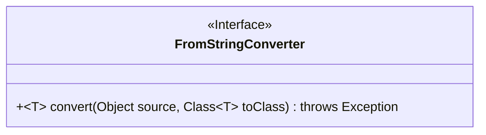
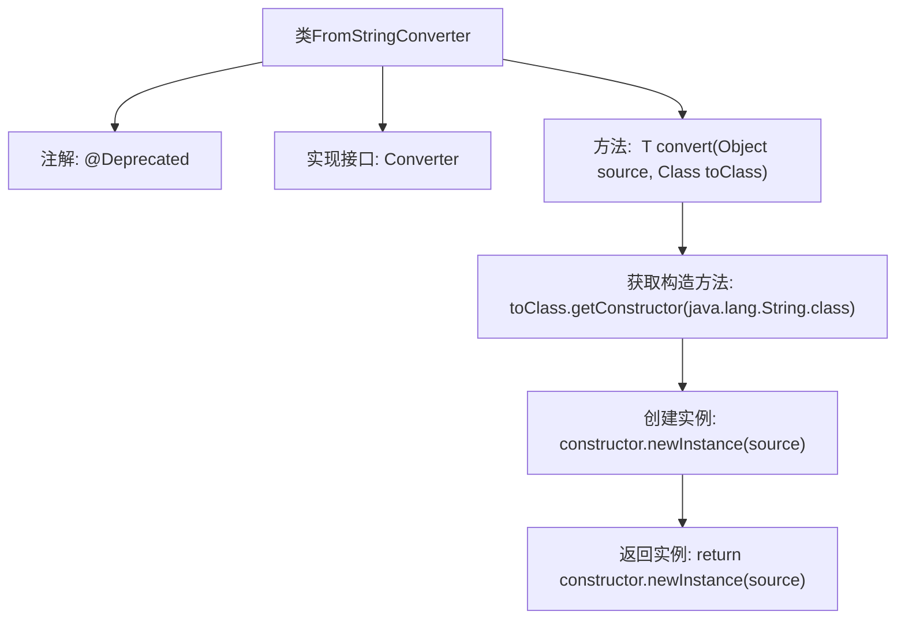

# 基础信息

|      |      |
|------|------|
| 名称 | FromStringConverter |
| 编码语言 | .java |
| 代码路径 | spring-ldap/core/src/main/java/org/springframework/ldap/odm/typeconversion/impl/converters/FromStringConverter.java |
| 包名 | org.springframework.ldap.odm.typeconversion.impl.converters |
| 依赖项 | ['java.lang.reflect.Constructor', 'org.springframework.ldap.odm.typeconversion.impl.Converter'] |
| 概述说明 | FromStringConverter类已弃用，原用于对象转换。 |

# 说明

FromStringConverter类已被弃用，其主要功能是将对象转换为指定类的实例。由于不再推荐使用，开发者应寻找替代方案以实现相同的转换功能。

# 类列表 Class Summary

| 名称   | 类型  | 说明 |
|-------|------|-------------|
| FromStringConverter | class | FromStringConverter类已弃用，用于将对象转换为指定类实例。 |

## 类 FromStringConverter

|      |      |
|------|------|
| 访问范围 | @Deprecated;public final |
| 类型 | class |
| 名称 | FromStringConverter |
| 说明 | FromStringConverter类已弃用，用于将对象转换为指定类实例。 |

### UML类图

这段代码定义了一个名为 `FromStringConverter` 的类，该类实现了 `Converter` 接口。`FromStringConverter` 类包含一个泛型方法 `convert`，该方法接受一个 `Object` 类型的源对象和一个 `Class<T>` 类型的目标类作为参数，并返回一个 `T` 类型的实例。该方法通过反射调用目标类的构造函数来创建实例。由于该类被标记为 `@Deprecated`，表示它已不再推荐使用。

### 内部方法调用关系图

这段代码定义了一个名为 `FromStringConverter` 的类，该类实现了 `Converter` 接口，并标记为 `@Deprecated`，表示已过时。类中的 `convert` 方法接收一个 `Object` 类型的源对象和一个 `Class<T>` 类型的目标类，通过反射获取目标类的构造方法，并利用该构造方法创建并返回一个新的实例。该方法主要用于将字符串转换为目标类的实例。

### 字段列表 Field List

| 名称  | 类型  | 说明 |
|-------|-------|------|

### 方法列表 Method List

| 名称  | 类型  | 说明 |
|-------|-------|------|
| convert | T | 方法convert将源对象转换为指定类实例，使用字符串构造函数。 |

