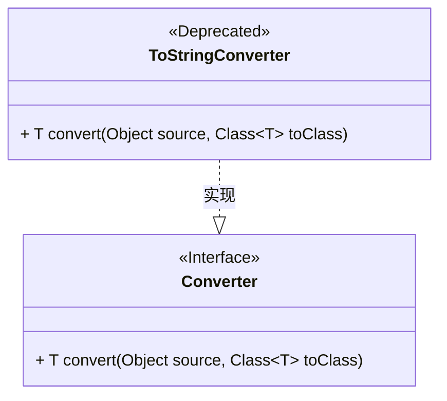
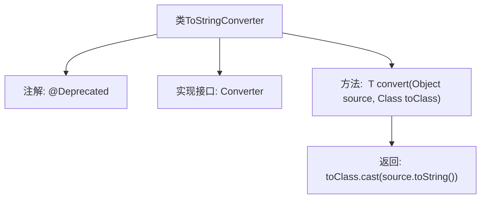

# 基础信息

|      |      |
|------|------|
| 名称 | ToStringConverter |
| 编码语言 | .java |
| 代码路径 | spring-ldap/core/src/main/java/org/springframework/ldap/odm/typeconversion/impl/converters/ToStringConverter.java |
| 包名 | org.springframework.ldap.odm.typeconversion.impl.converters |
| 依赖项 | ['org.springframework.ldap.odm.typeconversion.impl.Converter'] |
| 概述说明 | 已弃用的ToStringConverter类实现Converter接口，用于对象转字符串。 |

# 说明

已弃用的ToStringConverter类实现了Converter接口，其主要功能是将对象转换为字符串。由于该类已被弃用，建议开发者寻找替代方案或更新实现方式。

# 类列表 Class Summary

| 名称   | 类型  | 说明 |
|-------|------|-------------|
| ToStringConverter | class | 已弃用的ToStringConverter类实现Converter接口，将对象转换为字符串。 |

## 类 ToStringConverter

|      |      |
|------|------|
| 访问范围 | @Deprecated;public final |
| 类型 | class |
| 名称 | ToStringConverter |
| 说明 | 已弃用的ToStringConverter类实现Converter接口，将对象转换为字符串。 |

### UML类图

这段代码定义了一个`ToStringConverter`类，它实现了`Converter`接口。`ToStringConverter`类包含一个泛型方法`convert`，该方法将传入的`source`对象转换为字符串，并将其强制转换为目标类`toClass`的类型。由于`ToStringConverter`类被标记为`@Deprecated`，表示它已过时，不推荐使用。`Converter`接口定义了`convert`方法，`ToStringConverter`类通过实现该接口来提供具体的转换逻辑。

### 内部方法调用关系图

该流程图展示了`ToStringConverter`类的结构及其内部方法调用关系。`ToStringConverter`类被标记为`@Deprecated`，并实现了`Converter`接口。其核心方法`convert`接收一个`Object`和一个`Class<T>`参数，并返回将`source`对象转换为字符串后，再将其强制转换为`toClass`类型的对象。

### 字段列表 Field List

| 名称  | 类型  | 说明 |
|-------|-------|------|

### 方法列表 Method List

| 名称  | 类型  | 说明 |
|-------|-------|------|
| convert | T | 将对象转换为指定类型，通过调用toString方法并强制类型转换实现。 |

