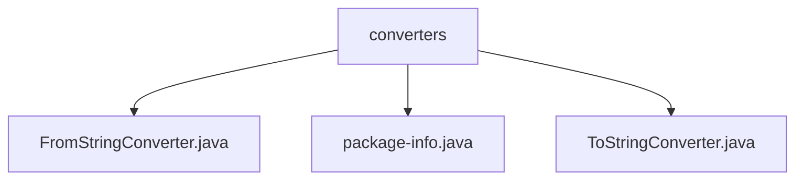

# 基础信息

|      |      |
|------|------|
| 名称 | converters |
| 编码语言 | .java |
| 代码路径 | spring-ldap/core/src/main/java/org/springframework/ldap/odm/typeconversion/impl/converters |
| 包名 | spring-ldap.core.src.main.java.org.springframework.ldap.odm.typeconversion.impl.converters |
| 概述说明 | FromStringConverter和ToStringConverter已弃用，建议开发者寻找替代方案。 |

# 说明

## 概述
该代码模块主要涉及类型转换功能，包含多个已弃用的转换器类。这些类主要用于将对象转换为指定类型的实例或字符串。由于这些类已被弃用，开发者需要寻找替代方案或更新实现方式。

## 主要业务场景
1. **FromStringConverter类**：该类的功能是将对象转换为指定类的实例。由于已被弃用，开发者需要寻找替代方案来实现相同的转换功能。
2. **ToStringConverter类**：该类实现了Converter接口，主要功能是将对象转换为字符串。同样，由于已被弃用，建议开发者寻找替代方案或更新实现方式。
3. **package-info.java**：该文件未提供具体信息，可能包含与类型转换相关的包级注释或元数据。

总结来说，该模块的核心业务场景是处理对象与字符串或其他类型之间的转换，但由于相关类已被弃用，开发者需要关注替代方案。

### 包内部结构视图

该流程图展示了`converters`文件夹下的三个文件：`FromStringConverter.java`、`package-info.java`和`ToStringConverter.java`。这些文件位于`spring-ldap/core/src/main/java/org/springframework/ldap/odm/typeconversion/impl/converters`路径下，且它们之间没有进一步的层级关系，直接归属于`converters`文件夹。

# 文件列表 File List

| 名称   | 类型  | 说明 |
|-------|------|-------------|
| [ToStringConverter.java](ToStringConverter.md) | file | 已弃用的ToStringConverter类实现Converter接口，用于对象转字符串。 |
| [package-info.java](package-info.md) | file | 内容为空，无法生成概要描述。 |
| [FromStringConverter.java](FromStringConverter.md) | file | FromStringConverter类已弃用，原用于对象转换。 |

