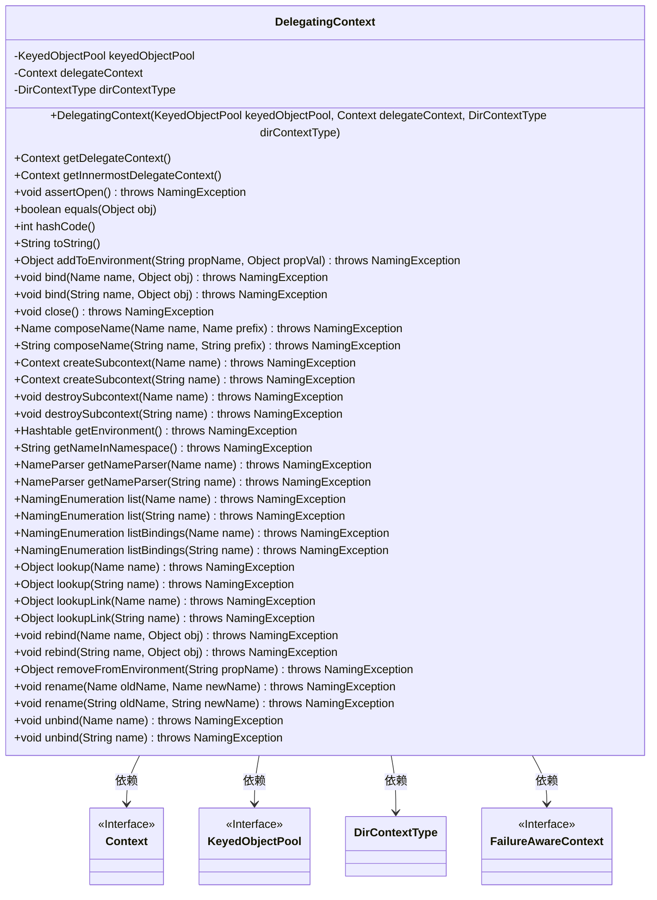

# 基础信息

|      |      |
|------|------|
| 名称 | DelegatingContext |
| 编码语言 | .java |
| 代码路径 | spring-ldap/core/src/main/java/org/springframework/ldap/pool/DelegatingContext.java |
| 包名 | org.springframework.ldap.pool |
| 依赖项 | ['java.util.Hashtable', 'javax.naming.Binding', 'javax.naming.Context', 'javax.naming.Name', 'javax.naming.NameClassPair', 'javax.naming.NameParser', 'javax.naming.NamingEnumeration', 'javax.naming.NamingException', 'org.apache.commons.pool.KeyedObjectPool', 'org.springframework.ldap.pool.factory.PoolingContextSource', 'org.springframework.util.Assert'] |
| 概述说明 | DelegatingContext实现Context接口，代理操作，支持池化管理和类型区分。 |

# 说明

DelegatingContext通过实现Context接口，将操作代理给委托上下文，支持池化管理和类型区分，提升了资源利用效率和操作灵活性。

# 类列表 Class Summary

| 名称   | 类型  | 说明 |
|-------|------|-------------|
| DelegatingContext | class | DelegatingContext实现Context接口，代理操作至委托上下文，支持池化管理和类型区分。 |

## 类 DelegatingContext

|      |      |
|------|------|
| 访问范围 | public |
| 类型 | class |
| 名称 | DelegatingContext |
| 说明 | DelegatingContext实现Context接口，代理操作至委托上下文，支持池化管理和类型区分。 |

### UML类图

**描述：**
`DelegatingContext` 类实现了 `Context` 接口，用于代理其他 `Context` 对象，并通过 `KeyedObjectPool` 进行对象池管理。它包含了多个方法，如 `bind`、`close`、`lookup` 等，这些方法在调用时会先检查 `Context` 是否已关闭，然后委托给内部的 `delegateContext` 执行。`DelegatingContext` 还支持递归获取最内层的 `Context`，并在关闭时将对象返回到对象池中。此外，它还处理了对象池中的对象有效性检查和异常处理。

### 内部方法调用关系图

**描述：**  
`DelegatingContext` 类是一个代理上下文类，它通过 `delegateContext` 委托操作给实际的 `Context` 对象。该类包含多个方法，如 `getDelegateContext` 和 `getInnermostDelegateContext`，用于获取委托的上下文对象。它还实现了 `Context` 接口的方法，如 `bind`、`lookup` 和 `close`，这些方法在调用前会检查上下文是否已关闭。`close` 方法用于将上下文对象返回到对象池或标记为无效。该类还重写了 `equals`、`hashCode` 和 `toString` 方法，以确保代理对象的正确比较和表示。

### 字段列表 Field List

| 名称  | 类型  | 说明 |
|-------|-------|------|
| keyedObjectPool | KeyedObjectPool | 私有键控对象池实例。 |
| delegateContext | Context | 私有上下文变量delegateContext。 |
| dirContextType | DirContextType | 私有且不可变的DirContextType类型变量dirContextType。 |

### 方法列表 Method List

| 名称  | 类型  | 说明 |
|-------|-------|------|
| createSubcontext | Context | 池化上下文不支持创建子上下文操作。 |
| getDelegateContext | Context | 获取当前对象的委托上下文实例。 |
| createSubcontext | Context | 该方法抛出异常，不支持在池化上下文中创建子上下文。 |
| assertOpen | void | 检查上下文是否关闭，若关闭则抛出命名异常。 |
| getInnermostDelegateContext | Context | 获取最内层委托上下文的方法。 |
| getEnvironment | Hashtable<?, ?> | 获取当前命名上下文环境信息的哈希表。 |
| composeName | String | 该方法组合名称并返回结果，确保上下文已打开。 |
| addToEnvironment | Object | 该方法抛出异常，表示不支持在池化上下文中调用addToEnvironment操作。 |
| lookup | Object | 查找对象方法，检查状态并调用委托上下文查找。 |
| equals | boolean | 比较两个Context对象是否相等，考虑委托关系。 |
| destroySubcontext | void | 销毁子上下文操作在池化上下文中不支持。 |
| bind | void | 绑定对象到指定名称，确保上下文已打开并委托操作。 |
| unbind | void | unbind方法用于解绑指定名称的上下文对象。 |
| listBindings | NamingEnumeration<Binding> | 方法列出指定名称的绑定，需确保上下文已打开。 |
| lookup | Object | 查找指定名称的对象，确保上下文已打开。 |
| toString | String | toString方法返回当前上下文或提示上下文已关闭。 |
| destroySubcontext | void | destroySubcontext方法抛出异常，不支持池化上下文操作。 |
| list | NamingEnumeration<NameClassPair> | 方法列出指定名称下的子项，返回枚举对象。 |
| composeName | Name | 方法composeName合并名称与前缀，抛出NamingException。 |
| lookupLink | Object | 方法`lookupLink`检查状态并调用委托上下文查找链接。 |
| getNameParser | NameParser | NameParser方法通过断言检查并返回委托上下文中的NameParser对象。 |
| bind | void | 绑定对象到指定名称，确保上下文已打开并调用委托上下文。 |
| getNameInNamespace | String | 方法`getNameInNamespace`确保上下文打开后，返回委托上下文的命名空间名称。 |
| listBindings | NamingEnumeration<Binding> | 方法`listBindings`返回指定名称的绑定枚举，要求上下文已打开。 |
| rebind | void | rebind方法用于重新绑定名称与对象，确保上下文打开并调用委托上下文。 |
| getNameParser | NameParser | `getNameParser`方法返回指定名称的解析器，需确保上下文已打开。 |
| lookupLink | Object | 方法查找链接，确保上下文打开后调用委托上下文查找。 |
| removeFromEnvironment | Object | 该方法抛出异常，不支持在池化上下文中调用removeFromEnvironment操作。 |
| close | void | 关闭方法释放并管理上下文对象池，处理异常。 |
| rename | void | 重命名方法，验证状态后调用委托上下文执行重命名操作。 |
| hashCode | int | hashCode方法返回当前最内层上下文对象的哈希值，若不存在则返回0。 |
| unbind | void | 该方法用于解绑指定名称的对象，确保上下文已打开并调用委托上下文进行解绑。 |
| rename | void | 重命名方法，检查状态后调用委托上下文执行重命名操作。 |
| rebind | void | 方法rebind用于重新绑定对象到指定名称，确保上下文已打开并调用代理上下文。 |
| list | NamingEnumeration<NameClassPair> | 方法list返回指定名称的枚举对象，可能抛出NamingException。 |

