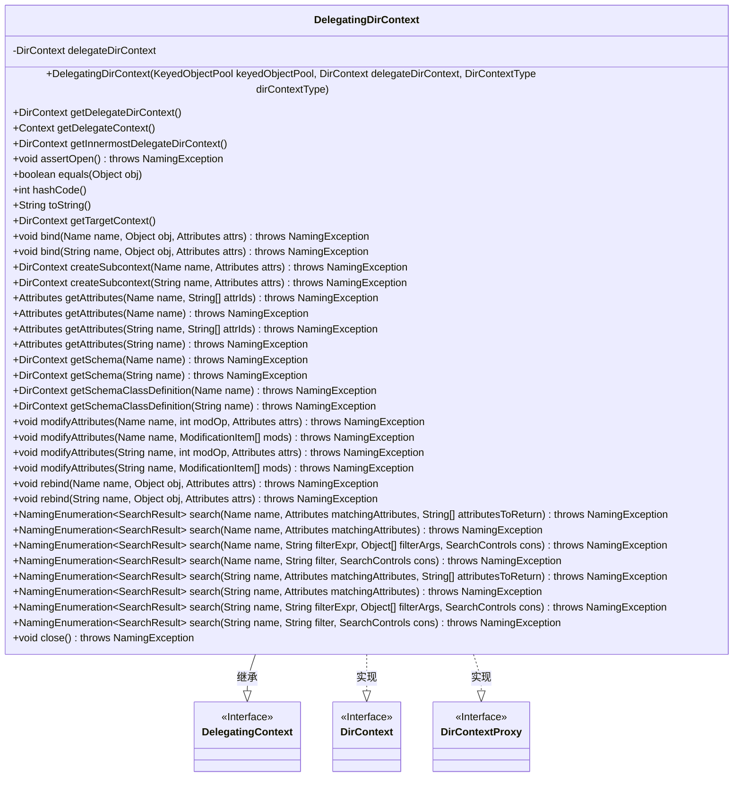

# 基础信息

|      |      |
|------|------|
| 名称 | DelegatingDirContext |
| 编码语言 | .java |
| 代码路径 | spring-ldap/core/src/main/java/org/springframework/ldap/pool/DelegatingDirContext.java |
| 包名 | org.springframework.ldap.pool |
| 依赖项 | ['javax.naming.Context', 'javax.naming.Name', 'javax.naming.NamingEnumeration', 'javax.naming.NamingException', 'javax.naming.directory.Attributes', 'javax.naming.directory.DirContext', 'javax.naming.directory.ModificationItem', 'javax.naming.directory.SearchControls', 'javax.naming.directory.SearchResult', 'org.apache.commons.pool.KeyedObjectPool', 'org.springframework.ldap.core.DirContextProxy', 'org.springframework.ldap.pool.factory.PoolingContextSource', 'org.springframework.util.Assert'] |
| 概述说明 | DelegatingDirContext类实现DirContext接口，委托操作至delegateDirContext，并提供获取最内层委托上下文的方法。 |

# 说明

DelegatingDirContext类实现了DirContext接口，其主要功能是将操作委托给delegateDirContext对象。该类还提供了获取最内层委托上下文的方法，以便在多层委托结构中访问最终的上下文对象。通过这种方式，DelegatingDirContext实现了对DirContext接口的扩展和灵活性，同时保持了操作的透明性和一致性。

# 类列表 Class Summary

| 名称   | 类型  | 说明 |
|-------|------|-------------|
| DelegatingDirContext | class | DelegatingDirContext类实现DirContext接口，委托操作至delegateDirContext，提供获取最内层委托上下文的方法。 |

## 类 DelegatingDirContext

|      |      |
|------|------|
| 访问范围 | public |
| 类型 | class |
| 名称 | DelegatingDirContext |
| 说明 | DelegatingDirContext类实现DirContext接口，委托操作至delegateDirContext，提供获取最内层委托上下文的方法。 |

### UML类图

类图描述：`DelegatingDirContext`类继承自`DelegatingContext`并实现了`DirContext`和`DirContextProxy`接口。它通过委托模式将操作委托给内部的`DirContext`实例，并提供了对`DirContext`接口方法的实现。该类还包含了一些辅助方法，如获取最内层的委托上下文和断言上下文是否打开等。

### 内部方法调用关系图

这段代码定义了一个名为 `DelegatingDirContext` 的类，它继承自 `DelegatingContext` 并实现了 `DirContext` 和 `DirContextProxy` 接口。该类的主要作用是代理 `DirContext` 的操作，并提供了对委托 `DirContext` 的访问和管理。通过 `getDelegateDirContext` 和 `getInnermostDelegateDirContext` 方法，可以获取到实际的 `DirContext` 实例。此外，类中还包含了多个 `DirContext` 接口方法的实现，这些方法在执行操作前会检查 `DirContext` 是否已关闭。

### 字段列表 Field List

| 名称  | 类型  | 说明 |
|-------|-------|------|
| delegateDirContext | DirContext | 私有变量delegateDirContext，类型为DirContext。 |

### 方法列表 Method List

| 名称  | 类型  | 说明 |
|-------|-------|------|
| getInnermostDelegateDirContext | DirContext | 获取最内层委托目录上下文。 |
| getDelegateDirContext | DirContext | 获取委托目录上下文对象。 |
| createSubcontext | DirContext | 池化上下文不支持创建子上下文操作。 |
| getSchema | DirContext | 池化上下文不支持调用getSchema方法。 |
| getTargetContext | DirContext | 获取目标上下文的方法，返回最内层委托目录上下文。 |
| close | void | 关闭委托目录上下文并释放资源。 |
| createSubcontext | DirContext | 不支持在池化上下文上调用createSubcontext方法。 |
| rebind | void | 重新绑定指定名称的对象及其属性，确保上下文已打开。 |
| toString | String | toString方法返回DirContext字符串或"DirContext is closed"。 |
| getDelegateContext | Context | 获取委托上下文的方法，返回委托目录上下文。 |
| bind | void | 绑定对象到命名上下文，需确保上下文已打开。 |
| getAttributes | Attributes | 获取指定名称的属性，需确保上下文已打开。 |
| getSchemaClassDefinition | DirContext | 该方法抛出异常，表示在池化上下文中不支持调用getSchemaClassDefinition。 |
| assertOpen | void | 检查DirContext是否关闭，若关闭则抛出NamingException。 |
| search | NamingEnumeration<SearchResult> | search方法通过名称和过滤器搜索，返回结果枚举。 |
| search | NamingEnumeration<SearchResult> | Java方法：搜索指定名称和属性的目录对象，返回匹配结果。 |
| search | NamingEnumeration<SearchResult> | 搜索方法，验证后调用委托目录上下文搜索。 |
| bind | void | 方法bind将对象与名称绑定，并处理属性。 |
| modifyAttributes | void | 修改指定名称的属性，需确保上下文已打开。 |
| getSchemaClassDefinition | DirContext | 方法getSchemaClassDefinition不支持在池化上下文中调用。 |
| modifyAttributes | void | 方法修改指定名称的属性，需确保上下文打开，调用代理上下文操作。 |
| search | NamingEnumeration<SearchResult> | 方法`search`根据名称、过滤表达式和参数进行搜索，返回结果枚举。 |
| search | NamingEnumeration<SearchResult> | 方法搜索指定名称和过滤条件的目录内容，返回搜索结果枚举。 |
| modifyAttributes | void | 方法`modifyAttributes`用于修改属性，需确保上下文已打开并调用代理方法。 |
| getAttributes | Attributes | 获取指定名称和属性ID的属性对象，确保上下文已打开。 |
| search | NamingEnumeration<SearchResult> | 搜索指定名称和匹配属性的方法，返回枚举结果。 |
| getAttributes | Attributes | 获取指定名称和属性的属性集，需确保上下文已打开。 |
| search | NamingEnumeration<SearchResult> | 方法搜索指定名称和过滤条件的目录上下文，返回结果枚举。 |
| getSchema | DirContext | 方法getSchema不支持在池化上下文中调用，会抛出UnsupportedOperationException异常。 |
| getAttributes | Attributes | 获取指定名称的属性，确保上下文已打开并调用委托方法。 |
| hashCode | int | 方法hashCode返回DirContext的哈希值，若为空则返回0。 |
| equals | boolean | 比较两个DirContext对象是否相等，先检查是否为同一实例，再验证类型并获取内部代理进行比较。 |
| rebind | void | 方法`rebind`用于重新绑定对象到指定名称，确保上下文已打开并调用委托上下文。 |
| search | NamingEnumeration<SearchResult> | 方法`search`根据名称和属性查找并返回匹配结果，需确保上下文已打开。 |
| modifyAttributes | void | 方法修改目录对象属性，需先检查是否打开，再调用委托上下文执行。 |

