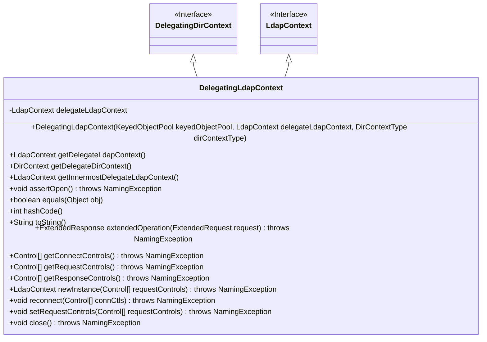

# 基础信息

|      |      |
|------|------|
| 名称 | DelegatingLdapContext |
| 编码语言 | .java |
| 代码路径 | spring-ldap/core/src/main/java/org/springframework/ldap/pool/DelegatingLdapContext.java |
| 包名 | org.springframework.ldap.pool |
| 依赖项 | ['javax.naming.NamingException', 'javax.naming.directory.DirContext', 'javax.naming.ldap.Control', 'javax.naming.ldap.ExtendedRequest', 'javax.naming.ldap.ExtendedResponse', 'javax.naming.ldap.LdapContext', 'org.apache.commons.pool.KeyedObjectPool', 'org.springframework.ldap.pool.factory.PoolingContextSource', 'org.springframework.util.Assert'] |
| 概述说明 | DelegatingLdapContext代理LdapContext，支持递归查找，确保连接有效。 |

# 说明

DelegatingLdapContext通过代理LdapContext操作，具备递归查找真实上下文的能力，确保连接的有效性和稳定性。该机制能够在复杂的上下文中准确找到并管理真实的LdapContext，从而保障操作的顺利进行。

# 类列表 Class Summary

| 名称   | 类型  | 说明 |
|-------|------|-------------|
| DelegatingLdapContext | class | DelegatingLdapContext代理LdapContext操作，支持递归查找真实上下文，确保连接有效性。 |

## 类 DelegatingLdapContext

|      |      |
|------|------|
| 访问范围 | public |
| 类型 | class |
| 名称 | DelegatingLdapContext |
| 说明 | DelegatingLdapContext代理LdapContext操作，支持递归查找真实上下文，确保连接有效性。 |

### UML类图

这段代码定义了一个 `DelegatingLdapContext` 类，它继承自 `DelegatingDirContext` 并实现了 `LdapContext` 接口。该类的主要作用是通过委托模式将 LDAP 上下文操作委托给内部的 `LdapContext` 实例。它提供了多个方法来获取委托的上下文、递归查找最内层的上下文、断言上下文是否打开以及实现 `LdapContext` 接口中的各种操作。此外，它还重写了 `equals`、`hashCode` 和 `toString` 方法，以确保对委托上下文的行为一致性。

### 内部方法调用关系图

```mermaid
graph TD
    A["类DelegatingLdapContext"]
    B["属性: LdapContext delegateLdapContext"]
    C["构造方法: DelegatingLdapContext(KeyedObjectPool, LdapContext, DirContextType)"]
    D["方法: LdapContext getDelegateLdapContext()"]
    E["方法: DirContext getDelegateDirContext()"]
    F["方法: LdapContext getInnermostDelegateLdapContext()"]
    G["方法: void assertOpen()"]
    H["方法: boolean equals(Object)"]
    I["方法: int hashCode()"]
    J["方法: String toString()"]
    K["方法: ExtendedResponse extendedOperation(ExtendedRequest)"]
    L["方法: Control[] getConnectControls()"]
    M["方法: Control[] getRequestControls()"]
    N["方法: Control[] getResponseControls()"]
    O["方法: LdapContext newInstance(Control[])"]
    P["方法: void reconnect(Control[])"]
    Q["方法: void setRequestControls(Control[])"]
    R["方法: void close()"]

    A --> B
    A --> C
    A --> D
    A --> E
    A --> F
    A --> G
    A --> H
    A --> I
    A --> J
    A --> K
    A --> L
    A --> M
    A --> N
    A --> O
    A --> P
    A --> Q
    A --> R
```

**描述：**  
`DelegatingLdapContext` 类继承自 `DelegatingDirContext` 并实现了 `LdapContext` 接口，主要用于代理 `LdapContext` 的操作。它包含一个 `delegateLdapContext` 属性，用于存储被代理的 `LdapContext` 实例。类中提供了多个方法，包括获取代理上下文、递归获取最内层代理上下文、断言上下文是否打开、重写 `equals`、`hashCode` 和 `toString` 方法，以及处理 `LdapContext` 接口的各种操作。该类还提供了关闭上下文的方法，并在关闭时释放资源。

### 字段列表 Field List

| 名称  | 类型  | 说明 |
|-------|-------|------|
| delegateLdapContext | LdapContext | 私有LDAP上下文代理对象。 |

### 方法列表 Method List

| 名称  | 类型  | 说明 |
|-------|-------|------|
| setRequestControls | void | 该方法不支持在池化上下文中设置请求控制。 |
| getDelegateDirContext | DirContext | 方法返回委托的LDAP上下文对象。 |
| getDelegateLdapContext | LdapContext | 该方法返回当前对象的委托LDAP上下文。 |
| getConnectControls | Control[] | 获取连接控件的数组，需确保上下文已打开。 |
| newInstance | LdapContext | LDAP上下文池不支持调用newInstance方法。 |
| getRequestControls | Control[] | 获取LDAP请求控制，需确保上下文已打开。 |
| equals | boolean | 比较两个LdapContext对象是否相等，包括委托对象。 |
| reconnect | void | 该方法抛出异常，表示不支持在池化上下文中调用重连操作。 |
| toString | String | 返回LdapContext字符串，若关闭则提示关闭。 |
| assertOpen | void | 检查LdapContext是否关闭，若关闭则抛出NamingException异常。 |
| getResponseControls | Control[] | 方法getResponseControls获取LDAP响应控制，需确保连接已打开。 |
| getInnermostDelegateLdapContext | LdapContext | 获取最内层LDAP上下文，若为代理则递归查找。 |
| close | void | 该方法关闭LDAP上下文，若为空则直接返回，否则调用父类关闭并置空。 |
| extendedOperation | ExtendedResponse | 方法执行LDAP扩展操作，先检查状态，再调用委托对象处理请求。 |
| hashCode | int | 该方法通过获取最内层LdapContext并返回其哈希码，若为空则返回0。 |

