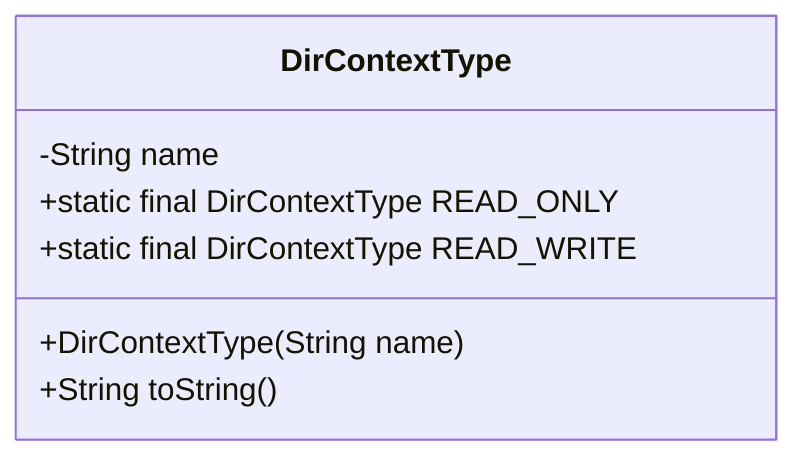
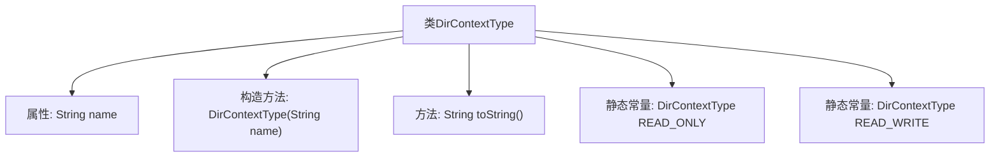

# 基础信息

|      |      |
|------|------|
| 名称 | DirContextType |
| 编码语言 | .java |
| 代码路径 | spring-ldap/core/src/main/java/org/springframework/ldap/pool/DirContextType.java |
| 包名 | org.springframework.ldap.pool |
| 依赖项 | ['javax.naming.directory.DirContext', 'org.springframework.ldap.core.ContextSource'] |
| 概述说明 | DirContextType类定义了READ_ONLY和READ_WRITE两种上下文类型。 |

# 说明

DirContextType类定义了两个上下文类型，分别是READ_ONLY和READ_WRITE。READ_ONLY表示只读上下文，允许用户读取数据但不能修改。READ_WRITE表示读写上下文，用户既可以读取数据也可以进行修改。这两种类型用于区分不同的操作权限，确保数据的安全性和完整性。

# 类列表 Class Summary

| 名称   | 类型  | 说明 |
|-------|------|-------------|
| DirContextType | class | DirContextType类定义两种上下文类型：READ_ONLY和READ_WRITE。 |

## 类 DirContextType

|      |      |
|------|------|
| 访问范围 | public final |
| 类型 | class |
| 名称 | DirContextType |
| 说明 | DirContextType类定义两种上下文类型：READ_ONLY和READ_WRITE。 |

### UML类图

类图描述：`DirContextType` 是一个不可变的类，用于表示目录上下文的类型。它包含一个私有的 `name` 属性，并通过构造函数初始化。类中定义了两个静态常量 `READ_ONLY` 和 `READ_WRITE`，分别表示只读和读写类型的目录上下文。`toString` 方法返回 `name` 属性的字符串表示。

### 内部方法调用关系图

这段代码定义了一个名为 `DirContextType` 的类，该类包含一个私有字符串属性 `name` 和一个私有构造方法，用于初始化该属性。类中还重写了 `toString` 方法，返回 `name` 的值。此外，类中定义了两个静态常量 `READ_ONLY` 和 `READ_WRITE`，分别表示只读和读写类型的 `DirContext`。这些常量通过调用私有构造方法进行初始化，并分别赋予不同的名称。

### 字段列表 Field List

| 名称  | 类型  | 说明 |
|-------|-------|------|
| name | String | 定义私有字符串类型变量name。 |
| READ_ONLY = new DirContextType("READ_ONLY") | DirContextType | 定义了一个只读的目录上下文类型常量。 |
| READ_WRITE = new DirContextType("READ_WRITE") | DirContextType | 定义了一个名为READ_WRITE的不可变DirContextType常量。 |

### 方法列表 Method List

| 名称  | 类型  | 说明 |
|-------|-------|------|
| toString | String | 该方法返回对象名称的字符串表示。 |

